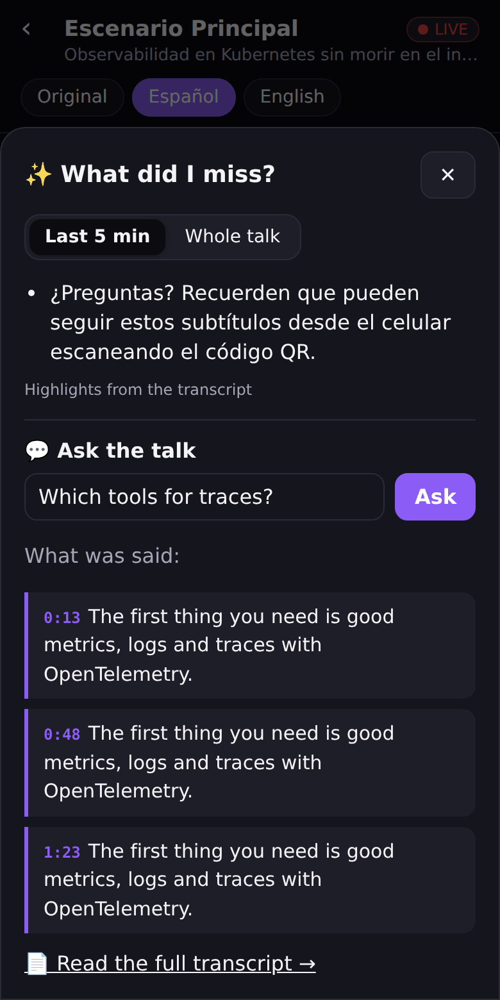
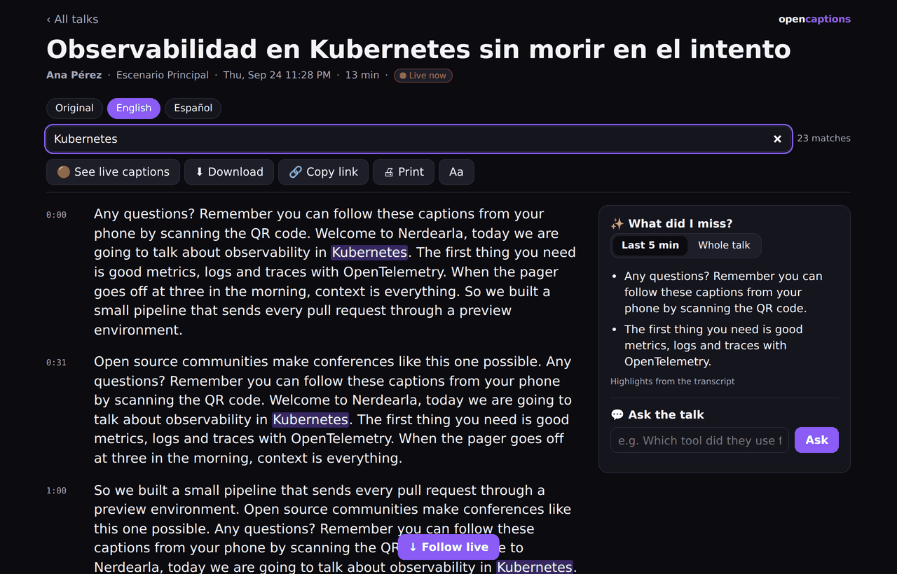
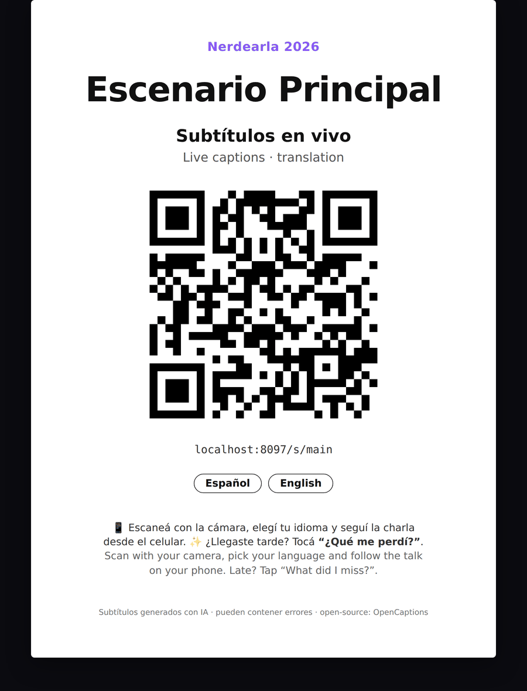
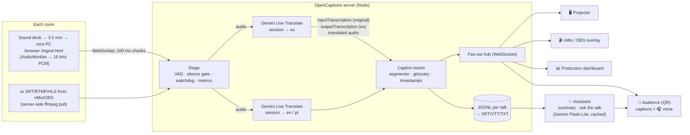

#  OpenCaptions

**Open-source live captions, translation and "what did I miss?" for multi-room conferences.**
Built for the [Nerdearla 2026 Vibeathon](https://nerdearla.devpost.com/) on **Gemini 3.5 Live Translate** + **Gemini Flash-Lite**.

Scan a QR code, pick your language and follow the talk live on your phone. Walked in late? Tap **✨ What did I miss?** for a summary of the last five minutes in your language, or **ask the talk** a question. After the talk, everyone can read, search and download the transcript. Meanwhile the projector shows big captions, vMix/OBS burns them into the stream, and one person watches every room from a single dashboard.

> 🇦🇷 *Subtítulos y traducción en vivo, open source, para conferencias con muchas salas en paralelo. El público escanea un QR, elige idioma y sigue la charla en el celu; si llegó tarde toca "¿Qué me perdí?" y recibe un resumen en su idioma, o le pregunta a la charla. Después, la transcripción queda para leer, buscar y descargar. El proyector muestra subtítulos grandes, vMix/OBS los planchan en el stream, y un panel de producción muestra estado, latencia, costo y alertas de cada sala.* — [Resumen en español ↓](#-resumen-en-español)

| Audience: live captions + ✨ catch-up | Transcript: read, search, summary, ask | Printable QR kit |
|---|---|---|
|  |  |  |

| Production dashboard | Stage screen / projector | vMix / OBS overlay |
|---|---|---|
|  |  |  |

**📚 Documentation:** [Overview](docs/overview.md) · [Getting started](docs/getting-started.md) · [Requirements](docs/requirements.md) · [Deployment](docs/deployment.md) · [Networking](docs/networking.md) · [Security](docs/security-guide.md) · [Latency](docs/latency.md) · [Architecture](docs/architecture.md) · [Configuration](docs/reference/configuration.md) · [API](docs/reference/api.md) · [Event-day runbook](docs/operations/runbook.md) · [All docs](docs/README.md)

---

## How it meets the challenge

| Challenge requirement | OpenCaptions |
|---|---|
| Live audio in | Headless agent on the room PC (sound card via the same 3.5 mm cable), browser page, or the SRT/RTMP/HLS stream vMix/OBS already produce |
| Transcription in the original language | Gemini 3.5 Live Translate input transcription, language auto-detected or pinned per room, technical glossary |
| EN → ES translation (ES → EN bonus) | Any direction, any number of languages per room (ES, EN, PT configured), sentence-level translation with live provisional updates |
| At least two simultaneous sessions | **30 simultaneous rooms** tested with real Nerdearla talks and Gemini on one laptop (server ~20 % CPU, 151 MB RAM) — `npm run multi -- --rooms 30` |
| OSI license + deployment guide | MIT · [deployment guide](docs/deployment.md) (venue PC or cloud VM, Docker or Node), [runbook](docs/operations/runbook.md), `npm run setup` wizard |
| Audience view: pick session + language | Phone page via QR (`/s/<room>`), plus transcript library, reading settings and translated voice 🎧 |

| Judging criterion | What we did |
|---|---|
| **Quality** | Sentence-level translation with context + glossary (no half-sentence mistranslations), passthrough when speaker and caption language match, hot-reloaded glossary for names and acronyms |
| **Latency** | ~3 s to original captions (broadcast live subtitling targets 3 s and averages more), ~4.6–5.7 s to translated captions, measured with real talks; our own pipeline adds under 0.2 s — the rest is the speech model; provisional translations while the sentence is spoken; [where the seconds go](docs/latency.md) |
| **Scalability** | One Live session per room regardless of languages; rooms share nothing, so it shards by room; summaries are cached and shared by all viewers; load test + multi-room latency test included |
| **Deployment / operation** | `npm run setup`, Docker (hardened) or plain Node, outbound-only networking, secure by default, zero-operator rooms (silence gating, auto-resume, agenda-driven talk titles), dashboard with alerts, cost and CPU/memory, event-day runbook |
| **Innovation** | ✨ *What did I miss?* and *Ask the talk*: grounded in the transcript, in the viewer's language, with quotes and timestamps; translated voice to your headphones; printable QR kit; transcript library with search |

## What it does

**For the audience**
- **Live captions on your phone** — scan the QR, pick the room and language (Original, Español, English, Português…). Big readable text, reading settings (text size, high-legibility fonts such as Atkinson Hyperlegible and Lexend, line spacing, light/dark), dual view with the original, "back to live" when you scroll.
- **✨ What did I miss?** — a summary of the last 5 minutes (or the whole talk so far) in *your* language, generated from the transcript only. Perfect for latecomers and for anyone who got distracted.
- **💬 Ask the talk** — "Which tool did she use for tracing?" The answer comes only from what was said, with quotes and timestamps; if it wasn't said, it says so.
- **📄 Transcript page** — read the whole talk as paragraphs with timestamps, search with highlights, switch language, download TXT / SRT / VTT, print, share a link. Updates live while the talk runs.
- **📚 Transcript library** — every talk of the event, searchable by title, speaker or room.
- **Bilingual speakers welcome** — hosts who switch between Spanish and English, Q&A in both languages: every caption language follows the speaker (transcription when they speak it, translation when they don't), and a single foreign word like *Kubernetes* doesn't flip the captions.
- **🎧 Listen mode** — the translated *voice* streamed to your phone (Gemini already generates it — we just don't throw it away).
- **⧉ Floating captions** — on a laptop, float the captions in an always-on-top window over the livestream, the slides or a video call.
- **Installable** — add it to the home screen like an app; shared links show the event name and a preview image.

**For the stage and the stream**
- **Projector screen** — full-screen, high-contrast captions (translation + original) with a QR to follow on the phone.
- **vMix / OBS overlay** — transparent or chroma background, so remote viewers get live translation in the stream.
- **Visual caption style editor** (`/style.html`) with presets and a 1920×1080 live preview.

**For organizers**
- **`npm run setup`** — a 1-minute wizard: event name, rooms, languages, API key, tokens; then prints exactly what to do next.
- **Guided dashboard** — a "getting started" checklist, then per-room status, audio meter, session health, latency, viewers, **estimated cost**, CPU/memory/event loop, alerts (*no audio*, *mic muted?*, *high latency*, *reconnecting*, *translation throttled*) and an event log. **📌 Float** keeps every room's status on top of OBS or vMix while you produce.
- **📅 Agenda** — paste the schedule as CSV; each room names its talk automatically when its slot starts (and waits for a pause if the previous speaker runs late). Titles and speakers show on phones, projector and transcripts.
- **🖨 QR kit** — printable A4 posters per room, bilingual.
- **🎬 Subtitle recorded talks** — `npm run subtitle -- talk.mp4 --langs en,es` writes `.srt`/`.vtt` files next to the video, ready for YouTube (our own demo video's subtitles were made this way).
- **Zero-operator rooms** — silence gating (nothing billed between talks), instant resume with pre-roll, automatic talk split after breaks, watchdogs, automatic reconnection.
- **Technical glossary** — vocabulary hints for the recognizer + hot-reloaded replacements (*"cubernetes" → Kubernetes*).

**Under the hood**
- **Resilient** — session resumption across Gemini's ~10-min connection lifetime without losing the words in flight, reconnection with backoff, a 12 s audio buffer during reconnects, connect timeouts, config fallback, crash-proof WebSocket handling, heartbeats for dead phones.
- **Secure by default** — tokens for admin and ingest from any other device (auto-generated), security headers, rate limits, SSRF-safe stream pulls, rate-limited and cached audience AI. See [docs/security-guide.md](docs/security-guide.md).
- **Enterprise options** — Google Cloud **Vertex AI** backend, no audio ever stored, `STORE_TRANSCRIPTS=false`, `RETENTION_DAYS`.
- **Offline mock engine** to develop, demo and load-test everything without an API key.

## Quick start (2 minutes)

Requirements: **Node.js ≥ 20**. That's it — the bundled 16 kHz WAV samples are read natively, and for any other format/stream an ffmpeg binary is installed automatically via `ffmpeg-static`.

```bash
git clone https://github.com/carraroesteban/opencaptions.git && cd opencaptions
npm install
npm run setup                 # 1-minute wizard: event, rooms, languages, API key (free: https://aistudio.google.com/apikey)
npm run check                 # 25-second end-to-end test of your key with samples/talk-en.wav
npm start                     # → http://localhost:8080
```

No API key yet? `npm run mock` runs everything with simulated captions.

Now feed audio to two rooms at once (the MVP "two simultaneous sessions" requirement):

```bash
npm run feed -- --stage main   --input samples/talk-en.wav     # English talk → ES captions
npm run feed -- --stage sala-b --input samples/talk-es.wav     # Spanish talk → EN captions
```

Open:

| URL | For |
|---|---|
| `http://localhost:8080/` | Audience: pick a room & language |
| `http://localhost:8080/watch.html?stage=main` | Live captions for one room (the QR points to `/s/main`), with ✨ *What did I miss?* and 💬 *Ask the talk* |
| `http://localhost:8080/talk.html?stage=main` | **Transcript page**: read, search, summary, ask, download (live while the talk runs) |
| `http://localhost:8080/talks.html` | **Transcript library** of every talk |
| `http://localhost:8080/admin.html` | Production dashboard (📅 agenda, glossary, links/QR, transcripts) |
| `http://localhost:8080/kit.html` | **Printable QR posters** for every room |
| `http://localhost:8080/ingest.html` | Stage ingest (mic / tab / file / bundled samples) |
| `http://localhost:8080/screen.html?stage=main` | Projector screen |
| `http://localhost:8080/overlay.html?stage=main&lang=es` | vMix / OBS overlay |
| `http://localhost:8080/style.html` | **Caption style editor** for overlay & projector |
| `http://localhost:8080/demo.html?mode=mic` | **Live microphone demo / sound check**: speak and see original + translation big on screen, with level meter and latency |
| `http://localhost:8080/demo.html?v=<youtube-url>` | **Play-along demo**: plays a YouTube talk in the browser while the server captions the same audio in real time (needs `yt-dlp`) — compare speech vs captions, record demos |

**Security by default:** on the machine running the server, everything just works. Any *other* device (a venue PC, your phone on the dashboard, a tunnel) needs a token — the server prints the admin and ingest tokens at startup (set your own with `ADMIN_TOKEN` / `INGEST_TOKEN`). Open `/admin.html?token=<ADMIN_TOKEN>` once and the browser remembers it. Caption pages for the audience are always public. Details: [docs/security-guide.md](docs/security-guide.md).

**Real talks as test audio:** `./scripts/fetch-samples.sh <youtube-url> my-talk 300 180` (needs `yt-dlp`), or feed YouTube directly: `npm run feed -- --stage main --youtube <url> --start 300`. In the browser you can also choose *Ingest → "Pestaña o pantalla"* and share a tab playing any Nerdearla talk.

## How it works



**✨ What did I miss? / 💬 Ask the talk.** The same fast text model that translates captions also reads the transcript: a summary of the last 5 minutes (or the whole talk) in the viewer's language, and answers to questions *grounded only in what was said*, with quotes and timestamps ("I couldn't find that" instead of guessing). Summaries are cached and shared by everyone watching the same room, questions are rate-limited per client and globally, and without a model (mock mode, `AUDIENCE_AI=off`, errors) it falls back to transcript highlights and keyword quotes. A summary of a one-hour talk costs well under one US cent.

**Why Gemini 3.5 Live Translate?** A single streaming session gives us, at the same time: the transcription of what the speaker says (`inputAudioTranscription`, with the detected language), a translation (`outputAudioTranscription`) and translated *speech* — with automatic source-language detection.

**What we learned testing it on real audio:** transcription streams steadily ~2–4 s behind the speaker, but *speech-to-speech* translation is generated at speaking pace, so on fast or dense talks the translated captions can drift further and further behind. So OpenCaptions supports three **caption translation modes** (global `TRANSLATION_MODE`, or per room from the dashboard):

| Mode | Live sessions per room | Where translated captions come from | Translated voice 🎧 |
|---|---|---|---|
| **`text`** (default) | **1** | **Gemini 3.5 Flash-Lite** translates each finished sentence (with context + glossary) and shows a provisional translation of the sentence in progress, refreshed every ~1.5 s → lag stays bounded (≈ transcription + one short request) | first target language |
| `live` | 1 per language | Live Translate's own speech translation | every language |
| `hybrid` | 1 per language | text, as in `text` | every language |

Text translation is rate-limit aware: a server-wide budget (`MT_RPM`), per-request timeouts and back-off on 429s; provisional updates are sacrificed first, and if a language is throttled the room **automatically falls back to Live Translate's own captions** for that language (the primary Live session already produces them), then switches back when quota recovers. Captions never freeze and never show text in the wrong language.

> **Free tier tip:** the free Gemini tier has low per-minute limits for text models. For demos with several rooms set `MT_RPM` to the Flash-Lite limit shown in AI Studio (e.g. `MT_RPM=14`) or `MT_PARTIAL_MS=3000`; for a real event enable billing (paid-tier data is also not used to train Google's models).

In every mode, when the speaker already talks in a caption language (e.g. a Spanish talk, Spanish captions) the transcription is passed through as-is — nothing is translated twice or parroted.

**Room config** (`config/event.json`): `source` pins the talk language (`"en"`, `"es"`…) or `"auto"`; `targets` lists caption languages. Viewers always also get *Original*.

### Latency

Measured continuously per room and shown on the dashboard: *speech onset → first caption* and *speech onset → first translated words*. The model streams while the speaker talks (it doesn't wait for sentence end), captions are pushed to viewers as partials and finalized on punctuation / pauses. The server itself only relays audio and short text messages, so end-to-end latency is dominated by the model (Google describes it as staying "a few seconds behind the speaker"). Audio is sent in 100 ms chunks, as the Live API recommends.

## Running it at an event (Nerdearla-style)

> 📋 Full step-by-step runbook: **[docs/operations/runbook.md](docs/operations/runbook.md)** (Spanish crew version: [event-day.es.md](docs/operations/event-day.es.md)) — HTTPS setup, per-room checklist, sound check, what each dashboard alert means, plan B. Where to run the server (venue PC vs. cloud) and whether to use Docker: [docs/deployment.md](docs/deployment.md).


Today, at Nerdearla, each stage's sound desk goes via a 3.5 mm cable into a mini PC, where a browser captures the input and shows the captions on the stage screens. OpenCaptions keeps exactly that setup:

1. **Server**: run it once for the whole event — on a venue PC or a small cloud VM ([how to choose](docs/deployment.md#choose-a-topology)): `docker compose up -d` with your `.env`. Put it behind **HTTPS** — required, because browsers only allow microphone capture on `localhost` or `https://` (Cloudflare Tunnel, Caddy, or built-in TLS with `HTTPS_CERT`/`HTTPS_KEY`) — and set `PUBLIC_URL`, `INGEST_TOKEN`, `ADMIN_TOKEN`.
2. **Audio per room** — pick one: **(a)** set the room's *pull* to the SRT/RTMP/HLS stream vMix/OBS already outputs (no hardware); **(b)** run the **headless agent** on the stage PC as a service: `node scripts/agent.js --stage <id> --device <n> --server wss://<server> --token <INGEST_TOKEN>` (see `deploy/` for systemd/launchd); or **(c)** open `https://<server>/ingest.html?stage=<id>&token=<INGEST_TOKEN>` in Chrome, choose the audio input, tick *Auto-iniciar*, click **Start**. Open *"Abrir pantalla para proyector"* on the second screen (it replaces today's SaaS window). For unattended kiosks launch Chrome with `--autoplay-policy=no-user-gesture-required --use-fake-ui-for-media-stream` and the `?autostart=1` URL.
3. **Audience**: print the QR posters from *Dashboard → 🖨 Kit de QR* (`/kit.html`, one A4 poster per room pointing to `/s/<room>`); the QR is also shown on the projector.
4. **Streaming (vMix)**: add a *Web Browser* input with `https://<server>/overlay.html?stage=<id>&lang=es` at 1920×1080 and put it as an overlay on the program output (OBS: *Browser Source*, same URL). Different stream per language → different overlay URL. Use `&bg=%2300ff00` if you prefer chroma key.
5. **Production team**: keep `/admin.html` open. Paste the agenda once (*📅 Agenda*, CSV `room,time,title,speaker`) and every talk gets its title and speaker automatically; talks are also split automatically after breaks. There is nothing to click during a talk.
6. **After the talk**: the transcript stays at `/talks.html` for everyone (read, search, summary, download); *Transcripciones* in the dashboard gives SRT/VTT for the YouTube upload and TXT for the blog / accessibility archive.

Alternatively, if the program audio already exists as a stream (vMix SRT output, Icecast, HLS), set `pull` on the room (dashboard ⚙︎ or config) and no ingest PC is needed.

## Scaling

- **Per room cost is linear and predictable**: one model session per target language. Rooms are independent; there's no shared state between them.
- **One process handles many rooms**: the server only relays ~32 KB/s of audio per room and fans out small JSON messages to viewers. Load test: `npm run loadtest -- --stages 10 --input samples/talk-en.wav` (10 rooms, 20 sessions: ~90 MB RSS).
- **Tested with 30 simultaneous rooms** of real Nerdearla 2025 talks through Gemini: latency p50 1.2 s / p90 2.7 s (original) and 1.8 s / 3.5 s (translation) on the dashboard metric, with the server at ~20 % of one CPU core, 151 MB RAM and 1.5 ms event-loop p99; about US$ 1.2 per minute for all 30 rooms. Details: [docs/latency.md](docs/latency.md).
- **Real-talk latency test**: `npm run multi -- --rooms 15 --minutes 5` opens 15 rooms, feeds each one a different Nerdearla 2025 talk from YouTube (server-side yt-dlp, real time), prints live p50/p90 latency per room and writes a JSON report to `data/latency-*.json`. `--playlist <url>` or `--file urls.txt` to choose the videos, `--list` for a dry run, `--cleanup` to delete the rooms afterwards.
- **More rooms than one process/API project can handle**: shard by room — run N instances with `STAGES=...` (and if needed a different `GEMINI_API_KEY`/project each, to spread Live API concurrency quotas) behind a reverse proxy that routes `/ws/*?stage=X` and `/s/X`. Captions are per-room, so no pub/sub is needed.
- **Viewers**: each viewer is one lightweight WebSocket receiving small JSON messages. For very large audiences, put a WebSocket fan-out gateway in front — the viewer protocol is tiny (see below).
- **Check your quotas**: Live API concurrent sessions depend on your Gemini tier; see AI Studio → rate limits.

### Cost (Gemini 3.5 Live Translate, paid tier, Sept 2026 pricing)

Live Translate is billed on streamed audio: ≈ **US$ 0.037 per session-minute** (input $0.0053/min + output $0.0315/min) → ≈ **US$ 2.2 per session-hour**. Text translation with Flash-Lite ($0.30 / 1M input, $2.50 / 1M output tokens) adds roughly **US$ 0.4–0.6 per talk-hour per language** (mostly the provisional re-translations; raise `MT_PARTIAL_MS` to cut it). The dashboard's cost estimate includes both.

| Scenario (default `text` mode) | Live sessions | ~Cost |
|---|---|---|
| One 40-min English talk → Spanish | 1 | ≈ US$ 1.8 |
| **Nerdearla: 30 English talks × 40 min → Spanish** | 1 each | **≈ US$ 55 total** |
| 10 rooms × 8 h, captions in ES + EN + PT | 10 | ≈ US$ 250 (less with silence gating) |
| Same, `hybrid` (translated voice in all 3 languages) | 30 | ≈ US$ 600 |

Silence gating means breaks, setup time and Q&A pauses aren't billed. The dashboard shows the running estimate per room. The free tier is enough to develop and test.

## Configuration

`config/event.json`:

```jsonc
{
  "eventName": "Nerdearla 2026",
  "languages": { "es": "Español", "en": "English", "pt": "Português" }, // what the UI offers
  "defaultTargets": ["es", "en"],
  "stages": [
    { "id": "main", "name": "Escenario Principal", "source": "auto", "targets": ["es", "en"] },
    { "id": "sala-a", "name": "Sala A", "source": "en", "targets": ["es", "pt"] },
    { "id": "sala-b", "name": "Sala B", "source": "es", "targets": ["en"],
      "pull": "srt://0.0.0.0:9001?mode=listener" }   // optional server-side ingest
  ]
}
```

Rooms edited from the dashboard are saved to `data/stages.json`. Every environment variable and file format: [docs/reference/configuration.md](docs/reference/configuration.md).

`config/glossary.json` — `vocabulary` (biases recognition: product names, speakers, sponsors) and `replacements` (`{ "from": "cubernetes|kubernete", "to": "Kubernetes", "lang": "orig" }`). Editable live from the dashboard (*Glosario*).

## Interfaces

**Ingest** — `ws://host/ws/ingest?stage=<id>` with `Authorization: Bearer <INGEST_TOKEN>` (browsers: `&token=`): send binary frames of PCM16LE mono 16 kHz (100 ms = 3200 bytes recommended; frames over 64 KB are dropped). Server replies with JSON `status` messages (level, sessions, caption preview). Anything that can produce PCM can be a source (`scripts/feed.js` is 60 lines).

**Viewer** — `ws://host/ws/view?stage=<id>&langs=es,orig&audio=es`: receives `hello` (room info, language map, history) then `caption` messages `{ id, channel, text, final, start, end }` and, if `audio` is set, binary PCM16 24 kHz translated speech.

**HTTP** — `GET /api/event`, `GET /api/status` (admin), `POST/PATCH/DELETE /api/stages[/:id]`, `POST /api/stages/:id/talk`, `GET /api/talks`, `GET /api/stages/:id/talks[/:talk]`, `GET /api/stages/:id/export.{srt|vtt|txt|json}?lang=es&talk=<id>`, `GET /api/stages/:id/summary?lang=es&scope=recent|full`, `POST /api/stages/:id/ask`, `GET/PUT /api/schedule`, `GET/PUT /api/glossary`, `GET /api/qr.svg?text=`, `GET /metrics` (Prometheus, admin), `GET /healthz`. Full reference: [docs/reference/api.md](docs/reference/api.md).

## Project layout

```
src/server.js          HTTP API, static UIs, WebSocket endpoints
src/stage.js           room: audio fan-out, VAD/silence gate, watchdog, latency & cost metrics
src/engines/gemini.js  Gemini Live Translate session: resumption, reconnect, buffering, config fallback
src/engines/mock.js    offline simulated engine
src/captions.js        fragment → caption segmentation (partial/final, timestamps)
src/glossary.js        vocabulary + hot-reloaded replacements
src/store.js           per-talk JSONL + SRT/VTT/TXT export
src/pull.js            ffmpeg / yt-dlp pull ingest
src/security.js        auth, security headers, rate limits, SSRF checks
src/assist.js          ✨ what-did-I-miss summaries + ask-the-talk (grounded, cached, rate-limited)
src/schedule.js        agenda → automatic talk titles
public/                audience (watch, talk, talks), screen, overlay, ingest, admin, kit, style editor (vanilla JS, no build)
public/brand/          logo, app icons, link-preview image
config/                event.json, glossary.json, schedule example
scripts/               setup, agent, feed, loadtest, multi-youtube, subtitle, check-gemini, fetch-samples
test/                  node:test suites (core, security, reliability, features)
deploy/                systemd / launchd service files
docs/                  documentation (Diátaxis) + ADRs
```

Engines implement a tiny interface (`start`, `sendAudio`, `endAudio`, `stop`, events `input`/`output`/`audio`), so a fully local engine (e.g. Gemma / Whisper-based) can be plugged in for events without internet.

## Security & compliance

Self-hosted, secure by default, no audio stored, optional transcript storage with retention, and a Vertex AI backend for organizations that need ISO 27001 / SOC 2-covered processing. Threat model, controls and hardening checklist: **[docs/security-guide.md](docs/security-guide.md)**. Report vulnerabilities privately: [SECURITY.md](SECURITY.md).

## Known limitations

- Live Translate is a preview model; behaviour and quotas may change.
- Translation quality for heavy accents / fast code-switching depends on the model. Pin `source` per room when you know the talk language (it's also cheaper).
- Speaker diarization is not shown yet.
- The audience assistant only knows what the recognizer transcribed: garbled words stay garbled (the glossary helps).
- A fully local engine (Gemma) for events without internet is on the roadmap; the engine interface is ready for it.

## 🇦🇷 Resumen en español

**OpenCaptions** es una solución open source (MIT) de transcripción y traducción simultánea para conferencias con muchas salas en paralelo:

- **Ingesta sin cambiar el setup actual**: la mini PC del escenario corre el agente (o abre `/ingest.html`) y toma la placa de audio (3.5 mm) como hoy. También acepta un pull SRT/RTMP/HLS desde vMix/OBS.
- **Una sesión de Gemini 3.5 Live Translate por sala** transcribe; **Gemini Flash-Lite** traduce oración por oración (con contexto y glosario) a los idiomas que quieras.
- **Público**: QR → elige sala e idioma en el celu; **✨ "¿Qué me perdí?"** resume los últimos 5 minutos en su idioma, **💬 "Preguntale a la charla"** responde solo con lo que se dijo (con citas y minuto), puede **escuchar la traducción con auriculares**, y después **leer, buscar y descargar la transcripción** de cada charla. **Proyector** con subtítulos grandes + QR. **Overlay para vMix/OBS** para quemar los subtítulos en el stream (traducción en vivo para la audiencia virtual).
- **Panel de producción**: guía de primeros pasos, estado, vúmetro, latencia, reconexiones, espectadores, costo estimado y alertas por sala; alta/edición de salas, **agenda** (títulos automáticos), glosario en caliente y **kit de QR imprimible**.
- **Sin operador**: pausa sola en silencio (no se paga), retoma cuando alguien habla, separa charlas automáticamente, se reconecta sola.
- **Exporta** SRT/VTT/TXT por charla. **Escala** linealmente por sala (≈ US$ 2,2 por hora de sesión); 30 charlas en inglés ≈ US$ 55.

`npm install && npm run setup && npm start` — ver [Quick start](#quick-start-2-minutes).

## Contributing

See [CONTRIBUTING.md](CONTRIBUTING.md) (dev setup, tests, commit style, documentation standards) and the [changelog](CHANGELOG.md).

## License

[MIT](LICENSE). Made during the Nerdearla 2026 Vibeathon (Sept 24–25, 2026).
