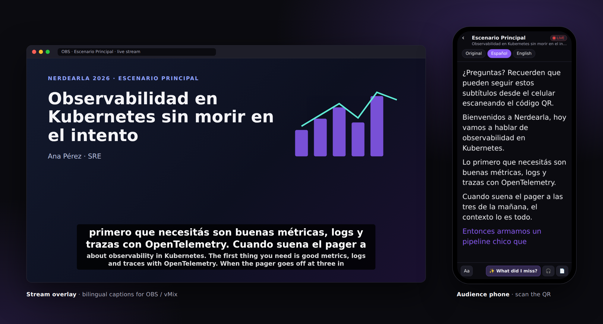
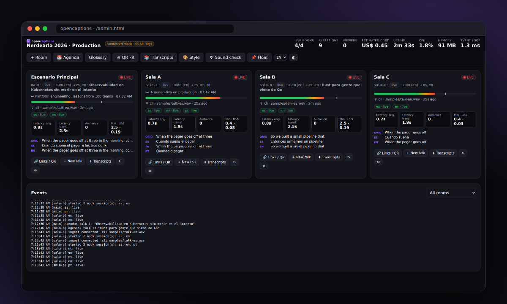
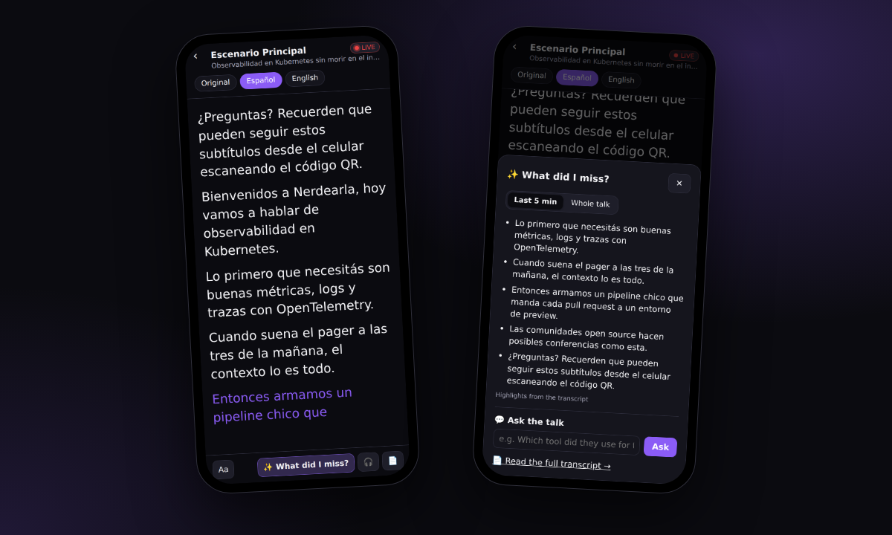
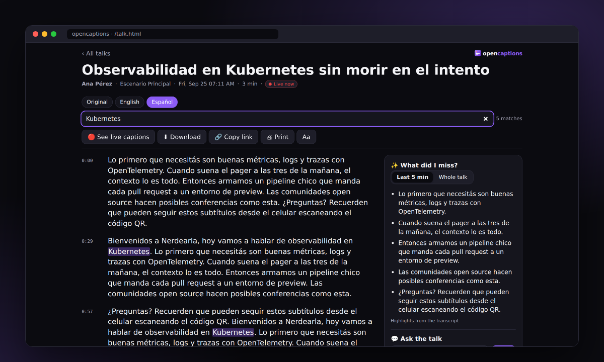
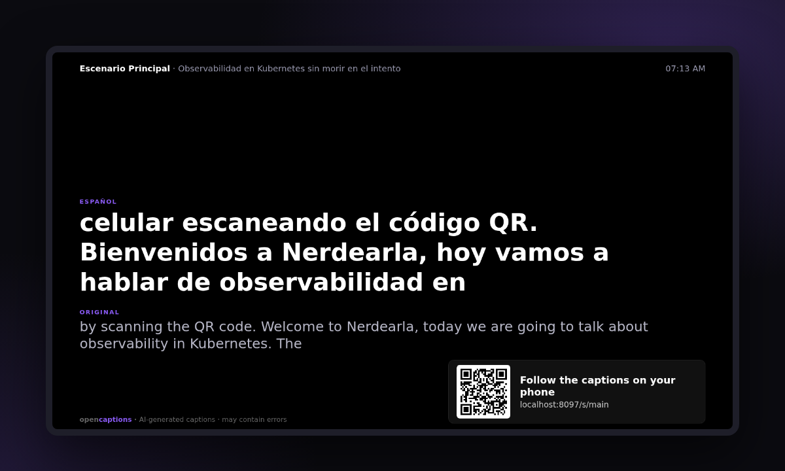
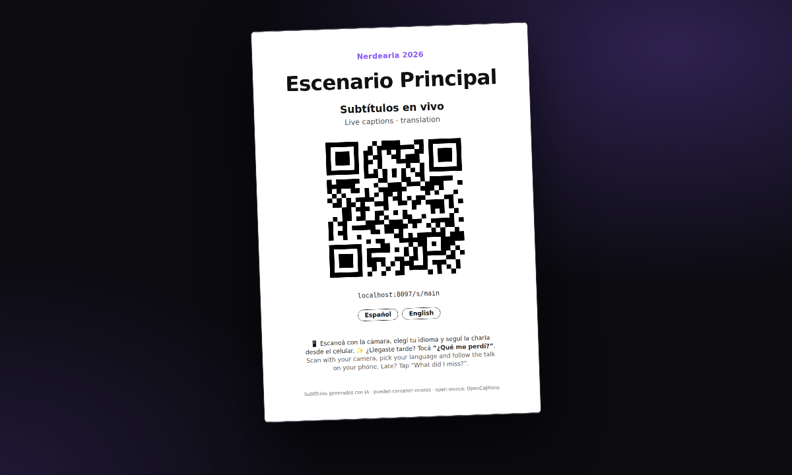
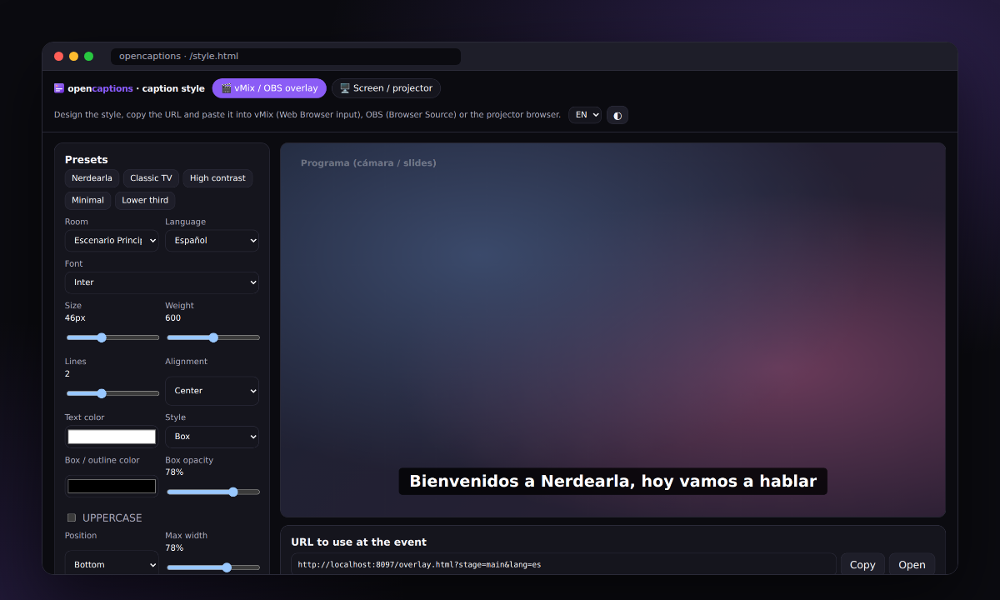
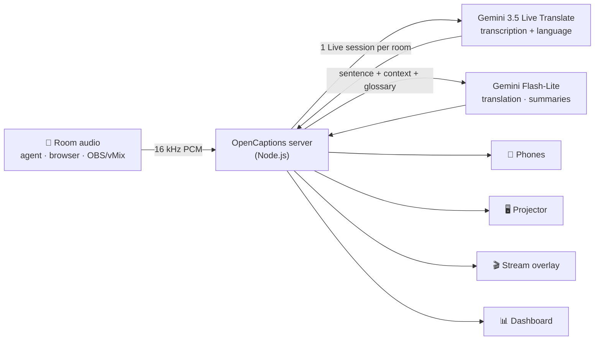

<div align="center">


# OpenCaptions

**Live captions and translation for every room of your conference.**<br>
Open source · self-hosted · built on Gemini 3.5 Live Translate

[](https://github.com/carraroesteban/opencaptions/actions/workflows/ci.yml)
[](LICENSE)
[](docs/requirements.md)
[](#-install)
[](https://nerdearla.devpost.com/)

[Quick start](#-quick-start) · [Install](#-install) · [Features](#-features) · [Documentation](#-documentation) · [Event-day runbook](docs/operations/runbook.md) · [En español](#-en-español)



</div>

A speaker talks. Seconds later, everyone in the room can read what they said **in their own language**: on their phone (scan the QR), on the projector, and burned into the livestream. Latecomers tap **✨ What did I miss?** for a summary. After the talk, the transcript stays online to read, search and download.

One server handles the whole event: 30 rooms ran at once on a laptop in our stress test. Rooms need no operator, and the production team watches everything from one dashboard.

## ✨ Features

**For the audience**

- 📱 **Live captions on any phone.** Scan the room's QR code and pick a language. No app, no sign-up.
- ✨ **What did I miss?** A summary of the last five minutes, or the whole talk, in your language.
- 💬 **Ask the talk.** Answers come only from what was said, with quotes and timestamps.
- 📄 **Transcripts** of every talk: read, search, download (TXT, SRT, VTT), print.
- 🌐 **Bilingual speakers.** When a host switches from Spanish to English, every caption language follows.
- ♿ **Reading settings**: text size, high-legibility fonts, line spacing, light and dark themes. 🎧 Translated voice in your headphones. ⧉ Floating captions on laptops.

**For the stage and the stream**

- 🖥️ **Projector view** with large captions and the room's QR code.
- 🎬 **OBS / vMix overlay**, transparent or chroma key, optionally bilingual. A visual style editor generates the URL.
- 🎛️ **Any audio source**: the sound desk through a PC (headless agent or browser), or OBS/vMix streaming straight to the server (RTMP, SRT, HLS).

**For organizers**

- 📊 **Production dashboard** for every room: status, audio level, latency, audience, cost and alerts. 📌 A floating mini-dashboard stays on top of OBS.
- 📅 **Agenda import.** Paste your Swapcard, Sessionize or spreadsheet export. Talks get their titles automatically, and speaker names help the AI spell them right.
- 🖨️ **Printable QR posters** for every room, a technical glossary, and a one-minute setup wizard.
- 🔒 **Secure by default**, with tokens, rate limits and no inbound ports needed. 💤 Silence isn't billed.

## 🚀 Quick start

Try it on your computer in two minutes, **without an API key**. Captions are simulated.

```bash
git clone https://github.com/carraroesteban/opencaptions.git
cd opencaptions
npm install
npm run mock
```

Open <http://localhost:8080>, pick a room, and in another terminal feed it a talk:

```bash
npm run feed -- --stage main --input samples/talk-en.wav
```

Ready for real captions? Get a free key at [Google AI Studio](https://aistudio.google.com/apikey), then:

```bash
npm run setup   # asks for the event name, rooms, languages and your API key
npm run check   # 25-second test of your key with a sample talk
npm start       # http://localhost:8080
```

| Page | Address |
|---|---|
| Audience (the QR code points here) | `http://localhost:8080/` |
| Production dashboard | `http://localhost:8080/admin.html` |
| Sound check with your microphone | `http://localhost:8080/demo.html?mode=mic` |
| Projector | `http://localhost:8080/screen.html?stage=main` |
| OBS / vMix overlay | `http://localhost:8080/overlay.html?stage=main&lang=es` |

Every page and endpoint: [API reference](docs/reference/api.md#static-pages).

## 📦 Install

### What you need

- **One server for the whole event.** It can be a laptop at the venue or a small cloud VM, on macOS, Linux or Windows. Speech recognition and translation run in Google's cloud, so the server only relays audio: 1 CPU and 1 GB of RAM are enough for 20+ rooms.
- **Node.js 20 or later**, or Docker.
- **A Gemini API key** ([AI Studio](https://aistudio.google.com/apikey)) or a Google Cloud project with Vertex AI.
- **Internet access to port 443.** No inbound ports: HTTPS can come from a Cloudflare Tunnel.
- ffmpeg is installed automatically with `npm install`. `yt-dlp` is optional, for YouTube demos.

### Supported platforms

| Platform | Server | Room audio (agent) | How it was verified |
|---|---|---|---|
| **macOS** 13+ (Apple Silicon) | ✅ | ✅ | End to end with Gemini, including the 30-room test and OBS streaming |
| **Linux** (Debian 12, Ubuntu 22.04+; x86-64, arm64) | ✅ | ✅ | Test suite in CI; server run in demo mode as a non-root user |
| **Windows** 10/11 x64 | ✅ | ✅ | Test suite in CI; not yet used at a live event |
| **Docker** (Linux image) | ✅ | — | Image built and smoke-tested in CI; non-root, read-only filesystem |

The operating system doesn't change latency: [why](docs/requirements.md#why-the-operating-system-barely-matters). Full details: [Requirements](docs/requirements.md).

### Option A: Node.js

```bash
git clone https://github.com/carraroesteban/opencaptions.git
cd opencaptions
npm install
npm run setup
npm start
```

On Windows, run the same commands in PowerShell. To keep it running after a reboot, use the service files in [`deploy/`](deploy/) (systemd, launchd) or see [Deployment](docs/deployment.md#systemd-service-linux-without-docker).

### Option B: Docker Compose

```bash
git clone https://github.com/carraroesteban/opencaptions.git
cd opencaptions
cp .env.example .env     # put GEMINI_API_KEY in .env
docker compose up -d     # http://localhost:8080
```

Add `--profile tunnel` and a `TUNNEL_TOKEN` for public HTTPS through Cloudflare, with no open ports. The image runs as a non-root user on a read-only filesystem and keeps its data in `./data`.

### Going live at an event

1. **Server:** run it on a venue PC or a cloud VM, put HTTPS in front, and set `PUBLIC_URL`. [How to choose](docs/deployment.md#choose-a-topology).
2. **Rooms:** create them in the dashboard. Paste the agenda from Swapcard. Print the QR posters.
3. **Audio per room:** point OBS/vMix at `rtmp://<server>:1935/live/<room>`, or run the agent on the room PC connected to the sound desk.
4. **Displays:** open the projector view on the room screen and add the overlay to the stream.
5. **During talks:** nothing to press. Rooms pause during silence, resume when someone speaks and switch talks with the agenda.

Step by step, with a sound-check list and what each alert means: **[Event-day runbook](docs/operations/runbook.md)** · [versión en español para el equipo técnico](docs/operations/event-day.es.md).

## 🖼️ Screenshots

| Production dashboard | Audience phone | Transcript, search and summary |
|---|---|---|
|  |  |  |
| **Projector** | **QR poster** | **Caption style editor** |
|  |  |  |

<sub>Taken in demo mode (`npm run mock`): same interface, simulated captions.</sub>

## 🧠 How it works



- **Gemini 3.5 Live Translate** streams the transcription of each room and detects the spoken language.
- **Gemini Flash-Lite** translates sentence by sentence, with the previous sentences and the glossary as context. A provisional translation updates while the sentence is still being spoken.
- When the speaker already uses a caption language, the transcription goes straight through. Nothing is translated twice.
- Rooms share nothing, so the system scales room by room.

Design decisions are recorded in [ADRs](docs/adr/). Internals: [Architecture](docs/architecture.md).

## 📈 Tested at scale

30 rooms at once, each playing a different Nerdearla 2025 talk from YouTube through real Gemini sessions, on one MacBook:

| Metric | Result |
|---|---|
| Rooms streaming | 29 of 30 (YouTube refused one video) |
| Caption latency, original language (p50 / p90) | 1.2 s / 2.7 s |
| Caption latency, translation (p50 / p90) | 1.8 s / 3.5 s |
| Server | about 20 % of one CPU core, 151 MB RAM |
| Cost | US$ 2.38 for the run (about US$ 1.2 per minute for all 30 rooms) |

With continuous speech, expect captions about 2–3 s behind the speaker. Most of that time is the speech model; our pipeline adds under 0.2 s. [Where the seconds go](docs/latency.md). Run it yourself: `npm run multi -- --rooms 10 --minutes 5`.

## 💵 Cost

About **US$ 2.2 per room-hour of speech**, plus US$ 0.4–0.6 per extra caption language. Silence isn't billed.

| Scenario | Approximate cost |
|---|---|
| One 40-minute talk, English → Spanish | US$ 1.8 |
| 30 talks of 40 minutes, English → Spanish | US$ 55 |
| 10 rooms × 8 hours, captions in Spanish, English and Portuguese | US$ 250 |

Live Translate is billed on streamed audio, about US$ 0.037 per session-minute. Flash-Lite translation adds the per-language part, mostly from provisional updates (raise `MT_PARTIAL_MS` to cut it). The dashboard shows a running estimate per room. The free tier is enough to develop and test.

For comparison, a human live captioner costs about US$ 90–300 per room-hour, for one language.

## 🏆 How it meets the Vibeathon challenge

| Requirement | OpenCaptions |
|---|---|
| Live audio in | Headless agent on the room PC, browser page, or the RTMP/SRT/HLS stream OBS and vMix already produce |
| Transcription in the original language | Gemini 3.5 Live Translate, language detected automatically or pinned per room, glossary |
| EN → ES translation (ES → EN bonus) | Any direction, several languages per room, speakers who switch language |
| At least two simultaneous sessions | 30 rooms tested at once with real talks |
| OSI license + deployment guide | MIT · [Deployment](docs/deployment.md) · [Runbook](docs/operations/runbook.md) · Docker |
| Audience picks session and language | QR code → room → language, plus transcripts and summaries |

| Judging criterion | What we did |
|---|---|
| **Quality** | Sentence-level translation with context and glossary, passthrough for same-language captions, agenda names as vocabulary |
| **Latency** | About 2–3 s to original captions with provisional translations in between; measured per room on the dashboard ([details](docs/latency.md)) |
| **Scalability** | One Live session per room, rooms independent, 30 rooms on one laptop, cached summaries for all viewers |
| **Deployment / operation** | Setup wizard, Docker, outbound-only networking, secure by default, rooms without an operator, alerts, runbook |
| **Innovation** | ✨ What did I miss?, 💬 Ask the talk, bilingual speakers, translated voice, floating captions, bilingual stream overlay |

## 📚 Documentation

| I want to… | Read |
|---|---|
| Understand the product | [Overview](docs/overview.md) |
| Run it for the first time | [Getting started](docs/getting-started.md) |
| Check hardware and operating systems | [Requirements](docs/requirements.md) |
| Deploy it for an event | [Deployment](docs/deployment.md) · [Networking](docs/networking.md) · [Security](docs/security-guide.md) |
| Run the event day | [Runbook](docs/operations/runbook.md) · [Troubleshooting](docs/operations/troubleshooting.md) |
| Look up a setting or an endpoint | [Configuration](docs/reference/configuration.md) · [API](docs/reference/api.md) |
| Understand latency | [Latency](docs/latency.md) |
| Change the code | [Architecture](docs/architecture.md) · [Contributing](CONTRIBUTING.md) · [ADRs](docs/adr/) |

<details>
<summary><b>Project layout</b></summary>

```
src/            server: rooms, Gemini sessions, translation, agenda, security
  engines/      Gemini Live Translate and the offline mock engine
public/         web pages (vanilla JS, no build step) and brand assets
scripts/        setup wizard, room agent, feeders, load and latency tests, subtitle tool
config/         event.json (rooms, languages), glossary.json, agenda example
deploy/         systemd and launchd service files
docs/           documentation (Diátaxis) and architecture decision records
test/           node:test suites
```

</details>

## 🚧 Known limitations

- Gemini 3.5 Live Translate is a preview model. Behavior and quotas may change.
- Accuracy with heavy accents or very fast language switching depends on the model. The glossary and pinning the room's language help.
- Speakers aren't labeled (no diarization) yet.
- It needs internet. A local engine for offline events is on the roadmap, and the engine interface is ready for it.

## 🇦🇷 En español

**OpenCaptions** es una solución open source (MIT) de subtítulos y traducción en vivo para conferencias con muchas salas en paralelo.

- **El público** escanea el QR, elige el idioma y sigue la charla en el celular. Si llegó tarde, toca **✨ ¿Qué me perdí?** o le pregunta a la charla. Después, la transcripción queda para leer, buscar y descargar.
- **El escenario** tiene subtítulos grandes en el proyector y un overlay para OBS/vMix, que puede mostrar dos idiomas.
- **La producción** usa un panel con el estado, la latencia, el costo y las alertas de cada sala. La agenda se importa desde Swapcard y las salas funcionan sin operador.
- **Cuesta** unos US$ 2,2 por hora de charla por sala, y el silencio no se cobra.

Para probarlo: `npm install && npm run mock`. Para usarlo en serio: `npm run setup && npm start`. Guía del día del evento: [event-day.es.md](docs/operations/event-day.es.md).

## 🤝 Contributing

Issues and pull requests are welcome. See [CONTRIBUTING.md](CONTRIBUTING.md) for the development setup, tests and documentation style, and the [changelog](CHANGELOG.md). Report vulnerabilities privately: [SECURITY.md](SECURITY.md).

## 📄 License

[MIT](LICENSE). Made for the Nerdearla 2026 Vibeathon.
