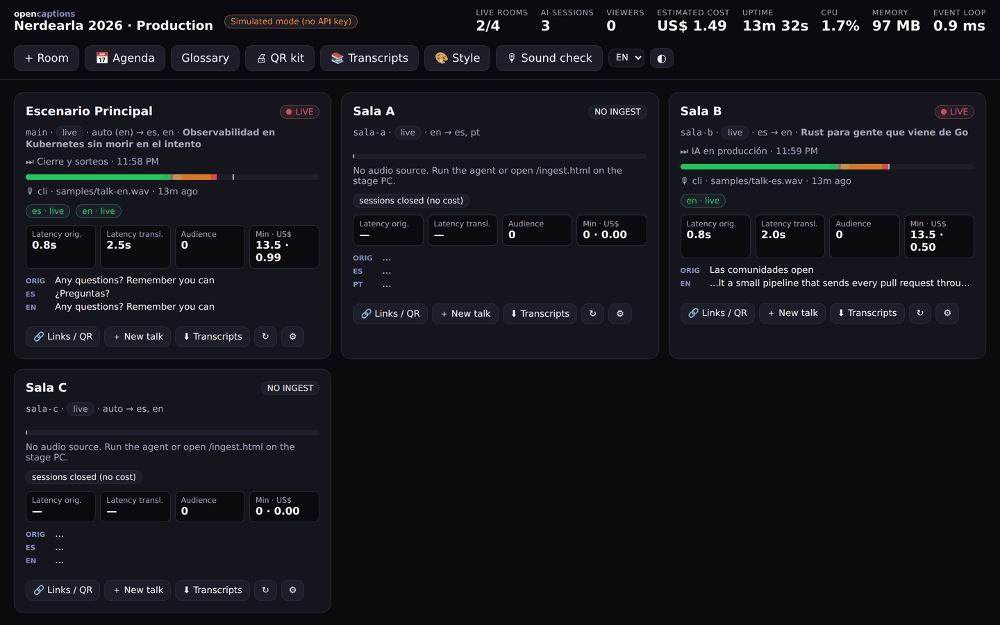
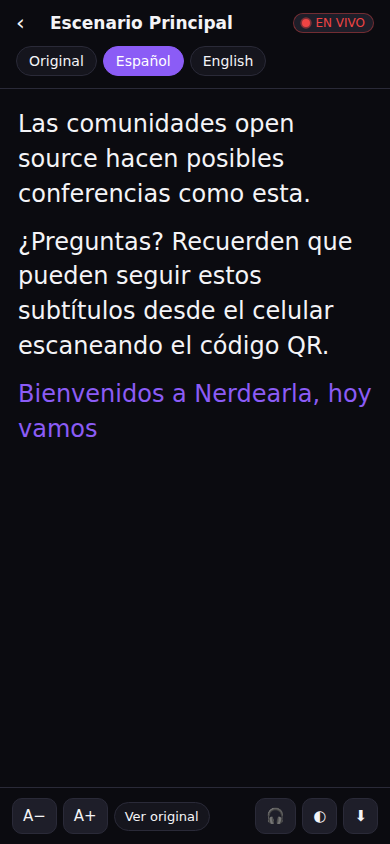
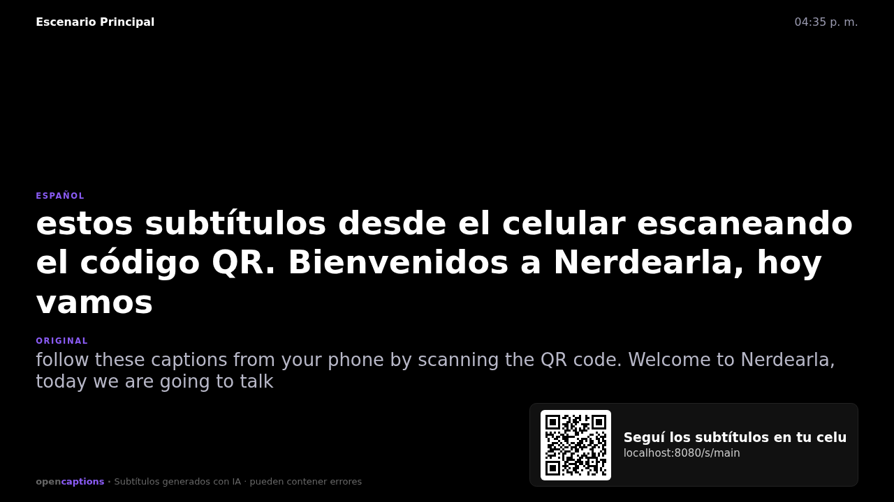
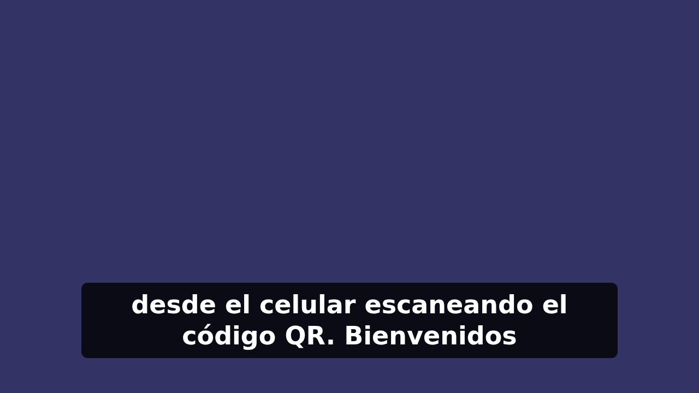
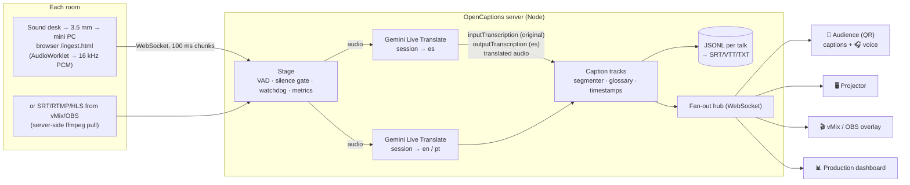

# OpenCaptions 🎙️→📝

**Open-source live captions & translation for multi-stage conferences.**
Built for the [Nerdearla 2026 Vibeathon](https://nerdearla.devpost.com/) on top of **Gemini 3.5 Live Translate**.

> 🇦🇷 *Subtítulos y traducción simultánea en vivo, open source, para conferencias con muchas salas en paralelo. El audio entra por el mismo browser de la mini PC que usan hoy, el público elige sala e idioma desde el celular (QR), el proyector muestra los subtítulos y vMix/OBS los "planchan" en el stream. Un panel de producción muestra estado, latencia, errores y costo de cada sala.* — [Resumen en español ↓](#-resumen-en-español)



| Audience (phone) | Stage screen / projector | vMix / OBS overlay |
|---|---|---|
|  |  |  |

---

## What it does

- **Live audio in** from any source: a **headless stage agent** (`scripts/agent.js`, runs as a systemd/launchd/Windows service, no browser) capturing the sound card, a **server-side pull** of the SRT / RTMP / HLS stream vMix/OBS already produce (no hardware per room), a browser page on the stage PC (quick setup), a tab/screen share, or an audio file.
- **Real-time captions** in the original language **and translations** (EN→ES, ES→EN, PT, and any of Gemini's 70+ languages), with one Live session per room plus fast sentence-level text translation with live provisional updates (so N languages don't multiply cost or lag). Source language is auto-detected (or pinned per room).
- **Many rooms in parallel**: one Node process runs N stages × M languages; tested with 10 simultaneous stages / 20 model sessions on a laptop.
- **Audience view**: mobile web page (via QR) to pick room + language, adjustable font, light/dark, auto-scroll with "back to live", dual view (translation + original), transcript download, and **🎧 listen mode: the translated *voice* streamed to your phone** (Gemini already generates it — we just don't throw it away).
- **Stage screen**: full-screen, high-contrast captions for the projector, translation + original, with a QR to follow on the phone.
- **Broadcast overlay** for **vMix** (*Web Browser* input) and **OBS** (*Browser Source*): transparent background (or chroma green) — burns captions into the stream so virtual attendees get live translation too.
- **Visual caption style editor** (`/style.html`): font (incl. Atkinson Hyperlegible), weight, size, colors, box/outline/shadow, opacity, position, lines, uppercase, presets — live preview at 1920×1080, outputs the URL for vMix/OBS or the projector.
- **Enterprise-ready options**: Google Cloud **Vertex AI** backend (ISO 27001/SOC 2-covered, regional), no audio ever stored, `STORE_TRANSCRIPTS=false` / `RETENTION_DAYS`, token-protected ingest & admin, TLS. See [docs/SECURITY.md](docs/SECURITY.md).
- **Production dashboard**: per-room status, live audio meter, model session health, reconnections, latency (speech→caption and speech→translation), viewers, audio minutes, **estimated cost**, alerts (*no audio*, *mic muted?*, *high latency*, *reconnecting*) and an event log. Add/edit rooms, set talk titles, start a new talk, restart sessions — all without restarting the server.
- **Technical glossary**: vocabulary biasing sent to the speech recognizer + deterministic post-fixes (e.g. *"cubernetes" → Kubernetes*, *"de guardia" → on-call*) that hot-reload while the event runs.
- **Transcript export** per talk in **SRT / VTT / TXT / JSON**, persisted to disk as it happens.
- **Zero-operator operation**: once a room's ingest is running it needs nobody. Silence gating stops streaming to the model after 30 s of silence (no cost between talks), resumes instantly (with 600 ms pre-roll) when someone speaks, closes sessions after 5 min idle, and starts a new transcript for the next talk. A watchdog restarts a session that goes quiet while people are talking.
- **Resilient**: automatic session resumption across Gemini's ~10-min connection lifetime (GoAway), reconnection with backoff, audio buffering during reconnects (nothing is lost), and automatic fallback if the model rejects optional config fields.
- **Offline mock engine** to develop, demo and load-test the whole pipeline without an API key.

## Quick start (2 minutes)

Requirements: **Node.js ≥ 20**. That's it — the bundled 16 kHz WAV samples are read natively, and for any other format/stream an ffmpeg binary is installed automatically via `ffmpeg-static` (a system `ffmpeg` or `$FFMPEG_PATH` is used if present).

```bash
git clone <this repo> opencaptions && cd opencaptions
npm install
cp .env.example .env          # put your GEMINI_API_KEY (free: https://aistudio.google.com/apikey)
npm run check                 # 25-second end-to-end test of your key with samples/talk-en.wav
npm start                     # → http://localhost:8080
```

Now feed audio to two rooms at once (the MVP "two simultaneous sessions" requirement):

```bash
npm run feed -- --stage main   --input samples/talk-en.wav     # English talk → ES captions
npm run feed -- --stage sala-b --input samples/talk-es.wav     # Spanish talk → EN captions
```

Open:

| URL | For |
|---|---|
| `http://localhost:8080/` | Audience: pick a room & language |
| `http://localhost:8080/admin.html` | Production dashboard |
| `http://localhost:8080/ingest.html` | Stage ingest (mic / tab / file / bundled samples) |
| `http://localhost:8080/screen.html?stage=main` | Projector screen |
| `http://localhost:8080/overlay.html?stage=main&lang=es` | vMix / OBS overlay |
| `http://localhost:8080/style.html` | **Caption style editor** for overlay & projector |
| `http://localhost:8080/demo.html?mode=mic` | **Live microphone demo / sound check**: speak and see original + translation big on screen, with level meter and latency |
| `http://localhost:8080/demo.html?v=<youtube-url>` | **Play-along demo**: plays a YouTube talk in the browser while the server captions the same audio in real time (needs `yt-dlp`) — compare speech vs captions, record demos |

No API key? `npm run mock` runs everything with simulated captions (great for UI work and load tests).

**Real talks as test audio:** `./scripts/fetch-samples.sh <youtube-url> my-talk 300 180` (needs `yt-dlp`), or feed YouTube directly: `npm run feed -- --stage main --youtube <url> --start 300`. In the browser you can also choose *Ingest → "Pestaña o pantalla"* and share a tab playing any Nerdearla talk.

## How it works



**Why Gemini 3.5 Live Translate?** A single streaming session gives us, at the same time: the transcription of what the speaker says (`inputAudioTranscription`, with the detected language), a translation (`outputAudioTranscription`) and translated *speech* — with automatic source-language detection.

**What we learned testing it on real audio:** transcription streams steadily ~2–4 s behind the speaker, but *speech-to-speech* translation is generated at speaking pace, so on fast or dense talks the translated captions can drift further and further behind. So OpenCaptions supports three **caption translation modes** (global `TRANSLATION_MODE`, or per room from the dashboard):

| Mode | Live sessions per room | Where translated captions come from | Translated voice 🎧 |
|---|---|---|---|
| **`text`** (default) | **1** | **Gemini 3.5 Flash-Lite** translates each finished sentence (with context + glossary) and shows a provisional translation of the sentence in progress, refreshed every ~1.5 s → lag stays bounded (≈ transcription + one short request) | first target language |
| `live` | 1 per language | Live Translate's own speech translation | every language |
| `hybrid` | 1 per language | text, as in `text` | every language |

Text translation is rate-limit aware: a server-wide budget (`MT_RPM`), per-request timeouts and back-off on 429s; provisional updates are sacrificed first, and if a language is throttled the room **automatically falls back to Live Translate's own captions** for that language (the primary Live session already produces them), then switches back when quota recovers. Captions never freeze and never show text in the wrong language.

> **Free tier tip:** the free Gemini tier has low per-minute limits for text models. For demos with several rooms set `MT_RPM` to the Flash-Lite limit shown in AI Studio (e.g. `MT_RPM=14`) or `MT_PARTIAL_MS=3000`; for a real event enable billing (paid-tier data is also not used to train Google's models).

In every mode, when the speaker already talks in a caption language (e.g. a Spanish talk, Spanish captions) the transcription is passed through as-is — nothing is translated twice or parroted.

**Room config** (`config/event.json`): `source` pins the talk language (`"en"`, `"es"`…) or `"auto"`; `targets` lists caption languages. Viewers always also get *Original*.

### Latency

Measured continuously per room and shown on the dashboard: *speech onset → first caption* and *speech onset → first translated words*. The model streams while the speaker talks (it doesn't wait for sentence end), captions are pushed to viewers as partials and finalized on punctuation / pauses. The server itself only relays audio and short text messages, so end-to-end latency is dominated by the model (Google describes it as staying "a few seconds behind the speaker"). Audio is sent in 100 ms chunks, as the Live API recommends.

## Running it at an event (Nerdearla-style)

> 📋 Full step-by-step runbook (in Spanish, for the production team): **[docs/EVENT-DAY.md](docs/EVENT-DAY.md)** — HTTPS setup, per-room checklist, sound check, what each dashboard alert means, plan B.


Today, at Nerdearla, each stage's sound desk goes via a 3.5 mm cable into a mini PC, where a browser captures the input and shows the captions on the stage screens. OpenCaptions keeps exactly that setup:

1. **Server**: run it once for the whole event (a small VM is enough): `docker compose up -d` with your `.env`. Put it behind **HTTPS** — required, because browsers only allow microphone capture on `localhost` or `https://` (Cloudflare Tunnel, Caddy, or built-in TLS with `HTTPS_CERT`/`HTTPS_KEY`) — and set `PUBLIC_URL`, `INGEST_TOKEN`, `ADMIN_TOKEN`.
2. **Audio per room** — pick one: **(a)** set the room's *pull* to the SRT/RTMP/HLS stream vMix/OBS already outputs (no hardware); **(b)** run the **headless agent** on the stage PC as a service: `node scripts/agent.js --stage <id> --device <n> --server wss://<server> --token <INGEST_TOKEN>` (see `deploy/` for systemd/launchd); or **(c)** open `https://<server>/ingest.html?stage=<id>&token=<INGEST_TOKEN>` in Chrome, choose the audio input, tick *Auto-iniciar*, click **Start**. Open *"Abrir pantalla para proyector"* on the second screen (it replaces today's SaaS window). For unattended kiosks launch Chrome with `--autoplay-policy=no-user-gesture-required --use-fake-ui-for-media-stream` and the `?autostart=1` URL.
3. **Audience**: print the per-room QR from *Dashboard → Links / QR* (it points to `/s/<room>`); it is also shown on the projector.
4. **Streaming (vMix)**: add a *Web Browser* input with `https://<server>/overlay.html?stage=<id>&lang=es` at 1920×1080 and put it as an overlay on the program output (OBS: *Browser Source*, same URL). Different stream per language → different overlay URL. Use `&bg=%2300ff00` if you prefer chroma key.
5. **Production team**: keep `/admin.html` open. Everything is visible at a glance; there is nothing to click during a talk. Use *＋ Nueva charla* to title talks (for nicer transcript files) — optional, talks are split automatically after breaks.
6. **After the talk**: *Transcripciones* → SRT/VTT for the YouTube upload, TXT for the blog / accessibility archive.

Alternatively, if the program audio already exists as a stream (vMix SRT output, Icecast, HLS), set `pull` on the room (dashboard ⚙︎ or config) and no ingest PC is needed.

## Scaling

- **Per room cost is linear and predictable**: one model session per target language. Rooms are independent; there's no shared state between them.
- **One process handles many rooms**: the server only relays ~32 KB/s of audio per room and fans out small JSON messages to viewers. Load test: `npm run loadtest -- --stages 10 --input samples/talk-en.wav` (10 rooms, 20 sessions: ~90 MB RSS).
- **Real-talk latency test**: `npm run multi -- --rooms 15 --minutes 5` opens 15 rooms, feeds each one a different Nerdearla 2025 talk from YouTube (server-side yt-dlp, real time), prints live p50/p90 latency per room and writes a JSON report to `data/latency-*.json`. `--playlist <url>` or `--file urls.txt` to choose the videos, `--list` for a dry run, `--cleanup` to delete the rooms afterwards.
- **More rooms than one process/API project can handle**: shard by room — run N instances with `STAGES=...` (and if needed a different `GEMINI_API_KEY`/project each, to spread Live API concurrency quotas) behind a reverse proxy that routes `/ws/*?stage=X` and `/s/X`. Captions are per-room, so no pub/sub is needed.
- **Viewers**: each viewer is one lightweight WebSocket receiving small JSON messages. For very large audiences, put a WebSocket fan-out gateway in front — the viewer protocol is tiny (see below).
- **Check your quotas**: Live API concurrent sessions depend on your Gemini tier; see AI Studio → rate limits.

### Cost (Gemini 3.5 Live Translate, paid tier, Sept 2026 pricing)

Live Translate is billed on streamed audio: ≈ **US$ 0.037 per session-minute** (input $0.0053/min + output $0.0315/min) → ≈ **US$ 2.2 per session-hour**. Text translation with Flash-Lite ($0.30 / 1M input, $2.50 / 1M output tokens) adds roughly **US$ 0.4–0.6 per talk-hour per language** (mostly the provisional re-translations; raise `MT_PARTIAL_MS` to cut it). The dashboard's cost estimate includes both.

| Scenario (default `text` mode) | Live sessions | ~Cost |
|---|---|---|
| One 40-min English talk → Spanish | 1 | ≈ US$ 1.8 |
| **Nerdearla: 30 English talks × 40 min → Spanish** | 1 each | **≈ US$ 55 total** |
| 10 rooms × 8 h, captions in ES + EN + PT | 10 | ≈ US$ 250 (less with silence gating) |
| Same, `hybrid` (translated voice in all 3 languages) | 30 | ≈ US$ 600 |

Silence gating means breaks, setup time and Q&A pauses aren't billed. The dashboard shows the running estimate per room. The free tier is enough to develop and test.

## Configuration

`config/event.json`:

```jsonc
{
  "eventName": "Nerdearla 2026",
  "languages": { "es": "Español", "en": "English", "pt": "Português" }, // what the UI offers
  "defaultTargets": ["es", "en"],
  "stages": [
    { "id": "main", "name": "Escenario Principal", "source": "auto", "targets": ["es", "en"] },
    { "id": "sala-a", "name": "Sala A", "source": "en", "targets": ["es", "pt"] },
    { "id": "sala-b", "name": "Sala B", "source": "es", "targets": ["en"],
      "pull": "srt://0.0.0.0:9001?mode=listener" }   // optional server-side ingest
  ]
}
```

Rooms edited from the dashboard are saved to `data/stages.json`. Environment variables: see [`.env.example`](.env.example).

`config/glossary.json` — `vocabulary` (biases recognition: product names, speakers, sponsors) and `replacements` (`{ "from": "cubernetes|kubernete", "to": "Kubernetes", "lang": "orig" }`). Editable live from the dashboard (*Glosario*).

## Interfaces

**Ingest** — `ws://host/ws/ingest?stage=<id>&token=<INGEST_TOKEN>`: send binary frames of PCM16LE mono 16 kHz (any size; 100 ms recommended). Server replies with JSON `status` messages (level, sessions, caption preview). Anything that can produce PCM can be a source (`scripts/feed.js` is 60 lines).

**Viewer** — `ws://host/ws/view?stage=<id>&langs=es,orig&audio=es`: receives `hello` (room info, language map, history) then `caption` messages `{ id, channel, text, final, start, end }` and, if `audio` is set, binary PCM16 24 kHz translated speech.

**HTTP** — `GET /api/event`, `GET /api/status` (admin), `POST/PATCH/DELETE /api/stages[/:id]`, `POST /api/stages/:id/talk`, `GET /api/stages/:id/talks`, `GET /api/stages/:id/export.{srt|vtt|txt|json}?lang=es&talk=<id>`, `GET/PUT /api/glossary`, `GET /api/qr.svg?text=`, `GET /metrics` (Prometheus), `GET /healthz`.

## Project layout

```
src/server.js          HTTP API, static UIs, WebSocket endpoints
src/stage.js           room: audio fan-out, VAD/silence gate, watchdog, latency & cost metrics
src/engines/gemini.js  Gemini Live Translate session: resumption, reconnect, buffering, config fallback
src/engines/mock.js    offline simulated engine
src/captions.js        fragment → caption segmentation (partial/final, timestamps)
src/glossary.js        vocabulary + hot-reloaded replacements
src/store.js           per-talk JSONL + SRT/VTT/TXT export
src/pull.js            ffmpeg pull ingest
public/                audience, screen, overlay, ingest and admin pages (vanilla JS, no build)
scripts/               feed, loadtest, multi-youtube, agent, check-gemini, fetch-samples
```

Engines implement a tiny interface (`start`, `sendAudio`, `endAudio`, `stop`, events `input`/`output`/`audio`), so a fully local engine (e.g. Gemma / Whisper-based) can be plugged in for events without internet.

## Security & compliance

Self-hosted, no audio stored, optional transcript storage with retention, and a Vertex AI backend for organizations that need ISO 27001 / SOC 2-covered processing. Details and recommended enterprise deployment: **[docs/SECURITY.md](docs/SECURITY.md)**.

## Known limitations

- Live Translate is a preview model; behaviour and quotas may change.
- Translation quality for heavy accents / fast code-switching depends on the model. Pin `source` per room when you know the talk language (it's also cheaper).
- Speaker diarization is not shown yet.

## 🇦🇷 Resumen en español

**OpenCaptions** es una solución open source (MIT) de transcripción y traducción simultánea para conferencias con muchas salas en paralelo:

- **Ingesta sin cambiar el setup actual**: la mini PC del escenario abre `/ingest.html` en el browser y toma la placa de audio (3.5 mm) como hoy. También acepta pestañas/streams, archivos o un pull SRT/RTMP/HLS desde vMix/OBS.
- **Una sesión de Gemini 3.5 Live Translate por idioma destino** entrega a la vez la transcripción original, la traducción y la voz traducida.
- **Público**: QR → elige sala e idioma en el celu; puede **escuchar la traducción con auriculares**. **Proyector** con subtítulos grandes + QR. **Overlay para vMix/OBS** para quemar los subtítulos en el stream (traducción en vivo para la audiencia virtual).
- **Panel de producción**: estado, vúmetro, latencia, reconexiones, espectadores, costo estimado y alertas por sala; alta/edición de salas y glosario en caliente.
- **Sin operador**: pausa sola en silencio (no se paga), retoma cuando alguien habla, separa charlas automáticamente, se reconecta sola.
- **Exporta** SRT/VTT/TXT por charla. **Escala** linealmente por sala (≈ US$ 2,2 por hora de sesión); 30 charlas en inglés ≈ US$ 55.

`npm install && cp .env.example .env && npm start` — ver [Quick start](#quick-start-2-minutes).

## License

[MIT](LICENSE). Made during the Nerdearla 2026 Vibeathon (Sept 24–25, 2026).
