<div align="center">

<picture>
  <source media="(prefers-color-scheme: dark)" srcset="docs/images/logo-lockup-dark.png" />
  
</picture>

### Every talk, understood by everyone.

Live captions and translation for conferences, classrooms, town halls and any event with a microphone.<br>
On every phone, on the big screen and in your livestream. Free and open source.

[](https://github.com/carraroesteban/opencaptions/releases/latest)
[](https://github.com/carraroesteban/opencaptions/actions/workflows/ci.yml)
[](LICENSE)
[](docs/requirements.md)
[](#install)

**[Website](https://opencaptions.kvza.ar)** · [30-second demo](https://opencaptions.kvza.ar/#screens) · [Quick start](#quick-start) · [Features](#features) · [Pricing](#what-it-costs) · [Docs](#documentation) · [En español](#en-español)

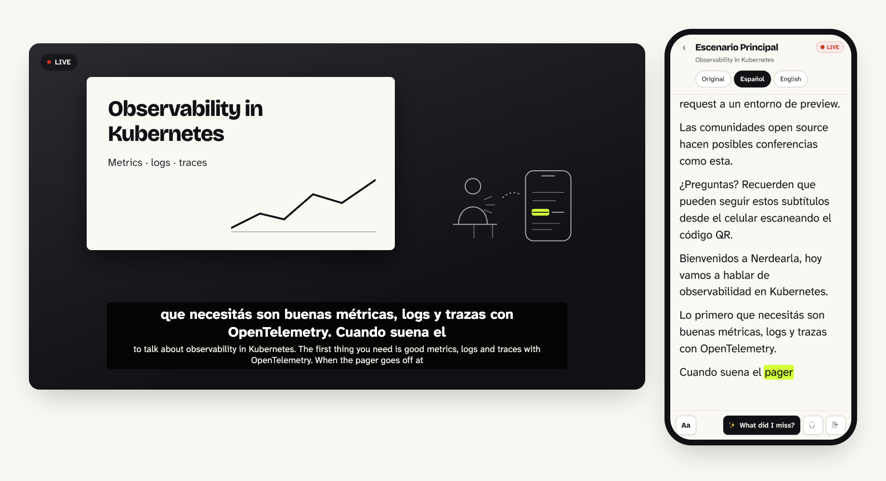

</div>

---

Someone speaks into a microphone. A few seconds later, everyone in the room can read it **in their own language**: on their phone, on the screen next to the stage, and in the livestream. People who arrive late catch up with one tap. When the session ends, the full transcript is ready to read, search and share.

OpenCaptions is the complete toolkit for doing that at a real event. It is free, it runs on your own server, and it needs no app, no accounts and no per-seat licences.

## Why OpenCaptions

**Inclusive by design.** Captions help people who are deaf or hard of hearing, people listening in a second language, and anyone in a noisy room. Attendees choose their language, text size, a high-legibility font and light or dark mode.

**Effortless on the day.** Rooms run without an operator. They pause during silence, resume when someone speaks and pick up talk titles from your agenda. One dashboard shows every room's audio, delay, audience and cost, and raises an alert if something needs attention.

**Every screen covered.** The audience reads on their phones after scanning a QR code. The presenter screen shows large captions next to the speaker. A transparent overlay drops into OBS or vMix for the livestream.

**Yours to own.** MIT-licensed and self-hosted, with no lock-in and no tracking. Use Google Gemini for the best quality, or run everything on your own hardware so that no audio leaves the building.

## Also just for you

Not running an event? Choose **Just for me** the first time you open the app, and OpenCaptions captions whatever you're listening to on your own computer: a video call in another language, a class, a video, or the conversation around you. Translated into your language if you like, in big text and in a small window that floats over everything. Nothing is shared with anyone. [How it works](docs/personal.md).

## Made for every kind of event

<p align="center">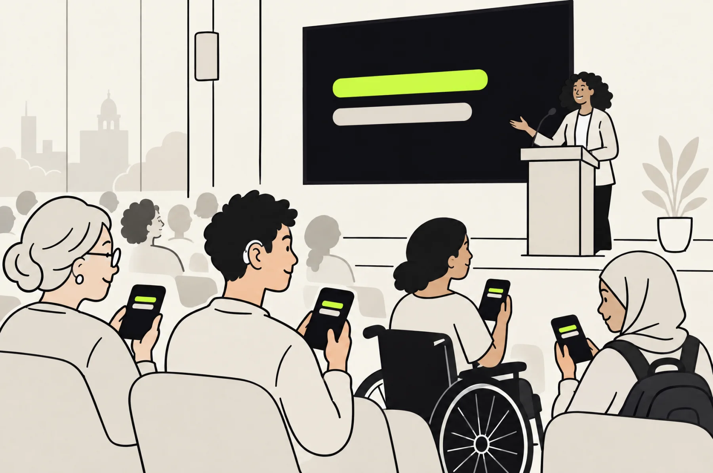</p>

Conferences and summits · universities and schools · places of worship · town halls and public meetings · company all-hands · festivals and cultural events · trade shows · hybrid and livestreamed events.

## Features

<table>
<tr>
<td width="33%" valign="top">

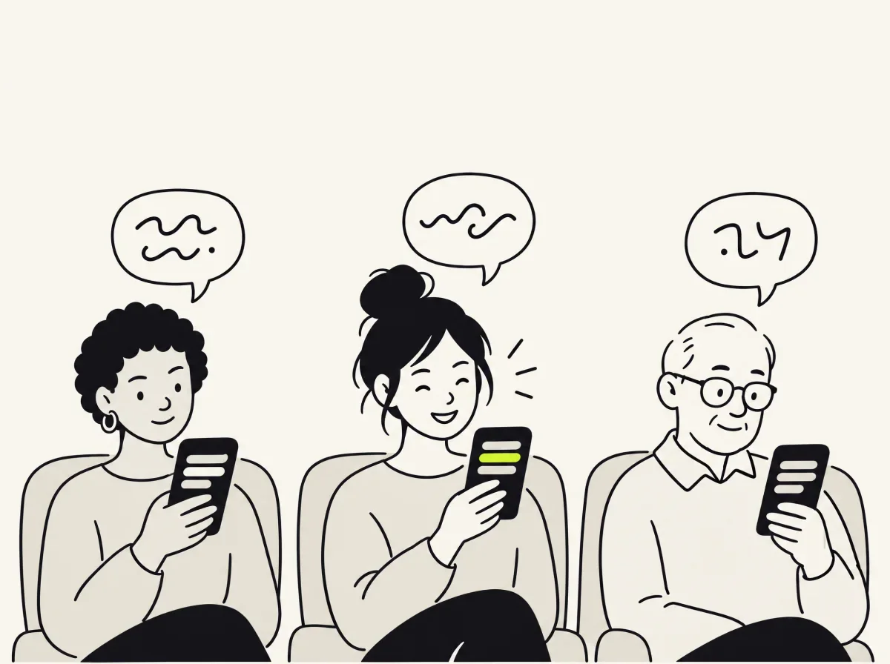

**For your audience**

- **Captions on any phone.** Scan the room's QR code and pick a language. No app, no sign-up.
- **Smooth to read:** words appear at the speaker's pace and lines roll up like TV captions, on phones, the presenter screen, the overlay and the floating window. Nothing jumps or re-wraps.
- **Listen in any language:** the translation read aloud in headphones, in the AI's natural voice or the phone's own voice, in any of 82 languages.
- **What did I miss?** A summary of the last five minutes, or the whole session, in the reader's language.
- **Ask the talk.** Questions answered only from what was said, with quotes and timestamps.
- **Transcripts** to read, search, print and download (TXT, SRT, VTT).
- **Who's speaking:** the crew taps the speaker's name (from the agenda, the host or Q&A) and captions, transcripts and exports say who said what.
- **Accessibility settings:** text size, high-legibility fonts, line spacing, light and dark themes, floating captions and translated audio in headphones.

</td>
<td width="33%" valign="top">


**For the stage and the stream**

- **Presenter screen** with full-screen captions and the room's QR code.
- **Livestream overlay** for OBS and vMix, transparent or chroma key, in one or two languages.
- **Breaks and music:** a break in the agenda, a break scene in vMix or OBS, or the B key on the room's computer pauses the captions; screens and phones show when the talk resumes and what's next. Music between talks is recognized and not captioned (♪ on the overlay).
- **Visual style editor** for fonts, colors and layout. It builds the URL for you.
- **Multilingual speakers.** When a host switches language mid-sentence, every caption language follows.
- **Any audio source:** the sound desk through a PC, a browser tab, or OBS/vMix streaming straight to the server (RTMP, SRT, HLS).
- **Captions in Zoom, YouTube Live and Microsoft Teams:** paste the meeting's or stream's caption link and the room's captions, in any language, appear inside it. Webhooks send them anywhere else.

</td>
<td width="33%" valign="top">

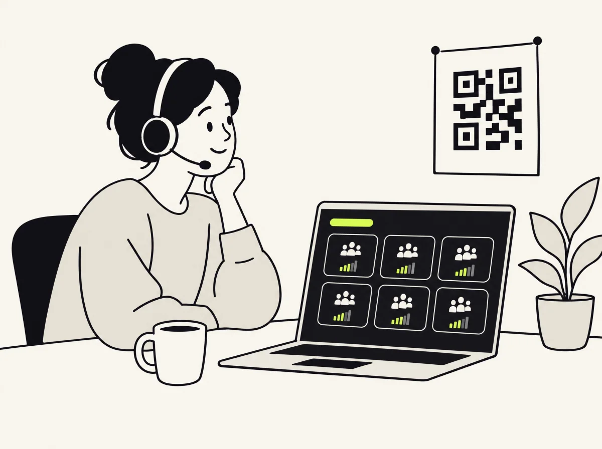

**For organizers**

- **Guided setup:** the first time you open the dashboard, a short illustrated wizard asks for the event name, rooms and languages. Skip anything you're not sure about.
- **Production dashboard** with every room's status, audio level, delay, audience, cost and alerts, plus a floating mini-dashboard. It warns when a talk runs over and starts the next one in one click.
- **Safe on event day:** Event mode locks the setup while you're live, every change can be undone from History, and deleted rooms come back from the trash.
- **Agenda import** from Swapcard, Sessionize or any spreadsheet: titles and speaker names appear automatically.
- **Printable QR posters** for every room, in one click.
- **Glossary** so names, brands and specialist terms are spelled right.
- **Fix a caption live:** the crew corrects a misheard word from the dashboard and it changes on every screen and phone; one click adds it to the glossary. Admins can clean up any transcript afterwards.
- **Backup audio:** a second computer (or another output of the sound desk) stands by for each room and takes over by itself if the main one stops or goes silent.
- **Offline backup:** if the venue loses internet, captions switch to AI running on your laptop and come back to the cloud on their own.
- **Agenda from Sessionize or a calendar link** (Google, Outlook): talks get their titles and speakers by themselves.
- **Alerts on your phone** through ntfy, Telegram, Slack, Discord or a webhook, when a room loses its sound, the AI keeps failing, a talk runs over or the internet drops.
- **Event report:** every talk with its length, words, audience and AI cost, printable or as a spreadsheet.
- **Secure by default:** signed-in sessions, a crew role for volunteers, optional two-factor or company sign-in, and no inbound ports needed.

</td>
</tr>
</table>

## Screenshots

| Production dashboard | On the audience's phone | Transcript, search and summary |
|---|---|---|
| 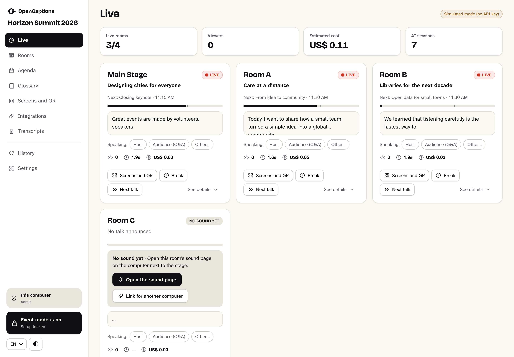 | 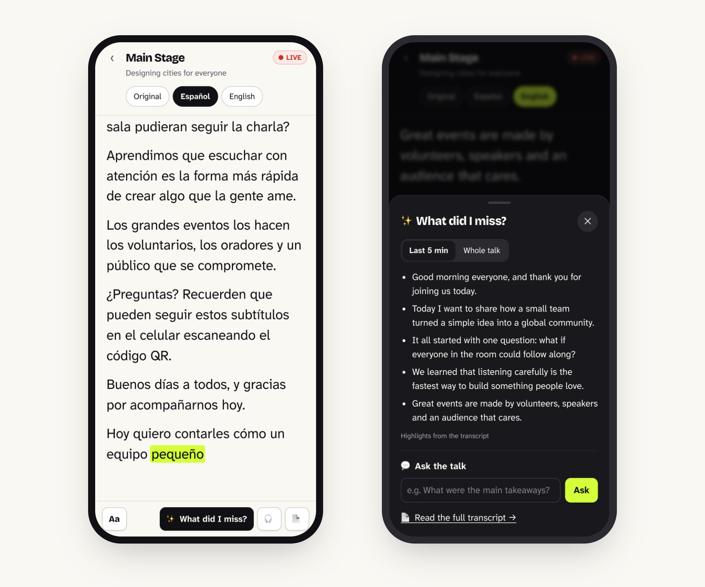 | 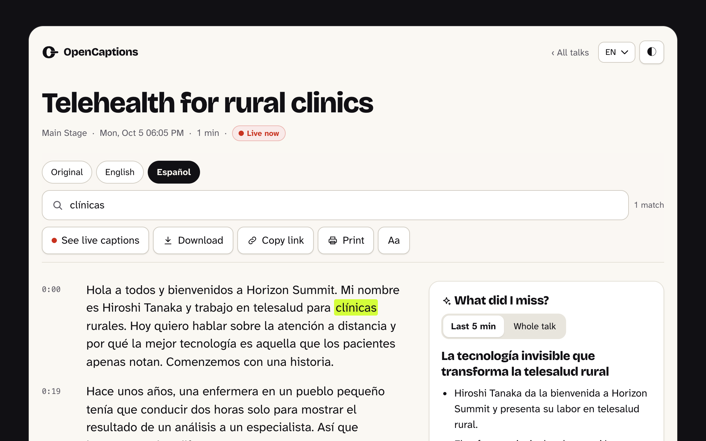 |
| **Presenter screen** | **QR poster** | **Caption style editor** |
| 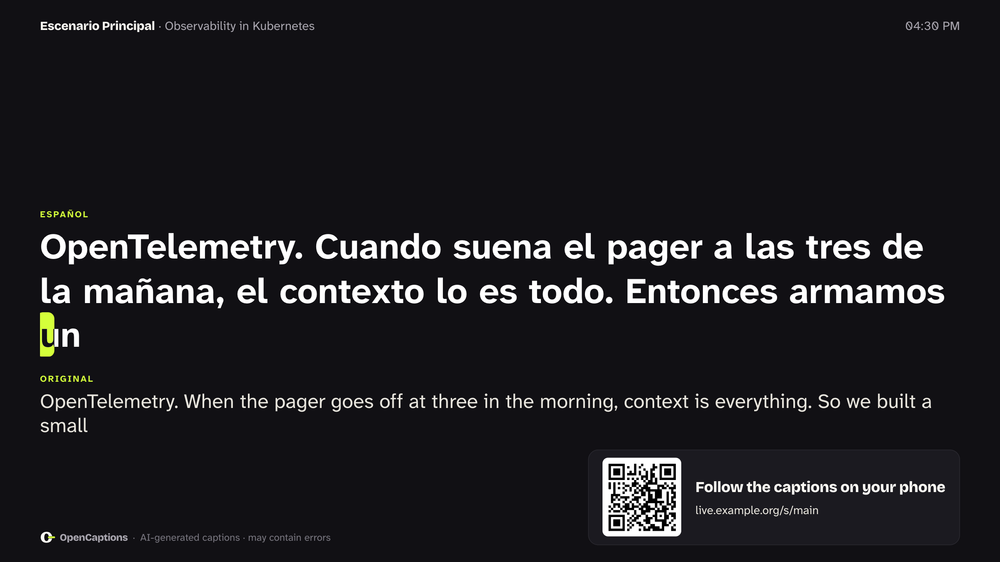 | 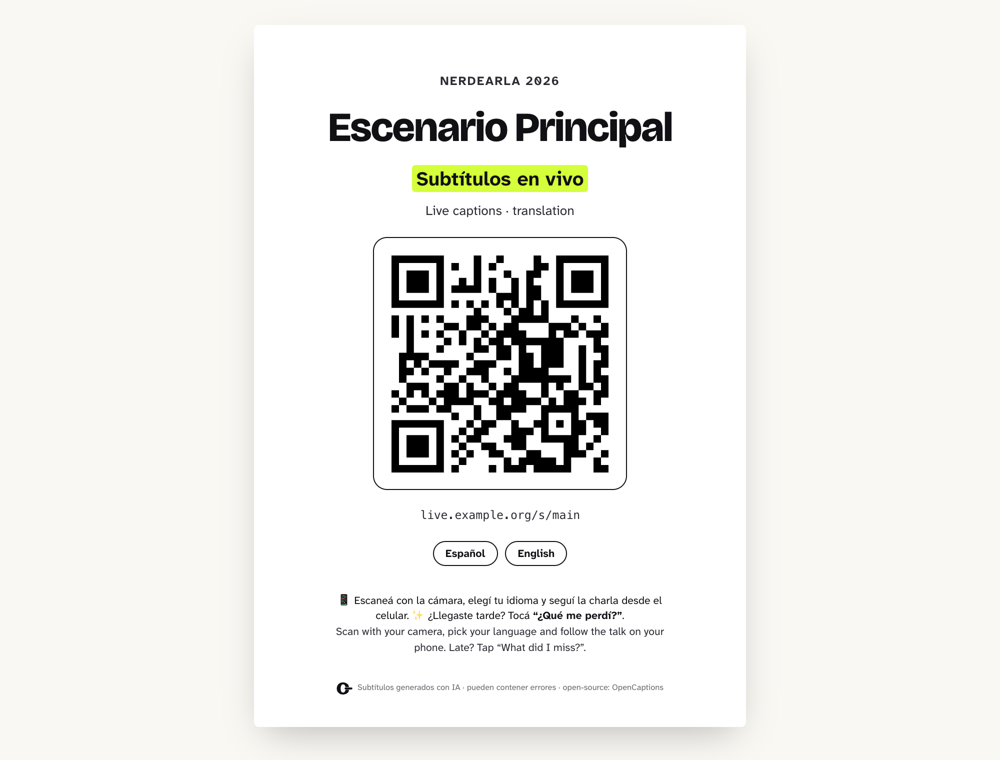 | 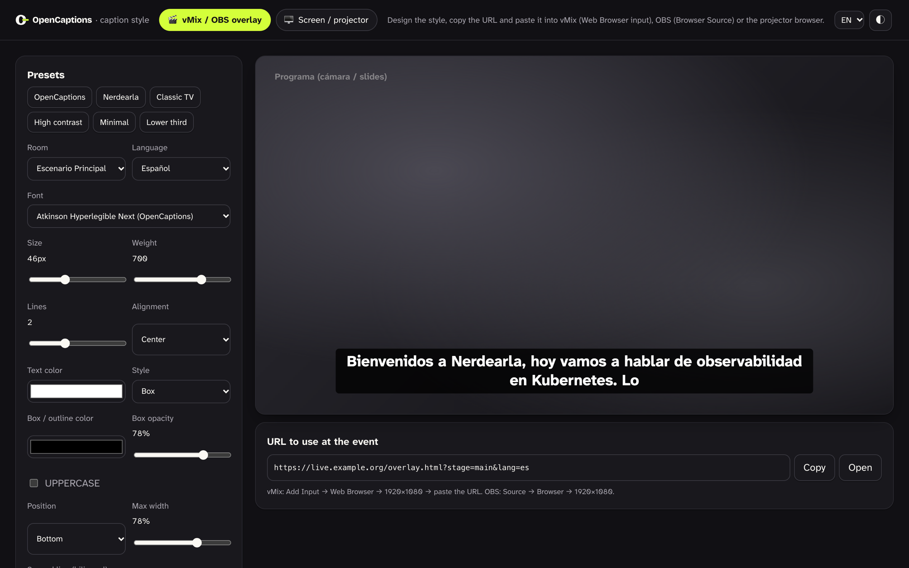 |

<sub>Shown in demo mode, which uses the same interface with simulated captions.</sub>

## Quick start

### Without the terminal

1. Install **Node.js** (the LTS version) from [nodejs.org](https://nodejs.org/en/download). It's free.
2. Download **[OpenCaptions for Mac](https://github.com/carraroesteban/opencaptions/releases/latest/download/OpenCaptions-mac.zip)** or **[OpenCaptions for Windows](https://github.com/carraroesteban/opencaptions/releases/latest/download/OpenCaptions-windows.zip)**.
3. **Mac:** unzip it, drag **OpenCaptions** to Applications and open it. **Windows:** extract the ZIP and double-click **Start OpenCaptions**.

The first time, it installs what it needs (about a minute), then opens the dashboard in your browser. The welcome wizard asks for the event name, rooms and languages, connects Gemini with your API key, and can create a public HTTPS address for the QR codes with one click. A window shows OpenCaptions running: keep it open during the event, and close it to stop. Your settings and transcripts are kept outside the app, so they survive updates.

<details>
<summary>The computer warns about the app the first time</summary>

The launchers aren't signed with a paid Apple or Microsoft certificate yet, so the first launch asks you to confirm:

- **Mac, "Apple could not verify…":** click **Done**, then open **System Settings → Privacy & Security**, scroll down and click **Open Anyway** next to OpenCaptions. Then allow it to control Terminal (that's the window that shows it running). You only do this once.
- **Windows, "Windows protected your PC":** click **More info → Run anyway**. If an antivirus blocks the launcher, open the `app` folder and double-click `Start OpenCaptions.bat`.

</details>

### In the cloud, in a few minutes

[](https://render.com/deploy?repo=https://github.com/carraroesteban/opencaptions)

A public server with HTTPS and a disk for your data, nothing to install. Fly.io and Railway are ready too: [Cloud platforms](docs/deployment.md#cloud-platforms-render-flyio-railway).

### With Docker, without downloading the code

```bash
docker run -d --pull always --name opencaptions --restart unless-stopped -p 127.0.0.1:8080:8080 -v opencaptions-data:/app/data -v opencaptions-config:/app/config ghcr.io/carraroesteban/opencaptions
```
```bash
docker logs opencaptions | grep "Open the dashboard"
```

The second command prints a link that opens the dashboard already signed in; the wizard does the rest, API key and public address included.

### For developers

See it working in two minutes, **no API key needed** (captions are simulated):

```bash
git clone https://github.com/carraroesteban/opencaptions.git
cd opencaptions
npm install
npm run mock
```

Open <http://localhost:8080>, pick a room, and in a second terminal play a sample talk into it:

```bash
npm run feed -- --stage main --input samples/talk-en.wav
```

Ready for real captions? Get a free API key from [Google AI Studio](https://aistudio.google.com/apikey) and paste it in **Dashboard → Settings**, or from the terminal:

```bash
npm run setup   # event name, rooms, languages and your API key, in about a minute
npm run check   # a 25-second end-to-end test with a sample talk
npm start       # http://localhost:8080
```

Prefer to keep everything on your own machine? [Local mode](docs/local.md) runs speech recognition and translation offline:

```bash
brew install ollama        # Linux: curl -fsSL https://ollama.com/install.sh | sh · Windows: ollama.com/download
npm run local -- --check   # downloads the models once (~4 GB) and tests them
npm run local              # http://localhost:8080
```

Or get the best of both: Gemini as usual, with your laptop ready to take over if the venue's internet goes down:

```bash
npm run local -- --fallback
```

| Screen | Address |
|---|---|
| Audience (the QR code points here) | `/` |
| Production dashboard | `/admin.html` |
| Presenter screen | `/screen.html?stage=main` |
| Livestream overlay | `/overlay.html?stage=main&lang=es` |
| Sound check with your microphone | `/demo.html?mode=mic` |

Every page and endpoint is listed in the [API reference](docs/reference/api.md#static-pages).

## Install

**What you need**

- **One server for the whole event:** a laptop at the venue or a small cloud server, on macOS, Linux or Windows. With Gemini the AI runs in Google's cloud, so one CPU core and 1 GB of RAM are enough for 20 rooms or more.
- **Node.js 20 or later** (the Mac app and Windows launcher tell you if it's missing), or Docker.
- **A Gemini API key** ([AI Studio](https://aistudio.google.com/apikey)) or a Google Cloud project with Vertex AI. In [local mode](docs/local.md) you need no account at all.
- **Outbound internet on port 443.** No inbound ports are needed; the dashboard can create a public HTTPS address through Cloudflare Tunnel.

**Option A: Node.js**

```bash
git clone https://github.com/carraroesteban/opencaptions.git
cd opencaptions
npm install
npm run setup
npm start
```

To keep it running across reboots, use the service files in [`deploy/`](deploy/) (systemd, launchd) or follow [Deployment](docs/deployment.md#systemd-service-linux-without-docker).

**Option B: Docker Compose**

```bash
git clone https://github.com/carraroesteban/opencaptions.git
cd opencaptions
cp .env.example .env     # optional settings; the API key can also be pasted in the dashboard
mkdir -p data            # where transcripts and settings are kept
docker compose up -d --build
docker compose logs opencaptions | grep "Open the dashboard"
```

The last command prints a link that opens the dashboard already signed in. In Docker, even your own browser counts as another device, so the dashboard asks for that password otherwise.

To skip the build, use the published image `ghcr.io/carraroesteban/opencaptions` (see [Quick start](#with-docker-without-downloading-the-code)). Public HTTPS: **Dashboard → Settings → Public address**, or add `--profile tunnel` and a `TUNNEL_TOKEN`. The image runs as a non-root user on a read-only filesystem.

| Platform | Server | Room audio agent |
|---|---|---|
| macOS 13+ (Apple Silicon) | ✅ | ✅ |
| Linux (Debian 12, Ubuntu 22.04+; x86-64, arm64) | ✅ | ✅ |
| Windows 10/11 x64 | ✅ | ✅ |
| Docker (Linux image) | ✅ | — |

Full details: [Requirements](docs/requirements.md).

## Going live

1. **Server.** Run it at the venue or in the cloud. For HTTPS, click **Settings → Public address** (free, through Cloudflare), or put your own HTTPS in front and set `PUBLIC_URL`. [Choosing a setup](docs/deployment.md#choose-a-topology).
2. **Rooms.** The welcome wizard asks for them the first time you open the dashboard. Then paste your agenda and print the QR posters.
3. **Sound.** The wizard's last step shows each way in, on screen: a computer next to the stage opens the room's sound page (from another computer, a one-time link or QR code, with no password to type), OBS or vMix stream to an address it makes for the room, or the small agent runs on the PC connected to the sound desk.
4. **Screens.** Open the presenter screen next to the stage and add the overlay to your stream.
5. **Showtime.** Nothing to press: rooms pause in silence, resume on speech and follow the agenda.

The **[event-day runbook](docs/operations/runbook.md)** has a sound-check list and explains every alert ([en español](docs/operations/event-day.es.md)).

## How it works

<picture>
  <source media="(prefers-color-scheme: dark)" srcset="docs/images/diagrams/how-it-works-dark.png" />
  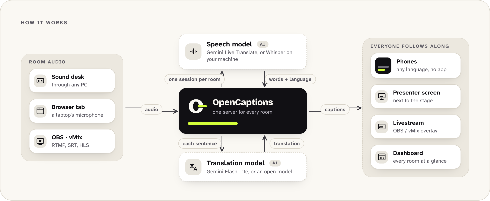
</picture>

<details><summary>Text version of this diagram</summary>

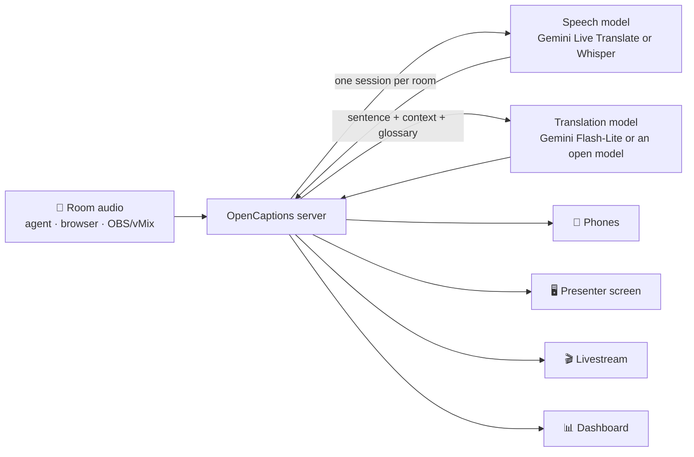
```mermaid
flowchart LR
  A["🎤 Room audio<br/>agent · browser · OBS/vMix"] --> S["OpenCaptions server"]
  S -->|"one session per room"| G["Speech model<br/>Gemini Live Translate or Whisper"]
  G --> S
  S -->|"sentence + context + glossary"| F["Translation model<br/>Gemini Flash-Lite or an open model"]
  F --> S
  S --> P["📱 Phones"]
  S --> R["🖥️ Presenter screen"]
  S --> O["🎬 Livestream"]
  S --> D["📊 Dashboard"]
```

</details>

- A speech model transcribes each room continuously and detects the language being spoken.
- Each sentence is translated with the previous sentences and your glossary as context. A provisional translation updates while the sentence is still being spoken, so captions never wait for a full stop.
- If the speaker is already using a caption language, that text goes straight through and is never translated twice.
- Rooms are independent, so an event grows one room at a time.

Captions typically appear a few seconds after the words are spoken ([where the time goes](docs/latency.md)). Design decisions are recorded in [ADRs](docs/adr/); internals are in [Architecture](docs/architecture.md).

## What it costs

**The software is free.** You only pay for the AI you choose to use.

| | Gemini (cloud) | Local mode |
|---|---|---|
| Price | About **US$ 2.2 per room-hour of speech**, plus US$ 0.4–0.6 per extra language | **Free.** Runs on your own hardware |
| Silence | Never billed | — |
| Best for | Highest accuracy and lowest delay, many rooms | Privacy, no internet, no budget |

For example, a 40-minute talk captioned from English into Spanish costs about **US$ 1.80** with Gemini. A human live captioner typically costs US$ 90–300 per room-hour, for a single language. The dashboard shows a running cost estimate for every room.

## Privacy and security

- **Self-hosted:** transcripts stay on your server. In local mode, audio never leaves the building.
- **Sign-in for the dashboard** with expiring sessions, an admin and a crew role, signed-in devices you can sign out, two-factor codes, and company sign-in (Google, Microsoft, any OpenID Connect provider). The audience pages are read-only.
- **No inbound ports, rate limits and strict security headers** by default. Details in the [security guide](docs/security-guide.md).
- **With Gemini, the room's audio goes to Google.** On the free tier Google may use it to improve its products; for events with personal information, use a paid key or Vertex AI. What organizers should tell speakers and the audience, with a ready-made notice: [Licenses and responsibilities](docs/legal.md).

## Documentation

| I want to… | Read |
|---|---|
| Understand the product | [Overview](docs/overview.md) |
| Run it for the first time | [Getting started](docs/getting-started.md) |
| Check hardware and operating systems | [Requirements](docs/requirements.md) |
| Deploy it for an event | [Deployment](docs/deployment.md) · [Networking](docs/networking.md) · [Security](docs/security-guide.md) |
| Run the event day | [Runbook](docs/operations/runbook.md) · [Troubleshooting](docs/operations/troubleshooting.md) |
| Look up a setting or an endpoint | [Configuration](docs/reference/configuration.md) · [API](docs/reference/api.md) |
| Run it without the cloud | [Local mode](docs/local.md) |
| Send captions to Zoom, YouTube, Teams or a webhook; import the agenda | [Integrations](docs/integrations.md) |
| Caption your own calls, videos and conversations | [Just for me](docs/personal.md) |
| Customize the look | [Brand and design system](docs/brand.md) |
| Change the code | [Architecture](docs/architecture.md) · [Contributing](.github/CONTRIBUTING.md) · [ADRs](docs/adr/) |
| Check licenses and what you must tell people | [Licenses and responsibilities](docs/legal.md) |

## Current limitations

- Gemini Live Translate is a preview model; its behavior and quotas may change.
- Accuracy with strong accents or very rapid language switching depends on the model. The glossary and pinning a room's language help.
- Speakers are labeled by the crew with one tap; voices aren't told apart automatically yet.
- The Mac app and Windows launcher aren't signed yet, so the first launch shows a warning to confirm.
- In local mode a laptop handles about one room, and captions run a few seconds further behind than with Gemini.

## En español

**OpenCaptions** lleva subtítulos y traducción en vivo a cualquier evento: congresos, universidades, iglesias, sesiones públicas, eventos corporativos y festivales. Es gratis, open source (MIT) y corre en tu propio servidor.

- **El público** escanea el QR, elige su idioma y sigue la charla en el celular. Si llegó tarde, toca **¿Qué me perdí?**. Al final, la transcripción queda para leer, buscar y descargar.
- **En el escenario**, una pantalla con subtítulos grandes junto al orador y un overlay para OBS o vMix, en uno o dos idiomas.
- **Para la organización**, un panel con el estado, la demora, el público y el costo de cada sala. Las salas funcionan solas y toman los títulos de la agenda.
- **Costo:** el software es gratis. Con Gemini, unos US$ 2,2 por hora de charla por sala (el silencio no se cobra). En modo local, nada: corre en tu propia compu y el audio no sale del edificio.

Para empezar sin terminal: instalá [Node.js](https://nodejs.org/es/download) y descargá [OpenCaptions para Mac](https://github.com/carraroesteban/opencaptions/releases/latest/download/OpenCaptions-mac.zip) o [para Windows](https://github.com/carraroesteban/opencaptions/releases/latest/download/OpenCaptions-windows.zip). En Mac, arrastrá OpenCaptions a Aplicaciones y abrilo; en Windows, descomprimí el ZIP y hacé doble clic en **Start OpenCaptions**. El asistente pregunta el nombre del evento, las salas y los idiomas, conecta Gemini con tu API key y crea una dirección pública con HTTPS en un clic. Con Docker: `docker run -d -p 127.0.0.1:8080:8080 -v opencaptions-data:/app/data -v opencaptions-config:/app/config ghcr.io/carraroesteban/opencaptions`. Guía para el día del evento: [event-day.es.md](docs/operations/event-day.es.md).

## Contributing

Issues and pull requests are welcome. See [CONTRIBUTING.md](.github/CONTRIBUTING.md) for the development setup, tests and documentation style. Please report vulnerabilities privately: [SECURITY.md](.github/SECURITY.md).

## License

[MIT](LICENSE): free for any event, commercial or not.
