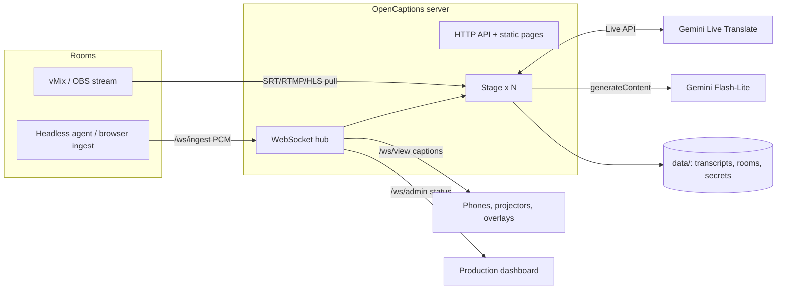
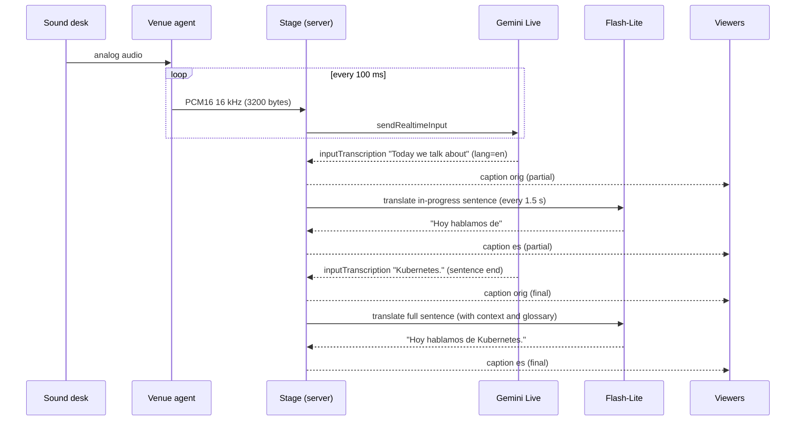
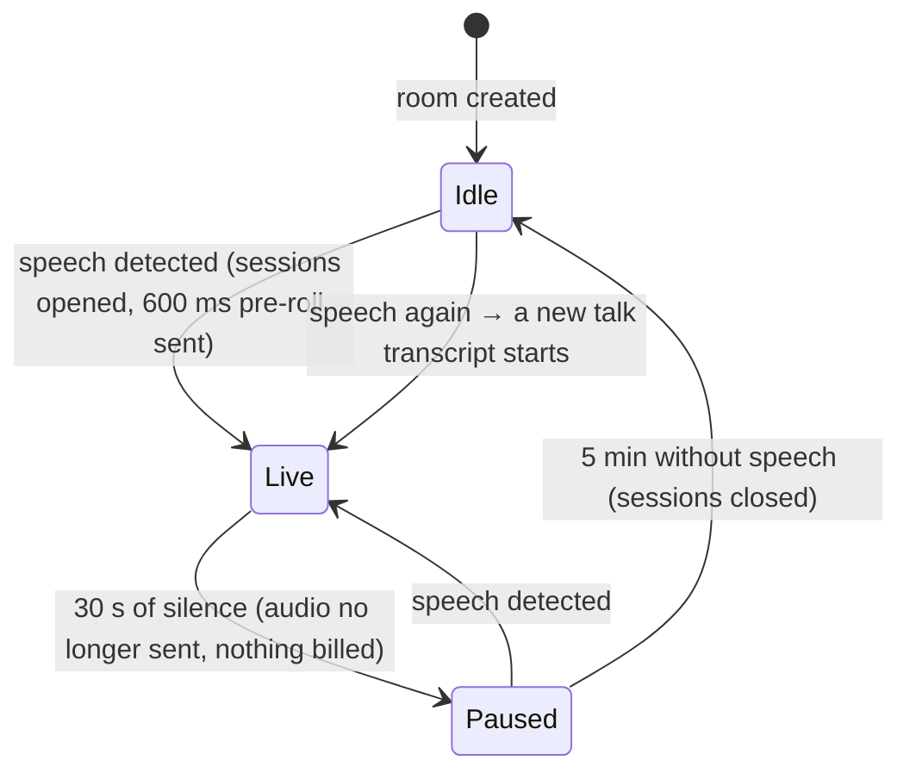

# Architecture

This page describes how OpenCaptions is built, how data moves through it, how it handles failures and how it scales. The reasons behind the main choices are recorded as [architecture decision records](adr/README.md).

## Goals and constraints

| Goal | Consequence for the design |
|---|---|
| Run a whole multi-room conference with no operator per room | Automatic silence gating, session renewal, reconnection, watchdogs and talk splitting |
| Keep latency close to the model's own delay | The server only relays audio. No transcoding, no queues and no database on the hot path. |
| Predictable, low cost | One model session per room. Text translation per sentence instead of one speech session per language. Nothing is billed during silence. |
| Easy to deploy and fork | A single Node.js process, five runtime dependencies, no build step, plain files instead of a database |
| Fit the existing venue setup | Audio from a sound-desk cable into a PC, or from the vMix/OBS stream. Output to projectors, phones and vMix/OBS. |

## System context

## Components

| Module | Responsibility |
|---|---|
| `src/server.js` | Express HTTP API, static pages, WebSocket endpoints (`ingest`, `view`, `admin`), room registry, persistence of rooms edited at runtime |
| `src/security.js` | Authentication (`AUTH`, tokens, localhost trust), security headers, rate limits, WebSocket origin checks, SSRF validation for pulls |
| `src/stage.js` | One room: receives audio, detects speech, gates silence, owns model sessions and caption tracks, measures latency and cost, raises alerts |
| `src/engines/gemini.js` | One Gemini Live Translate session: config fallbacks, session resumption, reconnect with backoff, 12 s audio buffer while reconnecting |
| `src/engines/mock.js` | Offline engine with the same interface, for development and load tests |
| `src/translate.js` | `SentenceTranslator`: sentence-level text translation with provisional partials, a global rate limiter, timeouts, retries and fallback to Live's own translation |
| `src/captions.js` | `CaptionTrack`: turns model fragments into partial/final caption segments with timestamps and line-length limits |
| `src/glossary.js` | Vocabulary hints for recognition and whole-word replacements, hot-reloaded from `config/glossary.json` |
| `src/store.js` | Per-talk JSONL storage, retention purge, SRT/VTT/TXT export |
| `src/pull.js` | Audio sources: native WAV reader, ffmpeg for streams and files, yt-dlp for YouTube, real-time pacing |
| `src/system.js` | Process and host metrics: CPU, memory, event-loop lag |
| `src/assist.js` | Audience assistant: *What did I miss?* summaries and *Ask the talk* answers from the transcript (Gemini Flash-Lite), cached and rate-limited, with an extractive fallback |
| `src/schedule.js` | Agenda: parses CSV/JSON, finds the current and next talk per room; the Stage uses it to name talks automatically |
| `public/` | Vanilla JavaScript pages (audience, projector, overlay, ingest, dashboard, demo, style editor), with no build step |
| `scripts/` | Headless agent, feed, load test, multi-room latency test, Gemini check |

## Data flow for one sentence

Key points:

- **One Live session per room** (in the default `text` mode) produces the original transcription with the detected language.
- **Translation per target language** is a separate, stateless text request per sentence, so adding a language doesn't add a streaming session.
- **Passthrough:** if the speaker already uses a caption language, the transcription is shown as-is for that language.
- **Glossary** replacements are applied to every caption right before it's emitted.

## Room lifecycle

## Failure handling

| Failure | Detection | Recovery |
|---|---|---|
| Gemini ends the connection (about every 10 min, `goAway`) | Server message | Resume with the session handle. Audio is buffered meanwhile, and the old connection's trailing transcriptions are still accepted for 4 s so the words in flight aren't lost. |
| Network drop to Gemini | Socket close or error | Reconnect with exponential backoff. Up to 12 s of audio is buffered and replayed. Network errors keep the full config and the resume handle. |
| Connect hangs (blocked network, no `setupComplete`) | 12 s connect timeout | Retry; the dashboard alerts if a session stays connecting for more than 10 s |
| Model rejects optional config fields | Setup closed with an invalid-argument reason | Retry with a smaller configuration (full → minimal → bare) |
| Session alive but silent while people talk | Watchdog: 20 s of speech without text | Force a fresh session |
| Translation throttled (HTTP 429) or slow | Error or timeout | Back off and retry. Provisional updates are dropped first. The primary language temporarily falls back to Live's own translation. |
| Venue network drop | Agent socket closes, or no server message for 6 s (half-dead connection) | The agent reconnects forever and keeps about 15 s of audio |
| Phone vanishes without closing (Wi-Fi roam, sleep) | No pong to the 25 s ping | The server drops it after about 50 s; slow clients with over 1 MB queued are dropped too. They reconnect and get the history. |
| Malformed input (oversized frame, bad URL, stream that isn't live yet) | Socket/stream error | Logged; the connection or pull is closed or retried, the process keeps serving every other room |
| Talk rollover while a translation is in flight | — | Translators are bound to their talk: the late sentence is stored in the talk it belongs to, never duplicated or moved to the next one |
| Server restart | Clients see the socket close | Pages, projectors and agents reconnect automatically. Rooms are reloaded from config or `data/stages.json`. |

## State and persistence

- **In memory:** rooms, sessions, caption history (last lines per track), metrics. Losing it only loses the last few seconds of live context.
- **On disk (`data/`):** transcripts (`transcripts/<room>/<talk>/`), rooms created at runtime (`stages.json`), generated tokens (`secrets.json`), latency reports.
- **Config (`config/`):** event and rooms (`event.json`), glossary (`glossary.json`, also written by the dashboard).

There is no database. That's deliberate ([ADR 0001](adr/0001-single-process-node-no-database.md)).

## Scaling

- **Per room:** about 32 KB/s of audio in and out, one Live session, a few text requests per minute per language. Server CPU per room is a small fraction of one core.
- **Per process:** dozens of rooms. Tested with 10 rooms and 20 sessions at about 90 MB RSS. The practical ceiling is the Gemini quota for concurrent Live sessions.
- **Horizontal:** shard by room. Each instance gets its own `STAGES` list, and optionally its own API key or project. A reverse proxy routes by the `stage` parameter. Rooms share nothing, so no pub/sub is needed.
- **Audience:** each viewer is one WebSocket that receives small JSON messages. For very large audiences, put a WebSocket-capable CDN or fan-out gateway in front of `/ws/view`.
- **Not supported today:** running two instances for the **same** room (active-active). Use a supervisor with restart (Docker `restart`, systemd) for availability.

## Extension points

- **Engines:** implement `start`, `sendAudio`, `endAudio`, `stop`, `restart` and `status`, and emit `input`, `output`, `audio`, `turn`, `state`, `log` and `error`. `mock.js` is the smallest example. A local engine (Gemma or Whisper-based) for offline events plugs in here.
- **Audio sources:** anything that produces PCM16 mono 16 kHz can send it to `/ws/ingest`. See the [API reference](reference/api.md).
- **Outputs:** the viewer protocol is plain JSON over WebSocket. Overlays and pages are static HTML that you can copy and restyle.

## Quality attributes and how they're verified

| Attribute | How it's checked today |
|---|---|
| Correctness of segmentation, exports and security rules | Unit tests (`npm test`) in CI on Linux, macOS and Windows |
| Latency | Dashboard metrics and `npm run multi` reports |
| Load | `npm run loadtest` (mock engine, many rooms) |
| Real model behaviour | `npm run check`, manual event rehearsals |

There is no automated end-to-end test against the real model, because of cost and quota. See the roadmap in [CONTRIBUTING.md](../CONTRIBUTING.md#roadmap).
