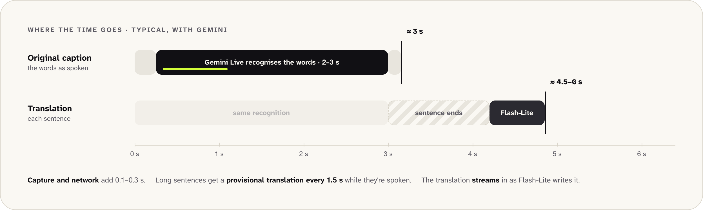

# Brand and design system

How OpenCaptions looks, and where each piece lives. Every page (the app, the overlay and the [website](https://opencaptions.kvza.ar)) uses the same design tokens, so change a colour or font in one place.

## Logo: the "Open O"

An open ring with a caption line coming out of it. The approved files are in [`public/brand/`](../public/brand/). Don't redraw them: the other files there reuse their paths unchanged.

| File | Use |
|---|---|
| `logo-ink.svg` | Light backgrounds: everything in ink. |
| `logo-dark.svg` | Dark backgrounds: paper O, lime line. |
| `logo-original.svg` | The source file as delivered (lime line on paper). Kept for reference; **don't use it on screen**, because lime on paper breaks the colour rule. |
| `mark-ink.svg`, `mark-dark.svg` | The same two, cropped to the artwork. The `.brand` wordmark uses these. |
| `sprite.svg` | The O and the line as symbols, for inline SVG that follows the theme and animates (`.oc-logo`). |
| `icon.svg`, `maskable.svg`, `avatar.svg` | App icon, favicon, maskable icon and avatars: ink O on a lime tile. |
| `icon-192.png`, `icon-512.png`, `maskable-512.png`, `avatar-512.png`, `../favicon.ico`, `../apple-touch-icon.png` | Rasterized from the SVGs above. |
| `og.png` | Link preview (1200×630). |
| `../../docs/images/social-preview.png` | GitHub social preview (1280×640). Upload it in the repository's **Settings → General → Social preview**. |

The wordmark is **OpenCaptions** in Bricolage Grotesque 800.

## Colour

| Token | Value | Role |
|---|---|---|
| `--ink` | `#111014` | Text on light, dark background |
| `--paper` | `#FAF8F3` | Light background, text on dark |
| `--lime` | `#D4FF3A` | Highlight. At most ~10% of any screen |
| `--graphite` | `#2B2A31` | Dark surfaces; translation lines on light |
| `--fog` | `#E8E5DD` | Light surfaces; translation lines on dark |

**The rule:** lime only on ink, or ink on lime. Never lime on paper, and never lime as text on a light background. In the code this means lime is always a *fill* (highlighter, selected pill, primary button in dark mode) with ink on top. When you need an emphasis colour for text or a stroke, use `--accent-fg` (ink in light mode, lime in dark mode).

Translation lines (the second language in the overlay, the original under a translation, the projector's second band) use the muted `--translation` token: Fog on dark, Graphite on light. Never a second accent colour.

An event can set its own highlight colour with `accent` in `config/event.json`. Text on it switches between ink and paper automatically for contrast.

## Type

- **Bricolage Grotesque 800**: headlines and the wordmark (`--font-display`).
- **Atkinson Hyperlegible Next 400/700**: body, UI and captions (`--font`). It's also the default caption font in the overlay and the projector.

Both load from Google Fonts, with system fonts as fallback, so pages still work on a venue network without internet.

## Light and dark

[`public/tokens.css`](../public/tokens.css) defines every semantic token (`--bg`, `--fg`, `--line`, `--primary-bg`…) for both themes. Pages follow `prefers-color-scheme` unless the viewer picks a theme with the ◐ toggle, which sets `data-theme` on `<html>`. The overlay ignores the theme: it always stays transparent.

## Motion

- **Highlighter sweep on the live word** (`.live-word`, set by `liveText()` / `liveHtml()` in `common.js`). The lime and an ink copy of the word sweep in together, so the word is always ink on lime, even in dark mode.
- **The caption line types out of the O** (`.oc-logo.typing` loops, as on the waiting screen; `.oc-logo.typed` plays once, as on the website).

Both are turned off for people who ask for reduced motion.

## Illustrations

Friendly line illustrations live in [`public/art/`](../public/art/) as WebP: `hero`, `audience`, `stage`, `organizer`, `local`, `setup` and `waiting`, plus the welcome wizard's `ob-welcome`, `ob-name`, `ob-rooms`, `ob-langs`, `ob-audio` and `ob-share`, and `offline` for the website. They were generated with Higgsfield (GPT Image 2.5) from one shared style prompt: ink lines on paper, warm-grey fills, and lime only on dark screens, so they follow the colour rule. They are drawn on paper, so pages frame them like prints (a rounded paper card) and they work in both themes. To add one, reuse the same style prompt so the set stays consistent.

The website's hero also uses photographic objects on a transparent background (`public/art/objects/`: microphone, badge, headphones, clicker, ticket, phone), generated the same way. Lime appears on them only on black surfaces (the badge, the phone screen).

## Diagrams in the docs

The technical diagrams in these docs are drawn in the same style: paper and ink, Bricolage headings, the server as the one dark block (lime in dark mode), AI models with a dashed border, and lime only on dark screens. Each one has a light and a dark version, and GitHub shows the one that matches the reader's theme:

```html
<picture>
  <source media="(prefers-color-scheme: dark)" srcset="images/diagrams/latency-dark.png" />
  
</picture>
```

The sources are small HTML pages in [`docs/diagrams/`](diagrams/) that share `diagram.css` (the look) and `diagram.js` (icons and the arrows between boxes). To change one, edit its HTML and run `npm run docs:images` (or `npm run docs:images -- latency` for just that one); it needs Chrome. Below each diagram, a collapsed *Text version* keeps the Mermaid description for screen readers and plain-text readers: update it too.

## Where things live

| Path | What |
|---|---|
| `public/tokens.css` | Palette, fonts and semantic tokens (light + dark). |
| `public/style.css` | Shared components: buttons, pills, chips, cards, sheets, logo, highlighter. |
| `public/illustrations.js` | Small inline SVG illustrations and the button icon set (`icon()`, `mountIcons()`). |
| `public/art/` | The illustration set (WebP). |
| `docs/diagrams/` | Sources of the documentation diagrams; `npm run docs:images` renders them to `docs/images/diagrams/`. |
| `site/` | The landing page (EN at `/`, ES at `/es/`). `npm run site` copies the tokens, styles, brand assets and screenshots next to it and serves it on port 8081. The `Site` workflow deploys it to GitHub Pages at opencaptions.kvza.ar. |
