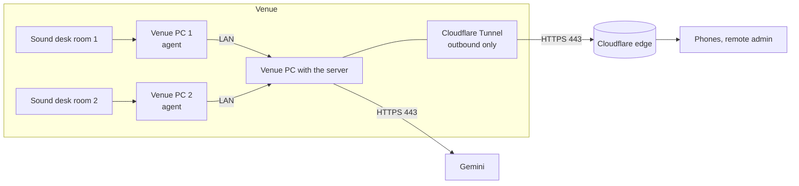
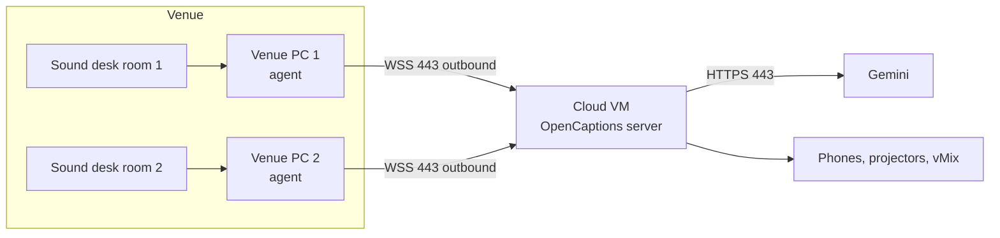

# Deployment

This guide helps you choose where the OpenCaptions server runs, then install it. Before you expose it to any network, read [Security](security-guide.md).

## Choose a topology

There are two supported layouts. Both are valid for a real event. Pick one from the decision table below.

### Topology A: server on a venue PC



One machine at the venue runs the server. Room PCs send audio to it over the local network. A Cloudflare Tunnel publishes it at an HTTPS address without opening any inbound port. The same machine can also be the capture PC for one room.

### Topology B: cloud server, venue PCs only send audio



The server runs on a small cloud VM with a real domain and TLS certificate. Each room PC only makes an outbound connection to it. Nothing at the venue accepts incoming connections.

### Decision table

| Question | A: venue PC | B: cloud server |
|---|---|---|
| Setup effort | Lowest. One machine, no cloud account. | A VM, a domain and DNS. About 30 minutes. |
| Monthly cost | None | About US$ 7–15 for a small VM (e2-small class). Covered by event credits. |
| Venue internet drops | Captions stop anyway, because Gemini is in the cloud. Local screens keep the last captions. | Same. Rooms reconnect by themselves when the link returns. |
| The server machine fails | All rooms stop until it's back. Keep a second PC ready. | The VM has cloud-grade uptime. Venue PC failures only affect their own room. |
| Audience outside the venue (stream viewers, remote) | Works through the tunnel. | Works directly. |
| Restricted venue network | Only needs outbound 443 to Cloudflare and Google. | Only needs outbound 443 to your domain. Google isn't contacted from the venue at all. |
| Data location | Audio and transcripts stay on hardware you control, apart from Gemini. | On the VM, in the cloud region you choose. |
| Good for | Small events, rehearsals, a single room, demos | Multi-room conferences, multi-day events, companies |

**Hybrid:** you can start with A for rehearsals and move to B for the event. Nothing changes on the room PCs except the `--server` address.

### Is it safe to expose the main PC to the internet?

Never open or forward a router port to a venue PC or to the server. Both topologies avoid it:

- In A, the tunnel is an **outbound** connection from the PC to Cloudflare. Nobody can reach the PC's ports directly.
- In B, only the cloud VM listens, behind TLS, and the venue PCs only connect out.

On top of that, OpenCaptions requires tokens for everything except the public caption pages. See [Security](security-guide.md).

## Install the server

You can install in three ways. They are equivalent at runtime.

| Method | Best for |
|---|---|
| [Docker Compose](#docker-compose) | Linux servers and cloud VMs. Reproducible and isolated. |
| [Node.js directly](#nodejs-directly) | macOS and Windows laptops, development, venue PCs |
| [systemd service](#systemd-service-linux-without-docker) | Linux servers when you don't want Docker |

### Is Docker worth it?

For the **server on Linux or in the cloud**, yes:

- Same image everywhere, one-command upgrades and rollbacks.
- It runs as a non-root user with a read-only filesystem and no Linux capabilities.
- It restarts on failure and includes a health check.

For **venue PCs that capture audio**, no. Docker Desktop on macOS and Windows can't access sound cards. Run the agent with Node.js as a system service instead.

For **a laptop demo**, it's optional. `npm start` is simpler.

### Docker Compose

Requirements: Docker Engine 24+ with the Compose plugin.

```bash
git clone https://github.com/carraroesteban/opencaptions.git
cd opencaptions
cp .env.example .env
```

Edit `.env` and set at least these values:

```bash
GEMINI_API_KEY=<key>
ADMIN_TOKEN=<openssl rand -base64 24>
INGEST_TOKEN=<openssl rand -base64 24>
PUBLIC_URL=https://subs.example.com
```

Then start it:

```bash
docker compose up -d --build
docker compose logs -f          # shows the URLs
```

By default the container is published only on `127.0.0.1:8080`, ready for a tunnel or reverse proxy on the same host. To reach it from the LAN directly, set `BIND_ADDR=0.0.0.0` in `.env`.

To include `yt-dlp` for YouTube demos and `npm run multi`, set `WITH_YTDLP=1` in `.env` and rebuild.

To add the Cloudflare Tunnel as a second container:

1. In the Cloudflare dashboard, open **Zero Trust → Networks → Tunnels** and create a tunnel.
2. Add a public hostname that points to the service `http://opencaptions:8080`.
3. Copy the tunnel token to `TUNNEL_TOKEN` in `.env`.
4. Run:

   ```bash
   docker compose --profile tunnel up -d
   ```

Upgrade:

```bash
git pull && docker compose up -d --build
```

### Node.js directly

Works on macOS, Linux and Windows.

```bash
git clone https://github.com/carraroesteban/opencaptions.git
cd opencaptions
npm ci --omit=dev
cp .env.example .env            # Windows: Copy-Item .env.example .env
npm start
```

To keep it running after you close the terminal:

- **macOS:** use a launchd agent. Adapt `deploy/com.opencaptions.agent.plist` so it runs `src/server.js`.
- **Linux:** use the systemd unit below.
- **Windows:** use [NSSM](https://nssm.cc/): `nssm install OpenCaptions "C:\Program Files\nodejs\node.exe" src\server.js`, then set the app directory to the repository folder.

### systemd service (Linux without Docker)

`deploy/opencaptions.service` runs the server as an unprivileged user with systemd sandboxing. The install steps are in the comments at the top of the file. It listens on `127.0.0.1` only and expects a tunnel or reverse proxy in front.

## HTTPS

Browsers only allow microphone capture on `localhost` or HTTPS pages. Phones on other networks also need a public HTTPS address. Choose one option:

| Option | Inbound ports | Certificate | When |
|---|---|---|---|
| **Cloudflare Tunnel** (named) | None | Automatic | Topology A, or B without a public IP. Recommended. |
| Cloudflare quick tunnel: `cloudflared tunnel --url http://localhost:8080` | None | Automatic, random `trycloudflare.com` name | Demos only. The URL changes on every start. |
| **Caddy** reverse proxy: `caddy reverse-proxy --from subs.example.com --to localhost:8080` | 80 and 443 on a public VM | Automatic (Let's Encrypt) | Topology B on a VM with a public IP |
| Built-in TLS: `HTTPS_CERT` and `HTTPS_KEY` | 8080 on the LAN | [mkcert](https://github.com/FiloSottile/mkcert). Install its CA on every device. | Isolated LAN with no internet for clients |

Tunnels and reverse proxies all support WebSockets without extra configuration. Set `PUBLIC_URL` to the final HTTPS address so QR codes point to it.

When the proxy runs on the same host as the server, OpenCaptions trusts its `X-Forwarded-*` headers (`TRUST_PROXY=loopback`, or `uniquelocal` in Docker Compose). Requests that come through a proxy are **never** treated as local, so they always need a token for admin and ingest.

## Cloud VM example (Google Compute Engine)

This is topology B on Google Cloud. The Google Developers Platform credits for the Vibeathon can pay for it.

1. Create a VM: e2-small (2 vCPU burst, 2 GB), Debian 12, in a region near the venue (for Argentina, `southamerica-west1` Santiago or `southamerica-east1` São Paulo). Allow HTTP and HTTPS traffic.
2. Point a DNS record such as `subs.example.com` to the VM's external IP.
3. SSH in and install Docker:

   ```bash
   curl -fsSL https://get.docker.com | sh
   ```

4. Follow [Docker Compose](#docker-compose), keeping `BIND_ADDR=127.0.0.1`.
5. Install Caddy for HTTPS (`sudo apt install caddy`). Put this in `/etc/caddy/Caddyfile`:

   ```
   subs.example.com {
     reverse_proxy 127.0.0.1:8080
   }
   ```

   Then run `sudo systemctl reload caddy`.

6. Open `https://subs.example.com/admin.html?token=<ADMIN_TOKEN>` once from your laptop. The token is saved in that browser and removed from the address bar.

**Cloud Run and other serverless platforms** aren't recommended. OpenCaptions keeps room state in memory and holds long-lived WebSockets. Serverless platforms cap request duration and can start extra instances that don't share state. If you must use one, set minimum and maximum instances to 1 and allocate CPU always. Clients reconnect automatically when a socket is cut.

## Run the agent as a service

The headless agent (`scripts/agent.js`) captures a sound card on the room PC and streams it to the server. It reconnects forever and keeps up to about 15 seconds of audio while the network is down.

Find the input device first:

```bash
node scripts/agent.js --list-devices
```

Test in the foreground:

```bash
node scripts/agent.js --stage sala-a --device 1 --server wss://subs.example.com --token <INGEST_TOKEN>
```

The agent sends the token in an `Authorization` header, never in the URL. Then install it as a service:

| OS | How |
|---|---|
| Linux | `deploy/opencaptions-agent@.service`: one systemd instance per room, such as `opencaptions-agent@sala-a`. The steps are in the file header. |
| macOS | `deploy/com.opencaptions.agent.plist`: a launchd agent. Grant microphone access to `node` under **System Settings → Privacy & Security → Microphone**. |
| Windows | `nssm install OpenCaptionsAgent "C:\Program Files\nodejs\node.exe" scripts\agent.js --stage sala-a --device "<device name>" --server wss://subs.example.com`. Set `INGEST_TOKEN` in the service environment. |

## Capacity and sharding

One process comfortably runs dozens of rooms. The practical limit is your Gemini quota for concurrent Live sessions, not the server. Beyond one project's quota, shard by room:

1. Run several instances, each with its own `STAGES=` list and, if needed, its own `GEMINI_API_KEY` or project.
2. Route `/ws/*?stage=<id>` and `/s/<id>` to the right instance with a reverse proxy.

Rooms share no state, so no message bus is needed. See [Architecture](architecture.md#scaling).

## Backups and upgrades

- **Back up `data/`.** It holds transcripts, rooms created from the dashboard and generated tokens (`secrets.json`). Also back up `config/`.
- **Upgrade:** `git pull`, then `npm ci --omit=dev` and restart, or `docker compose up -d --build`. Check [CHANGELOG.md](../CHANGELOG.md) for breaking changes first.
- **Roll back:** `git checkout <previous tag>` and restart.
- Screens, phones and agents reconnect by themselves after a restart. A restart during a talk loses a few seconds of captions.
