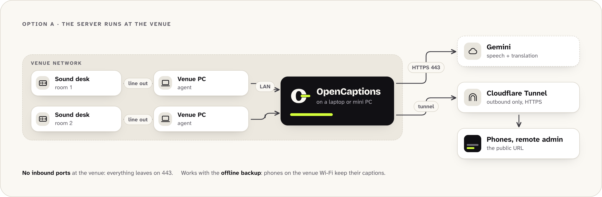
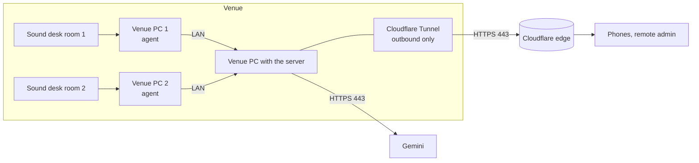
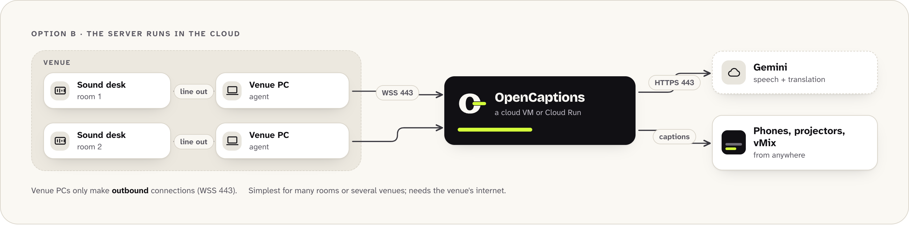
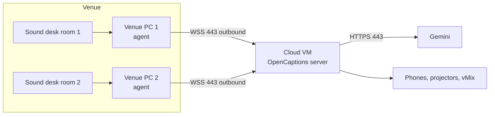

# Deployment

This guide helps you choose where the OpenCaptions server runs, then install it. Before you expose it to any network, read [Security](security-guide.md).

<p align="center"></p>

## Choose a topology

There are two supported layouts. Both are valid for a real event. Pick one from the decision table below.

### Topology A: server on a venue PC

<picture>
  <source media="(prefers-color-scheme: dark)" srcset="images/diagrams/deploy-venue-dark.png" />
  
</picture>

<details><summary>Text version of this diagram</summary>


```mermaid
flowchart LR
  subgraph Venue
    D1[Sound desk room 1] --> A1[Venue PC 1<br/>agent]
    D2[Sound desk room 2] --> A2[Venue PC 2<br/>agent]
    A1 -- LAN --> S[Venue PC with the server]
    A2 -- LAN --> S
    S --- T[Cloudflare Tunnel<br/>outbound only]
  end
  S -- HTTPS 443 --> G[Gemini]
  T -- HTTPS 443 --> CF[(Cloudflare edge)]
  CF --> P[Phones, remote admin]
```

</details>

One machine at the venue runs the server. Room PCs send audio to it over the local network. A Cloudflare Tunnel publishes it at an HTTPS address without opening any inbound port. The same machine can also be the capture PC for one room.

### Topology B: cloud server, venue PCs only send audio

<picture>
  <source media="(prefers-color-scheme: dark)" srcset="images/diagrams/deploy-cloud-dark.png" />
  
</picture>

<details><summary>Text version of this diagram</summary>


```mermaid
flowchart LR
  subgraph Venue
    D1[Sound desk room 1] --> A1[Venue PC 1<br/>agent]
    D2[Sound desk room 2] --> A2[Venue PC 2<br/>agent]
  end
  A1 -- WSS 443 outbound --> S[Cloud VM<br/>OpenCaptions server]
  A2 -- WSS 443 outbound --> S
  S -- HTTPS 443 --> G[Gemini]
  S --> P[Phones, projectors, vMix]
```

</details>

The server runs on a small cloud VM with a real domain and TLS certificate. Each room PC only makes an outbound connection to it. Nothing at the venue accepts incoming connections.

### Decision table

| Question | A: venue PC | B: cloud server |
|---|---|---|
| Setup effort | Lowest. One machine, no cloud account. | A VM, a domain and DNS. About 30 minutes. |
| Monthly cost | None | About US$ 7–15 for a small VM (e2-small class). Covered by event credits. |
| Venue internet drops | With the [offline backup](local.md#offline-backup), captions keep going on the venue PC and return to Gemini by themselves; without it they stop until the link returns. | Captions stop until the link returns; rooms reconnect by themselves. |
| The server machine fails | All rooms stop until it's back. Keep a second PC ready. | The VM has cloud-grade uptime. Venue PC failures only affect their own room. |
| Audience outside the venue (stream viewers, remote) | Works through the tunnel. | Works directly. |
| Restricted venue network | Only needs outbound 443 to Cloudflare and Google. | Only needs outbound 443 to your domain. Google isn't contacted from the venue at all. |
| Data location | Audio and transcripts stay on hardware you control, apart from Gemini. | On the VM, in the cloud region you choose. |
| Good for | Small events, rehearsals, a single room, demos | Multi-room conferences, multi-day events, companies |

**Hybrid:** you can start with A for rehearsals and move to B for the event. Nothing changes on the room PCs except the `--server` address.

### Is it safe to expose the main PC to the internet?

Never open or forward a router port to a venue PC or to the server. Both topologies avoid it:

- In A, the tunnel is an **outbound** connection from the PC to Cloudflare. Nobody can reach the PC's ports directly.
- In B, only the cloud VM listens, behind TLS, and the venue PCs only connect out.

On top of that, OpenCaptions requires sign-in for everything except the public caption pages. See [Security](security-guide.md).

## Install the server

You can install in several ways. They are equivalent at runtime.

| Method | Best for |
|---|---|
| [Mac app or Windows launcher](#mac-app-or-windows-launcher) | Organizers on a Mac or Windows laptop, no terminal |
| [Published Docker image](#published-docker-image) | Any Docker host, without downloading the code |
| [Docker Compose](#docker-compose) | Linux servers and cloud VMs. Reproducible and isolated. |
| [Node.js directly](#nodejs-directly) | macOS and Windows laptops, development, venue PCs |
| [systemd service](#systemd-service-linux-without-docker) | Linux servers when you don't want Docker |
| [Render, Fly.io or Railway](#cloud-platforms-render-flyio-railway) | A public server with HTTPS in a few minutes, no machine to look after |

### Is Docker worth it?

For the **server on Linux or in the cloud**, yes:

- Same image everywhere, one-command upgrades and rollbacks.
- It runs as a non-root user with a read-only filesystem and no Linux capabilities.
- It restarts on failure and includes a health check.

For **venue PCs that capture audio**, no. Docker Desktop on macOS and Windows can't access sound cards. Run the agent with Node.js as a system service instead.

For **a laptop demo**, it's optional. `npm start` is simpler.

### Mac app or Windows launcher

1. Install [Node.js](https://nodejs.org/en/download) (LTS).
2. Download [OpenCaptions for Mac](https://github.com/carraroesteban/opencaptions/releases/latest/download/OpenCaptions-mac.zip) or [OpenCaptions for Windows](https://github.com/carraroesteban/opencaptions/releases/latest/download/OpenCaptions-windows.zip) from the latest release.
3. **Mac:** unzip, drag **OpenCaptions** to Applications and open it. **Windows:** extract the ZIP and double-click **Start OpenCaptions**.

A window shows OpenCaptions running: it installs the libraries the first time (about a minute), starts the server and opens the dashboard, where the welcome wizard asks for the API key and can create the public address. Keep the window open; closing it stops the server. The first launch asks you to confirm an unsigned app: see the README's [Quick start](../README.md#without-the-terminal).

Settings, passwords and transcripts are kept outside the app, so a new version keeps them: `~/Library/Application Support/OpenCaptions/data` on a Mac, `%LOCALAPPDATA%\OpenCaptions\data` on Windows. To update, download the new version and open it. Developers get the same from a clone with `npm run app`.

### Published Docker image

Every push to `main` publishes `ghcr.io/carraroesteban/opencaptions` (amd64 and arm64; tags `latest`, `sha-…` and a version for each `v*` tag). Nothing to clone or build:

```bash
docker run -d --name opencaptions --restart unless-stopped -p 127.0.0.1:8080:8080 -v opencaptions-data:/app/data -v opencaptions-config:/app/config ghcr.io/carraroesteban/opencaptions
docker logs opencaptions | grep "Open the dashboard"
```

The named volumes keep transcripts, settings and secrets (`opencaptions-data`) and the event, glossary and agenda files (`opencaptions-config`, filled from the image the first time) across upgrades. Pass settings with `-e`, e.g. `-e GEMINI_API_KEY=…`, or set the key in the dashboard. Containers run in UTC: the welcome wizard offers to use your time zone for the agenda, or pass `-e TZ=Europe/Madrid`. Upgrade:

```bash
docker pull ghcr.io/carraroesteban/opencaptions
docker rm -f opencaptions
```

…then the same `docker run` again.

### Docker Compose

Requirements: Docker Engine 24+ with the Compose plugin.

```bash
git clone https://github.com/carraroesteban/opencaptions.git
cd opencaptions
cp .env.example .env
mkdir -p data
```

On Linux, the `data` folder must belong to the container's user (1000): if the container stops with "can't write to its data folder", run `sudo chown -R 1000:1000 data`. A named volume (as in the published-image command above) avoids this.

Everything in `.env` is optional: the API key can be pasted in the dashboard, and the passwords are generated on first start. For a server you'll keep, set your own:

```bash
GEMINI_API_KEY=<key>
ADMIN_TOKEN=<openssl rand -base64 24>
CREW_TOKEN=<openssl rand -base64 24>
INGEST_TOKEN=<openssl rand -base64 24>
PUBLIC_URL=https://subs.example.com
TZ=<your time zone, e.g. America/Argentina/Buenos_Aires>
```

Then start it:

```bash
docker compose up -d --build
docker compose logs -f          # shows the URLs and a dashboard link that signs you in
```

By default the container is published only on `127.0.0.1:8080`, ready for a tunnel or reverse proxy on the same host. To reach it from the LAN directly, set `BIND_ADDR=0.0.0.0` in `.env`.

To include `yt-dlp` for YouTube demos and `npm run multi`, set `WITH_YTDLP=1` in `.env` and rebuild.

For HTTPS, the dashboard's [public address](#one-click-public-address) works inside the container (the image includes `cloudflared`). Or add the Cloudflare Tunnel as a second container:

1. In the Cloudflare dashboard, open **Zero Trust → Networks → Tunnels** and create a tunnel.
2. Add a public hostname that points to the service `http://opencaptions:8080`.
3. Copy the tunnel token to `TUNNEL_TOKEN` in `.env`.
4. Run:

   ```bash
   docker compose --profile tunnel up -d
   ```

Upgrade:

```bash
git pull && docker compose up -d --build
```

### Node.js directly

Works on macOS, Linux and Windows.

```bash
git clone https://github.com/carraroesteban/opencaptions.git
cd opencaptions
npm ci --omit=dev
cp .env.example .env            # Windows: Copy-Item .env.example .env
npm start
```

To keep it running after you close the terminal:

- **macOS:** use a launchd agent. Adapt `deploy/com.opencaptions.agent.plist` so it runs `src/server.js`.
- **Linux:** use the systemd unit below.
- **Windows:** use [NSSM](https://nssm.cc/): `nssm install OpenCaptions "C:\Program Files\nodejs\node.exe" src\server.js`, then set the app directory to the repository folder.

### systemd service (Linux without Docker)

`deploy/opencaptions.service` runs the server as an unprivileged user with systemd sandboxing. The install steps are in the comments at the top of the file. It listens on `127.0.0.1` only and expects a tunnel or reverse proxy in front.

## Cloud platforms: Render, Fly.io, Railway

The repository has ready-made settings for three hosting platforms. Each runs the Docker image with a **persistent disk** for `data/` (settings, passwords, transcripts, and here also the glossary and agenda), HTTPS, and **never sleeps**: a server that sleeps when idle would cut the captions in the middle of a talk. That rules out free plans that sleep or have no disk.

On all three, OpenCaptions finds its public address by itself (QR codes and links use it), and trusts the platform's proxy (`TRUST_PROXY=1`). Every device needs the admin password: the first start prints **Open the dashboard** with a link that signs you in, in the platform's logs. Paste the Gemini key in the dashboard, or set `GEMINI_API_KEY` in the platform's environment.

### Render

[](https://render.com/deploy?repo=https://github.com/carraroesteban/opencaptions)

The button reads `render.yaml`: a web service on the smallest paid instance (`0.5c-512mb`, about 100 MB used with 1000 phones in our load test; choose `1c-2g` for big events) with a 5 GB disk. Render asks for `GEMINI_API_KEY` (optional). The address is `https://<name>.onrender.com`; add your own domain in Render's settings.

### Fly.io

With the [Fly CLI](https://fly.io/docs/flyctl/install/), from a copy of the repository:

```bash
fly launch --copy-config --no-deploy
```

```bash
fly volumes create data --size 1
```

```bash
fly deploy
```

`fly launch` asks for a unique app name (the address becomes `https://<name>.fly.dev`) and a region: pick the one closest to your audience. `fly.toml` keeps one machine always running with 1 GB of memory. The dashboard link is in `fly logs`.

### Railway

In Railway, **New project → Deploy from GitHub repo**, and choose your fork of OpenCaptions. `railway.json` builds the Dockerfile and checks `/healthz`. Then, in the service:

1. **Settings → Networking → Generate domain** (or add yours).
2. Right-click the service → **Attach volume**, mount path `/app/data`.
3. **Variables**: `TRUST_PROXY=1`, `GLOSSARY=/app/data/glossary.json`, `SCHEDULE=/app/data/schedule.json`, and optionally `GEMINI_API_KEY`.

The dashboard link is in the deployment's logs.

## HTTPS

Browsers only allow microphone capture on `localhost` or HTTPS pages. Phones on other networks also need a public HTTPS address. Choose one option:

| Option | Inbound ports | Certificate | When |
|---|---|---|---|
| **Dashboard → Settings → Public address**, own domain | None | Automatic | Topology A, or B without a public IP. Recommended. |
| **Dashboard → Settings → Public address**, quick | None | Automatic, random `trycloudflare.com` name | Trying it out and small events. The address changes on every start. |
| Cloudflare Tunnel as a Docker container (`--profile tunnel`) | None | Automatic | Docker Compose, if you prefer a separate container |
| **Caddy** reverse proxy: `caddy reverse-proxy --from subs.example.com --to localhost:8080` | 80 and 443 on a public VM | Automatic (Let's Encrypt) | Topology B on a VM with a public IP |
| Built-in TLS: `HTTPS_CERT` and `HTTPS_KEY` | 8080 on the LAN | [mkcert](https://github.com/FiloSottile/mkcert). Install its CA on every device. | Isolated LAN with no internet for clients |

### One-click public address

**Settings → Public address** (and the welcome wizard's "Phones" step) runs Cloudflare Tunnel for you: no account, router settings or certificates. The first time, it downloads Cloudflare's `cloudflared` into `local/bin/` (about 40 MB; the Docker image already has it). While it's on, its address is the public URL: QR codes, links and allowed origins use it. It comes back on after a restart (`data/setup.json`).

- **Quick address:** a random `https://….trycloudflare.com` address, ready in a minute or two (the dashboard shows the link once the address answers from the internet). It **changes every time OpenCaptions restarts**, or if `cloudflared` has to reconnect, so print the QR posters after starting it and don't restart during the event; the dashboard warns when it changed. Cloudflare offers quick tunnels for testing and small events, with a limit of about 200 requests at once.
- **Your own domain:** a fixed address for real events. In Cloudflare, open **Zero Trust → Networks → Tunnels**, create a tunnel, and add a public hostname pointing to `http://localhost:8080` (your `PORT`). Paste the tunnel token and the hostname in Settings. The token is kept in `data/secrets.json`.

From the command line: `TUNNEL=quick npm start`, or `TUNNEL=token TUNNEL_HOST=captions.example.com` after saving the token once from the dashboard. Requests through the tunnel are never treated as local, so the dashboard always needs sign-in there, and room computers their password.

Without a public address, QR codes use the address the dashboard was opened with, or this computer's Wi-Fi address when it was opened as `localhost`, so phones on the same Wi-Fi can follow.

Tunnels and reverse proxies all support WebSockets without extra configuration. With your own proxy, set `PUBLIC_URL` to the final HTTPS address so QR codes point to it.

When the proxy runs on the same host as the server, OpenCaptions trusts its `X-Forwarded-*` headers (`TRUST_PROXY=loopback`, or `uniquelocal` in Docker Compose). Requests that come through a proxy are **never** treated as local, so they always need sign-in.

## Cloud VM example (Google Compute Engine)

This is topology B on Google Cloud.

1. Create a VM: e2-small (2 vCPU burst, 2 GB), Debian 12, in a region near the venue (for Argentina, `southamerica-west1` Santiago or `southamerica-east1` São Paulo). Allow HTTP and HTTPS traffic.
2. Point a DNS record such as `subs.example.com` to the VM's external IP.
3. SSH in and install Docker:

   ```bash
   curl -fsSL https://get.docker.com | sh
   ```

4. Follow [Docker Compose](#docker-compose), keeping `BIND_ADDR=127.0.0.1`.
5. Install Caddy for HTTPS (`sudo apt install caddy`). Put this in `/etc/caddy/Caddyfile`:

   ```
   subs.example.com {
     reverse_proxy 127.0.0.1:8080
   }
   ```

   Then run `sudo systemctl reload caddy`.

6. Open `https://subs.example.com/admin.html` and sign in with the admin password (`docker compose logs opencaptions | grep "Admin token"`). Then turn on two-factor sign-in in **Settings → Access**.

**Cloud Run and other serverless platforms** aren't recommended. OpenCaptions keeps room state in memory and holds long-lived WebSockets. Serverless platforms cap request duration and can start extra instances that don't share state. If you must use one, set minimum and maximum instances to 1 and allocate CPU always. Clients reconnect automatically when a socket is cut.

## Run the agent as a service

The headless agent (`scripts/agent.js`) captures a sound card on the room PC and streams it to the server. It reconnects forever and keeps up to about 15 seconds of audio while the network is down.

Find the input device first:

```bash
node scripts/agent.js --list-devices
```

Test in the foreground:

```bash
node scripts/agent.js --stage room-a --device 1 --server wss://subs.example.com --token <INGEST_TOKEN>
```

The agent sends the ingest password in an `Authorization` header, never in the URL. Then install it as a service:

| OS | How |
|---|---|
| Linux | `deploy/opencaptions-agent@.service`: one systemd instance per room, such as `opencaptions-agent@room-a`. The steps are in the file header. |
| macOS | `deploy/com.opencaptions.agent.plist`: a launchd agent. Grant microphone access to `node` under **System Settings → Privacy & Security → Microphone**. |
| Windows | `nssm install OpenCaptionsAgent "C:\Program Files\nodejs\node.exe" scripts\agent.js --stage room-a --device "<device name>" --server wss://subs.example.com`. Set `INGEST_TOKEN` in the service environment. |

## Capacity and sharding

One process comfortably runs dozens of rooms. The practical limit is your Gemini quota for concurrent Live sessions, not the server. Beyond one project's quota, shard by room:

1. Run several instances, each with its own `STAGES=` list and, if needed, its own `GEMINI_API_KEY` or project.
2. Route `/ws/*?stage=<id>` and `/s/<id>` to the right instance with a reverse proxy.

Rooms share no state, so no message bus is needed. See [Architecture](architecture.md#scaling).

## Backups and upgrades

- **Back up the data folder.** It holds transcripts, rooms created from the dashboard, the History, and the passwords and API key (`secrets.json`): `data/` in a clone or Docker, `~/Library/Application Support/OpenCaptions/data` with the Mac app, `%LOCALAPPDATA%\OpenCaptions\data` with the Windows launcher. In a clone, also back up `config/`.
- **Upgrade:** download the new Mac or Windows version; or `git pull`, then `npm ci --omit=dev` and restart; or `docker compose up -d --build`. Check [CHANGELOG.md](../CHANGELOG.md) for breaking changes first.
- **Roll back:** `git checkout <previous tag>` and restart.
- Screens, phones and agents reconnect by themselves after a restart. A restart during a talk loses a few seconds of captions.
