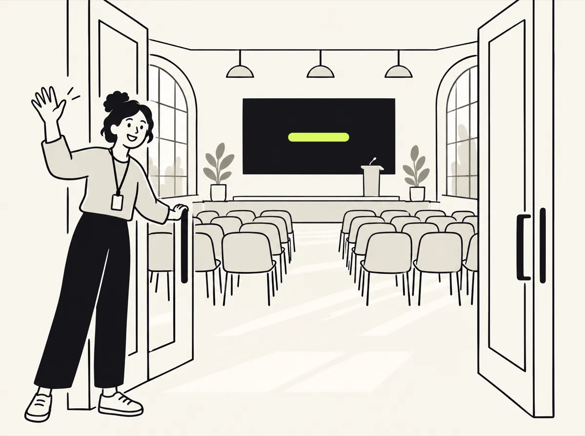

# Getting started

In this tutorial you run OpenCaptions on your own computer, watch simulated captions, then connect it to Gemini and caption two rooms at once. It takes about 10 minutes.

<p align="center"></p>

**You need:**

- A computer running macOS, Linux or Windows.
- [Node.js](https://nodejs.org/) 20 or later. Version 22 LTS is recommended. Check with `node --version`.
- [Git](https://git-scm.com/).
- For the second half: a Gemini API key from [Google AI Studio](https://aistudio.google.com/apikey).

## 1. Install

```bash
git clone https://github.com/carraroesteban/opencaptions.git
cd opencaptions
npm install
```

`npm install` also downloads a small ffmpeg binary (`ffmpeg-static`), so you don't need to install ffmpeg yourself.

## 2. Run without an API key

```bash
npm run mock
```

The server prints its URLs. Mock mode generates realistic fake captions whenever a room receives audio. You can build and test everything without spending money. (Mock mode defaults to the `live` translation mode so every language has a simulated voice track; the real engine defaults to `text`.)

Open these pages in your browser:

| Page | What you see |
|---|---|
| http://localhost:8080/ | The audience page. Pick a room and a language. |
| http://localhost:8080/admin.html | The production dashboard with every room's status. |

The first time you open the dashboard, a short welcome wizard asks for your event's name, its rooms and languages, connects the AI, offers a public address for phones and shows how to connect the sound. Every question can be skipped, and you can reopen it from **Settings → Setup wizard**. A new install has one room, `main`; that's all this guide needs until step 5.

Nothing is captioned yet, because no room is receiving audio.

## 3. Send audio to a room

Open a second terminal in the same folder and play the bundled English sample into the room called `main`:

```bash
npm run feed -- --stage main --input samples/talk-en.wav
```

On the audience page, open **Main stage**. Captions start after a few seconds. Switch between **Original** and **Español** to see the translation track. On the dashboard, the room turns live and shows an audio meter and latency.

Stop the feed with Ctrl+C. Stop the server with Ctrl+C in the first terminal.

## 4. Connect Gemini

The quickest way is the dashboard: open **Settings → Gemini** (or the wizard's AI step), click **Open AI Studio**, create a key, paste it and click **Check and connect**. OpenCaptions checks the key with Google and switches every room to Gemini straight away, with no restart. Skip to step 5.

From the terminal, the setup script also names your event and rooms and generates the passwords:

```bash
npm run setup
```

Or by hand:


1. Copy the example configuration:

   ```bash
   cp .env.example .env
   ```

   On Windows PowerShell, use `Copy-Item .env.example .env`.

2. Open `.env` in a text editor and set your key:

   ```
   GEMINI_API_KEY=<your-key>
   ```

3. Run the built-in check. It streams 25 seconds of the sample to Gemini and reports what came back and how long it took:

   ```bash
   npm run check
   ```

   If it fails, see [Troubleshooting](operations/troubleshooting.md#gemini-connection).

4. Start the real server:

   ```bash
   npm start
   ```

**No API key?** You can run the AI on your own computer instead. Install [Ollama](https://ollama.com/download), then run `npm run local -- --check` and `npm run local` in place of steps 3 and 4. The first run downloads about 4 GB of models. Captions run a little further behind the speaker than with Gemini. See [Local mode](local.md).

## 5. Caption two rooms at once

Add a second room: **Dashboard → Rooms → + Room**, with the ID `room-b`. Then, in two more terminals, run one feed per room:

```bash
npm run feed -- --stage main   --input samples/talk-en.wav
```

```bash
npm run feed -- --stage room-b --input samples/talk-es.wav
```

Room `main` receives English and shows Spanish captions. Room `room-b` receives Spanish and shows English captions. The dashboard shows both rooms, their latency and the estimated cost so far.

On a room's card, tap **Host** under *Speaking*: new captions are labeled with that name on phones, in the transcript and in the subtitle files.

## 6. Catch up and ask

On the audience page, tap **What did I miss?**. You get a summary of the last five minutes in the language you're reading, and a box to **ask the talk** a question ("which tool did they use for traces?"). The answer comes only from the transcript, with quotes and timestamps. Tap the transcript button (the page icon, bottom right) to open the full transcript: search it, switch language, download it.

In mock mode (no API key) the summary shows transcript highlights and the answers show matching quotes; with a Gemini key they're written by the model.

## 7. Try a live microphone

Open http://localhost:8080/demo.html?mode=mic, allow the microphone and speak. You see your words and their translation in large text, with a level meter and the measured delay. This is the page you use for sound checks.

Browsers only allow microphone access on `localhost` or over HTTPS. To use the microphone from another device, read [Deployment](deployment.md#https).

## What you did

You ran the server, fed it audio from a file and a microphone, and watched captions and translations in two rooms at the same time. The same pieces run at a real event:

- Each room's audio arrives through the **headless agent**, a browser page or a stream the server pulls.
- The audience follows on their phones with a QR code.
- The projector and the vMix/OBS overlay use the same captions.

## Next steps

- [Requirements](requirements.md): check what an event needs.
- [Local mode](local.md): run the models on your own computer, without the cloud.
- [Deployment](deployment.md): choose where the server runs.
- [Security](security-guide.md): read this before exposing the server to a network.
- [Event-day runbook](operations/runbook.md): run it at a real event.
