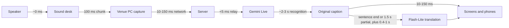

# Latency

This page explains where caption delay comes from, how to measure it and which settings reduce it.

**Short answer:** original-language captions appear about 3 seconds after the speaker says the words, and translations about 4.5–6 seconds after. Nearly all of that time is spent inside the speech model. The computer that runs the server makes no measurable difference, whether it's a Mac, Linux or Windows machine.

## Measured numbers

Real Gemini sessions, conference talks as input, server on a MacBook in Argentina, September 2026:

| Track | Typical delay |
|---|---|
| Original language (speech → first caption words) | about 3.2 s |
| Translation, `text` mode (speech → first translated words) | about 4.6–5.7 s |
| Translation, `live` mode (Live Translate's own translation) | Starts close to the original, then **drifts later** on long, fast talks. This is why `text` is the default. |

The dashboard shows these per room as a moving average. Measure your own setup with `npm run multi` (see [Measure it yourself](#measure-it-yourself)).

## Where the time goes



| Stage | Typical | Controlled by |
|---|---|---|
| Audio capture and 100 ms chunking | 100 ms | Fixed. It's the chunk size the Live API recommends. |
| Venue → server network | 10–150 ms | Topology and network quality. Wired beats Wi-Fi. |
| Server processing (relay, silence gate, fan-out) | < 5 ms | The event-loop lag on the dashboard shows it. It stays near zero. |
| Server → Gemini network | 20–200 ms | Distance to Google's edge |
| **Speech recognition inside the model** | **2–3 s** | The model. It waits for enough context to commit to words. |
| Translation | Waits for the sentence to end (or a provisional update every `MT_PARTIAL_MS`), plus 0.4–1 s per request | `MT_PARTIAL_MS`, sentence length, provider load |
| Server → viewers | 10–150 ms | Viewer network |

The model's recognition time is about 80% of the total. That's why hardware and operating system don't matter here. The server's CPU sits under a few percent per room.

## Tuning

Try one change at a time and compare the dashboard latency over a few minutes of real speech.

| Setting | Effect on latency | Cost / risk | Recommendation |
|---|---|---|---|
| `MT_PARTIAL_MS=1000` (default 1500) | Provisional translations appear about 0.5 s sooner on long sentences | About 50% more translation requests (roughly +US$ 0.2 per talk-hour per language). Can hit rate limits on low tiers. | Good trade on a paid tier |
| Pin the room's `source` language (`"en"` instead of `"auto"`) | First words of a talk arrive sooner and more reliably. The model doesn't need to detect the language. | None, if you know the talk language | **Do it** whenever the schedule tells you the language |
| `VAD_SILENCE_MS=300` | The model closes turns sooner after pauses, so captions finalize sooner | May split sentences at hesitations | Try it for fast, dense speakers |
| Clean audio feed from the desk, not a room microphone | The model commits to words sooner with fewer corrections | None | **Do it** |
| Wired Ethernet for venue PCs | Removes Wi-Fi jitter spikes of 100 ms to several seconds | None | **Do it** |
| `TRANSCRIPTION_MODE=SMART` | Removes filler words. Shorter captions, easier to read. | Not strictly verbatim | Optional |
| `TRANSLATION_MODE=live` | Lower initial delay for translation, but it drifts on long talks | More sessions when you have several languages | Only for short, slow talks |
| Show original and translation together (dual view) | Doesn't change latency, but viewers can follow the original while the translation catches up | None | The projector does this by default |

**Settings that don't help:**

- A faster CPU, more RAM, or a different operating system.
- Moving the server into a US region. That saves at most about 100 ms towards Gemini but adds the same towards viewers in Latin America.
- Smaller audio chunks. They save tens of milliseconds and cost more messages.

## Measure it yourself

- **One room:** `npm run check` prints time-to-first-text for a 25-second sample.
- **Live:** open `/demo.html?mode=mic`, speak and read the delay shown on screen.
- **Many rooms at once, with real talks:**

  ```bash
  npm run multi -- --rooms 10 --minutes 5
  ```

  This opens 10 rooms, feeds each a different conference video from YouTube in real time and prints p50/p90 latency per room. A JSON report is written to `data/latency-*.json`. This is also the best way to find your account's concurrent-session limit. It needs `yt-dlp`. Cost is about US$ 0.45/min for 10 rooms.

### How the dashboard measures latency

Latency is measured from **speech onset**, the first audio chunk above the speech threshold after a pause, to the **first caption text** of that utterance, per track. It's averaged with an exponential moving average. It reflects what a viewer experiences when a speaker starts a sentence. During long continuous speech, the lag stays in the same range because the model streams while the speaker talks.

## Ideas not implemented yet

- **Streaming translation:** show translated tokens as they arrive, instead of waiting for the whole response. Expected gain: 0.2–0.5 s.
- **Speculative translation:** translate stable prefixes of the sentence in progress, not only on a timer.
- **Adaptive partial interval:** translate provisional text more often when the provider is fast and quota is available.

Contributions are welcome. See [CONTRIBUTING.md](../CONTRIBUTING.md).
