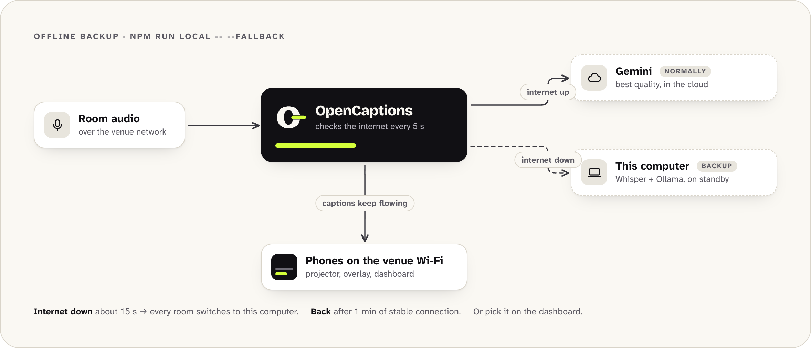
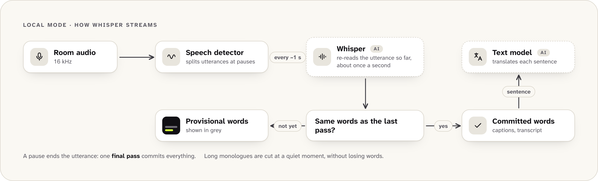
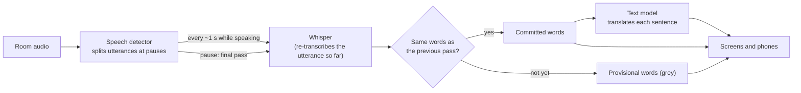

# Local mode: captions without the cloud

In local mode, speech recognition and translation run on your own computer, or on a machine on your network. There's no API key and no cost per hour, and the room's audio never leaves the building. It works without internet once the models are downloaded.

<p align="center"></p>

Everything else stays the same: the audience page, the projector, the overlay, transcripts, the agenda and the dashboard.

| | Gemini (default) | Local mode |
|---|---|---|
| Speech recognition | Gemini 3.5 Live Translate | Whisper, on this computer |
| Translation, summaries, questions | Gemini Flash-Lite | An open model through Ollama (Gemma 3 by default) |
| Needs | An API key and internet | A capable computer; internet only to download the models once |
| Cost | About US$ 2.2 per room-hour | Nothing per hour |
| Caption delay | About 2–3 s behind the speaker | About 4–5 s on a laptop CPU (see [Measured results](#measured-results)) |
| Rooms per server | 30 tested on one laptop | About one per computer today (see [Limits](#limits)) |
| Translated voice 🎧 | Yes | No |

Local mode is new. Use it for small events, rooms without internet, sensitive talks, or to try OpenCaptions without an account. For a multi-room conference, Gemini is still the tested option.

## Quick start

You need Node.js 20+, the repository with `npm install` done, and about 5 GB of free disk space.

**macOS (Apple Silicon):**

```bash
brew install ollama
npm run local -- --check
```

**Linux:**

```bash
curl -fsSL https://ollama.com/install.sh | sh
npm run local -- --check
```

**Windows:** install Ollama from [ollama.com/download](https://ollama.com/download), then run `npm run local -- --check` in PowerShell.

The first run downloads and prepares everything once, which takes a few minutes: a speech engine (about 35 MB), a Whisper model (0.2–0.6 GB, plus about a minute to unpack) and the translation model (about 3.3 GB). Then it plays 30 seconds of a sample talk through the whole pipeline and prints a report: accuracy, delay and translation speed. Later runs start in seconds.

When the check looks good, start the server:

```bash
npm run local
```

Open <http://localhost:8080> and feed a room from another terminal, exactly as in [Getting started](getting-started.md):

```bash
npm run feed -- --stage main --input samples/talk-es.wav
```

The dashboard shows a 🔒 chip with the models in use. `Ctrl+C` stops the server and everything `npm run local` started.

`npm start` still uses Gemini when a key is configured. To make local mode the default for `npm start` too, set `ENGINE=local` in `.env` (the setup wizard asks). Then keep the two servers running yourself, for example as services: Ollama, and a speech server such as `node scripts/local-asr-server.js --model local/models/sherpa-onnx-whisper-small`.

## Offline backup

Use Gemini for its quality and keep this computer ready in case the venue's internet goes down:

```bash
npm run local -- --fallback
```

<picture>
  <source media="(prefers-color-scheme: dark)" srcset="images/diagrams/offline-backup-dark.png" />
  
</picture>

This prepares the speech server and the text model exactly as `npm run local` does, then starts OpenCaptions with Gemini as the main engine (it needs `GEMINI_API_KEY` in `.env`). The server checks every 5 seconds whether Google's API is reachable:

- **Internet goes down:** after about 15 seconds without a connection, every room switches to the local engine. Captions pause for a few seconds while the rooms restart, then continue. The dashboard shows a *No internet* banner.
- **Internet comes back:** after a minute of stable connection, the rooms switch back to Gemini on their own.
- **Manual control:** the AI selector in the dashboard header switches between *Automatic*, *Always Gemini* and *Always this computer*. `POST /api/engine` with `{"mode": "auto" | "cloud" | "local"}` does the same.

To set it up without the launcher, run Ollama and a speech server yourself (see [Use your own servers](#use-your-own-servers)) and set `FALLBACK=local` in `.env`, or `"fallback": "local"` in `config/event.json`.

### What keeps working without internet

The backup only covers the AI. Whether the audience still sees captions depends on how they reach the server:

| | Without internet |
|---|---|
| Captions and translations | ✅ From this computer, a couple of seconds slower than with Gemini. |
| Audience phones on the venue Wi-Fi, projector, overlay, dashboard | ✅ If they reach this computer through the local network (its IP address, or a local name). Fonts fall back to system fonts. |
| Audience phones on mobile data, or a public URL through a tunnel or the cloud | ❌ They can't reach a laptop inside the venue. For an event that must survive outages, print the QR codes with the local address (`PUBLIC_URL=http://192.168.1.20:8080`) and ask people to join the Wi-Fi. |
| Room audio | ✅ If it reaches the server over the local network (agent, browser, or RTMP/SRT from OBS on the same network). |
| Translated voice 🎧 | ❌ It needs Gemini. The headphone option disappears until the connection returns. |
| *What did I miss?* and questions | ✅ Answered by the local model, a little slower. |

If OpenCaptions itself runs in the cloud (Cloud Run, a VPS), there's nothing to switch: when the venue loses internet, the audio can't reach the server. Run it on a computer inside the venue to use the backup.

## What `npm run local` does

1. **Speech server.** It uses the first of these that's available:
   1. the server in `LOCAL_ASR_URL`, if you set one;
   2. a speech server already listening on port 8178;
   3. whisper.cpp's `whisper-server`, if it's on your `PATH` or you built it with `--build-whisper`;
   4. WhisperKit (`whisperkit-cli`), on Apple Silicon;
   5. the bundled server: Whisper on [sherpa-onnx](https://github.com/k2-fsa/sherpa-onnx), which runs on the CPU of any Mac, Linux or Windows machine. The engine is installed into `local/runtime` on first use, so a normal `npm install` stays small.
2. **Text model.** It connects to Ollama, or starts `ollama serve` if Ollama is installed but not running. It downloads the model if needed, and loads it so the first caption doesn't wait.
3. **OpenCaptions** itself, with `ENGINE=local` and the addresses of both servers. With `--check`, it runs the end-to-end test instead.

Models go in `local/models` and the servers' logs in `local/logs`. Both folders are ignored by git.

| Option | Effect |
|---|---|
| `--check` | Run the 30-second end-to-end test instead of the server. Accepts the check's own options: `--input <file>`, `--seconds <n>`, `--target <lang>`, `--source <lang>`. |
| `--asr auto\|builtin\|whispercpp\|whisperkit` | Choose the speech backend instead of the first available one. |
| `--asr-model <size>` | Whisper model: `tiny`, `base`, `small`, `medium` or `large-v3-turbo`. For WhisperKit, a WhisperKit model name. |
| `--build-whisper` | Clone and build whisper.cpp's server first (needs git and cmake). On a Mac it uses the GPU. |
| `--llm-model <name>` | Text model for translation, summaries and questions. Default `gemma3:4b`. |
| `--mt-model <name>` | A separate model just for caption translation, for example `translategemma`. |
| `--no-llm` | Transcription only: captions in the spoken language, without translations or AI summaries. |
| `--fallback` | Keep Gemini as the main engine and use this computer only when the internet goes down. See [Offline backup](#offline-backup). |

## Choosing models

### Speech (Whisper)

Bigger models make fewer mistakes, but each pass takes longer, so captions fall further behind. Captions are re-transcribed about once a second while someone speaks, so the model has to run several times faster than real time.

| Model | Download | Where it fits |
|---|---|---|
| `base` | 0.2 GB | Machines with 4 cores or fewer. Fast, but weak in Spanish and on accents. |
| `small` | 0.6 GB | **Default** on Apple Silicon and on CPUs with 8+ cores. Good in English and Spanish. |
| `medium` | 1.5–1.9 GB | Only with a GPU backend. |
| `large-v3-turbo` | 0.6 GB (whisper.cpp) | **Best choice with a GPU or the Apple Neural Engine**: near the accuracy of the largest model at a fraction of its cost. Default for whisper.cpp on Apple Silicon. |

Which backend to use:

- **Mac with Apple Silicon:** the bundled server works out of the box on the CPU. For lower delay and better spelling of names (it uses the glossary and agenda, see [How it works](#how-it-works)), use the Neural Engine with `brew install whisperkit-cli`: `npm run local` then picks it up automatically. The first start downloads its model and compiles it for the Neural Engine, which takes several minutes, once. Or use the GPU: `xcode-select --install`, `brew install cmake`, then `npm run local -- --build-whisper`.
- **Linux or Windows with an NVIDIA GPU:** build whisper.cpp with CUDA, or run [speaches](https://github.com/speaches-ai/speaches) (faster-whisper) in Docker, and point `LOCAL_ASR_URL` at it. See [Use your own servers](#use-your-own-servers).
- **Any other machine:** the bundled server, with `small` if it keeps up, or `base`.

### Translation and the audience assistant

| Model | Download | Notes |
|---|---|---|
| `gemma3:4b` | 3.3 GB | **Default.** Translates and writes summaries and answers. Runs well on a laptop with 16 GB of memory. |
| `translategemma` | 3.3 GB | Google's Gemma 3 tuned only for translation (January 2026). Google reports its 4B model rivals the 12B general model on translation benchmarks. Use it as a second model for captions: `npm run local -- --mt-model translategemma`. Summaries and questions keep using `gemma3:4b`. |
| `gemma3:12b` | 8.1 GB | Better translations and summaries, but slower. For machines with 32 GB or more. |
| Others (`qwen3`, `llama3.2`…) | varies | Any Ollama chat model works. With Ollama, thinking is turned off for reasoning models, so they answer directly. |

With `--mt-model`, both models stay loaded, so plan for about 8 GB of memory for them.

With the TranslateGemma prompt, the glossary's vocabulary isn't sent to the translator, because the model is trained on a fixed prompt. The glossary's replacements still apply to every caption.

## How it works

Whisper transcribes recordings, not live streams. OpenCaptions makes it stream:

<picture>
  <source media="(prefers-color-scheme: dark)" srcset="images/diagrams/local-streaming-dark.png" />
  
</picture>

<details><summary>Text version of this diagram</summary>



</details>

- **Utterances.** A speech detector cuts the audio at pauses of 0.7 s (`LOCAL_END_SILENCE_MS`). A speaker who never pauses is cut after 12 s (`LOCAL_MAX_UTTERANCE_SEC`), at the quietest moment. The words on both sides of the cut are matched, so none are lost or repeated.
- **Words appear while the speaker talks.** About once a second (`LOCAL_STEP_MS`), the utterance so far is transcribed again. Words that two passes in a row agree on are committed; the rest are shown as provisional. When the utterance ends, one final pass completes it.
- **Final passes come first.** One speech server works on one request at a time. Final passes queue in order; a provisional pass is skipped when the server is busy, and cancelled when a final pass needs the server.
- **Names and context.** Whisper gets the glossary vocabulary, the agenda's talk and speaker names, and the previous sentence as its prompt, so it spells them right. whisper.cpp, WhisperKit and OpenAI-compatible servers use it; the bundled server can't (sherpa-onnx's Whisper has no prompt input). With the bundled server, add recurring mistakes to the glossary's `replacements` instead.
- **Languages.** Whisper detects the language of every utterance. If it hears a language the event doesn't use (Galician in a Spanish talk, for example), the utterance is transcribed again in the room's current language. Pin the room's language to skip detection altogether.
- **Whisper's hallucinations.** On silence or applause Whisper sometimes "hears" YouTube phrases such as *Thanks for watching* or *Subtítulos realizados por la comunidad de Amara.org*. A sentence that is exactly one of those phrases is removed, and so are sound tags like *[Music]* and repetition loops. Real speech that merely contains a word like *subscribe* is kept. Utterances shorter than 0.3 s aren't sent at all, and servers that report a no-speech probability (whisper.cpp, WhisperKit, faster-whisper) also get pure noise dropped.
- **Translation.** Each finished sentence is translated with the previous sentences as context, like the Gemini path. Provisional translations of the sentence in progress are only requested when the text model is idle, so a finished sentence waits for at most one of them.
- **Summaries and questions** (✨ and 💬) use the same text model, in JSON mode. With the default 8k-token context they read the last 20 minutes or so of a talk. Raise `LOCAL_LLM_CONTEXT` if your machine has memory to spare.

The code is in `src/engines/local.js` (streaming), `src/local/asr.js` (speech server client), `src/local/llm.js` (text model client) and `scripts/local-asr-server.js` (the bundled speech server). The design decision is recorded in [ADR 0009](adr/0009-local-engine-with-whisper-and-ollama.md).

## Use your own servers

`npm run local` is a convenience. OpenCaptions only needs two HTTP endpoints, so you can run the models anywhere on your network, for example on a GPU machine shared by several OpenCaptions servers.

**Speech.** Either dialect works:

| Server | `LOCAL_ASR_URL` |
|---|---|
| whisper.cpp `whisper-server`, or the bundled `node scripts/local-asr-server.js` | `http://<host>:8178/inference` |
| OpenAI-compatible: [speaches](https://github.com/speaches-ai/speaches), LocalAI, WhisperKit (`whisperkit-cli serve`) | `http://<host>:<port>/v1/audio/transcriptions`, plus `LOCAL_ASR_MODEL` if the server needs a model name |

**Text.** Ollama (`http://<host>:11434`) or any OpenAI-compatible chat server: LM Studio, llama.cpp's `llama-server`, vLLM, Jan. For those, use a URL ending in `/v1`, such as `http://<host>:1234/v1`.

Example `.env` for a GPU machine at `192.168.1.50`:

```env
ENGINE=local
LOCAL_ASR_URL=http://192.168.1.50:8000/v1/audio/transcriptions
LOCAL_ASR_MODEL=Systran/faster-whisper-large-v3
LOCAL_LLM_URL=http://192.168.1.50:11434
LOCAL_LLM_MODEL=gemma3:12b
LOCAL_MT_MODEL=translategemma:12b
```

Then `npm start` (or `npm run local`, which checks both servers first). Every setting is listed in the [configuration reference](reference/configuration.md#local-ai-enginelocal).

Keep these servers on a trusted network: they have no authentication of their own. Audio and text travel over plain HTTP to them unless you put TLS in front.

**With Docker.** The OpenCaptions image doesn't include the models, so `npm run local` doesn't work inside it. Run the speech server and Ollama on the host or on another machine, and give the container their addresses in `.env`, for example `LOCAL_ASR_URL=http://host.docker.internal:8178/inference` and `LOCAL_LLM_URL=http://host.docker.internal:11434`. On Linux, also add `extra_hosts: ["host.docker.internal:host-gateway"]` to the service in `docker-compose.yml`, and make both servers listen on an address the container can reach: `node scripts/local-asr-server.js --host 0.0.0.0` and `OLLAMA_HOST=0.0.0.0 ollama serve`. Only do that on a trusted network or behind a firewall.

## Measured results

`npm run local -- --check` streams 30 seconds of a bundled sample in real time through the speech server, then translates a few sentences. *Behind the speaker* is how far the committed words trail the audio, averaged over the run.

The bundled samples ([`samples/`](../samples/)) are fictional talks read by a synthetic voice (rebuild them with `scripts/make-samples.sh`). Clean, evenly paced speech is the best case for Whisper, so use them to check delay and speed, and expect more mistakes on real speakers.

| Machine | Whisper | Talk | Word error rate | First words (provisional) | Committed words behind the speaker | Time per pass | Translation per sentence |
|---|---|---|---|---|---|---|---|
| MacBook Pro, Apple M3 Pro (11 cores), bundled server on the CPU | small | English sample | 1.0 % | 1.4 s | about 3.9 s | 1.0 s | 0.6 s (gemma3:4b) |
| MacBook Pro, Apple M3 Pro (11 cores), bundled server on the CPU | small | Spanish sample | 0.0 % | 1.5 s | about 3.4 s | 1.3 s | 0.7 s (gemma3:4b) |

On real recorded talks (room microphones, accents, applause), `small` made about 9 % word errors in English and 18 % in Spanish on a 4-core Linux VM, about 4–5 s behind the speaker. `base` was faster but made more than twice as many mistakes, too many for Spanish.

What this tells you:

- On a laptop CPU, `small` gives usable captions in English and Spanish, about 4 s behind the speaker.
- A pass takes most of the delay: words are committed after two passes agree. A GPU or the Neural Engine makes each pass several times faster. Run the check on your machine and compare.
- For accuracy you can trust, run the check on a recording of your own event: `npm run local -- --check --input your-talk.wav` (it reports a word error rate when a `your-talk.txt` script sits next to it).

## Limits

- **Rooms per machine.** One speech server works on one request at a time. Several rooms can share it: final passes queue and provisional updates are skipped while it's busy, so captions stay correct but fall behind. We've measured one room per machine. For more rooms, run one OpenCaptions server per machine, each with its own rooms (`STAGES`, see [Capacity and sharding](deployment.md#capacity-and-sharding)), or use a GPU speech server that handles parallel requests (`LOCAL_ASR_CONCURRENCY`).
- **No translated voice** (🎧) and no `live` or `hybrid` translation modes. Captions are translated as text.
- **Accuracy depends on the models.** Accents, fast speech, and switching languages mid-sentence are harder for Whisper than for Gemini. Pinning each room's language helps.
- **Hardware.** The defaults need about 6 GB of free memory while running: about 1 GB for Whisper `small` and about 4–5 GB for `gemma3:4b` with its context.

## Troubleshooting

| Symptom | Cause | Fix |
|---|---|---|
| `speech server not reachable at http://127.0.0.1:8178/inference` | The speech server isn't running | Start with `npm run local`, not `npm start`. Details in `local/logs/speech-server.log` (or `whisper-server.log`, `whisperkit.log`). |
| `Ollama is not installed` | The launcher needs Ollama for translation | Install it (see [Quick start](#quick-start)), or run `npm run local -- --no-llm` for transcription only |
| Dashboard: `falta el modelo …` / `model "…" is not installed` | The text model hasn't been downloaded | `ollama pull <model>` |
| Captions fall further and further behind | Each pass is too slow for this machine | Use a smaller Whisper model (`--asr-model base`), a GPU backend, fewer rooms, or `LOCAL_STEP_MS=1500` for fewer provisional passes |
| Phrases nobody said on silence or music | Whisper hallucinating | Raise `SPEECH_RMS` so quiet noise doesn't count as speech. Tell us the phrase so we can filter it. |
| Words in the wrong language | Language detection on short utterances | Pin the room's language in the dashboard |
| Translations with notes, quotes or repeated phrases | The text model is too small, or not good at translating | Try `--mt-model translategemma` or a bigger model |
| WhisperKit takes minutes to start | It's compiling the model for the Neural Engine | Normal the first time only. The launcher waits up to 20 minutes. |
| A model download fails behind a corporate proxy | Node's `fetch` ignores `HTTPS_PROXY` | The launcher retries with `curl`, which honors it. Or download the file by hand into `local/models/`. |
| `couldn't load the speech engine (sherpa-onnx-node)` | The engine's install is incomplete, or was copied from another operating system | Delete the `local/runtime` folder and run `npm run local` again. An interrupted model download or unpack is redone automatically. |
