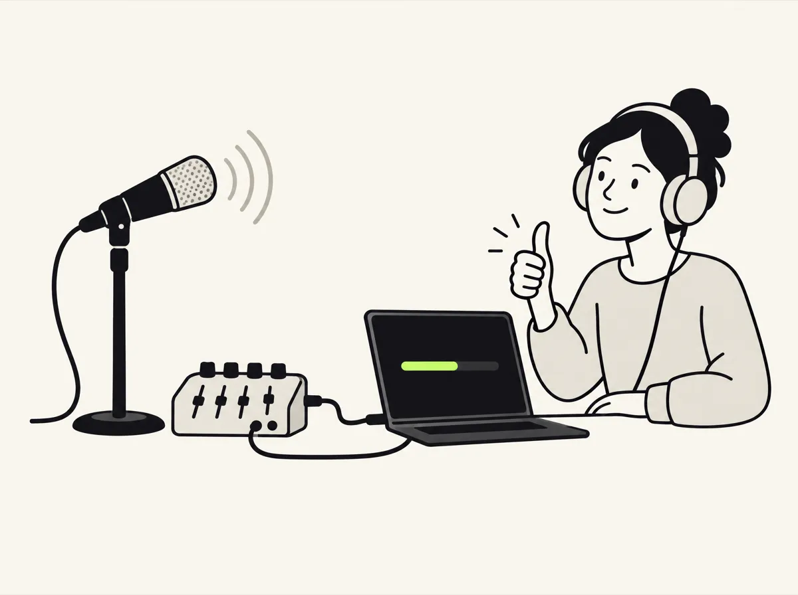

# Día del evento — guía de producción (español)

> Versión en inglés y más detallada: [runbook.md](runbook.md). Seguridad: [../security-guide.md](../security-guide.md). Problemas: [troubleshooting.md](troubleshooting.md).

<p align="center"></p>

Guía para operar OpenCaptions en cualquier evento, de una sala o de varias en paralelo (congresos, universidades, eventos corporativos y similares).
Objetivo: **cero operadores dedicados durante las charlas**. Una persona de producción mira el panel y actúa solo si aparece una alerta.

```
 Consola de sonido ──3.5 mm──► PC de la sala (agente o Chrome)
                                 ├─ agente o /ingest.html → manda el audio al server
                                 └─ /screen.html          → pantalla de la sala (subtítulos + QR)
                                          │
                               Server OpenCaptions (notebook o VM, HTTPS)
                                 ├─ Gemini Live Translate (1 sesión por sala)
                                 ├─ Gemini Flash-Lite (traducción de subtítulos)
                                 └─ /admin.html           → panel de producción
                                          │
       Público (celu, QR → /s/<sala>)   vMix/OBS (/overlay.html)   Transcripciones SRT/VTT/TXT
```

---

## T‑1 día: preparar el server

1. **Server**: una notebook en el lugar o una VM chica (2 vCPU / 2 GB alcanzan para 10+ salas).
   - **Sin terminal:** instalá [Node.js](https://nodejs.org/es/download) (LTS) y descargá [OpenCaptions para Mac](https://github.com/carraroesteban/opencaptions/releases/latest/download/OpenCaptions-mac.zip) o [para Windows](https://github.com/carraroesteban/opencaptions/releases/latest/download/OpenCaptions-windows.zip). En Mac, arrastrala a Aplicaciones y abrila; en Windows, descomprimí el ZIP y abrí **Start OpenCaptions**.
   - **Con terminal o Docker:** `npm install && npm start`, o `docker compose up -d` (ver [Deployment](../deployment.md)).

   Se abre el panel y el asistente pregunta el nombre del evento, las salas y los idiomas, conecta Gemini con tu API key, crea la dirección pública y usa tu zona horaria para la agenda.
2. **HTTPS** (para que los celulares de cualquier red lleguen a los subtítulos, y para usar micrófonos desde otras computadoras):
   - **Panel → Ajustes → Dirección pública** (Cloudflare Tunnel, sin abrir puertos): un clic te da `https://xxxx.trycloudflare.com`. Esa dirección **cambia cada vez que se reinicia**: para el evento usá **tu propio dominio** (ej. `subs.tuevento.com`) con el token de un túnel creado en Cloudflare, en la misma pantalla.
   - **Caddy** con dominio propio delante del server: `caddy reverse-proxy --from subs.tuevento.com --to localhost:8080`, y poné la dirección en `PUBLIC_URL`.
   - **Red local sin internet**: `mkcert` → `HTTPS_CERT=… HTTPS_KEY=… npm start` (hay que instalar la CA de mkcert en cada PC).

   **Nunca abras puertos del router hacia una PC de sala ni hacia el server**: el túnel o la VM en la nube hacen que todo sea saliente por el puerto 443.
3. **Contraseñas e ingreso.** La computadora del server no pide contraseña; cualquier otro dispositivo ingresa al panel con una. Hay tres, y la ventana de OpenCaptions las muestra al arrancar (o definilas vos con `ADMIN_TOKEN`, `CREW_TOKEN` e `INGEST_TOKEN`):
   - **Administración** (`Admin token`): todo el panel. Solo para la organización. Activá la **verificación en dos pasos** en Ajustes → Acceso.
   - **Equipo** (`Crew token`): para voluntarios y técnicos. Solo maneja los controles en vivo (siguiente charla, renombrar, quién habla, reconectar); no puede cambiar ni borrar la configuración.
   - **Computadoras de las salas** (`Ingest token`): para mandar el sonido; no abre el panel. Casi nunca hace falta: en **Pantallas y QR → Computadora junto al escenario**, **Crear un enlace para esa computadora** da un enlace (y un QR) que sirve una vez, por 30 minutos, y deja a esa computadora enviar el sonido de la sala sin escribir ninguna contraseña.

   **Ajustes → Acceso** muestra qué dispositivos tienen sesión iniciada (y permite cerrarlas) y cambia las contraseñas. El público, el proyector y el overlay **no** necesitan contraseña.
4. **Alertas en el celular:** Ajustes → Alertas → **App ntfy** (gratis, dos minutos): seguí los pasos y tocá **Guardar y probar**. Avisa si una sala se queda sin sonido, si la IA falla, si una charla se pasa 5 minutos o si se corta internet.
5. **Facturación y cuotas**: facturación activa en Google AI Studio (el plan gratuito limita las traducciones por minuto, y en ese plan Google puede usar el audio para mejorar sus productos). Configurá una **alerta de presupuesto**. Revisá en AI Studio las sesiones Live simultáneas de tu plan; si hay más salas que el límite, repartilas entre dos proyectos (ver [Deployment](../deployment.md#capacity-and-sharding)).
   **Avisá a oradores y público** que las charlas se subtitulan con IA, dónde se procesa el audio y si las transcripciones se publican. Hay un aviso listo para usar en [Licencias y responsabilidades](../legal.md#notice-template).
6. **Salas** (en el asistente o en **Panel → Salas**):
   - *Idioma de la charla*: «Detectar automáticamente» si los hosts o speakers cambian de idioma (presentación en español de una charla en inglés, preguntas bilingües). Fijalo solo si toda la charla es en un idioma. En los dos casos, si el speaker cambia de idioma cada pista lo sigue.
   - *Traducir a*: los idiomas de subtítulos.
7. **Glosario** (Panel → Glosario): nombres de speakers, sponsors, productos y siglas de la agenda. Se aplica al instante.
8. **Agenda**: Panel → Agenda → pegar la exportación de Swapcard, Sessionize o una planilla (o un CSV `sala,hora,título,speaker`; hay un ejemplo en `config/schedule.example.csv`). Muestra qué cambia antes de guardar. Cada charla toma su título y speaker sola; si el speaker anterior se pasa de tiempo, espera una pausa para no cortarlo.
9. **Carteles QR**: Panel → Pantallas y QR → Kit de QR (`/kit.html`): un A4 bilingüe por sala. Revisá que el QR apunte a la dirección pública, no a `localhost`.
10. **Ensayo general**: `npm run loadtest -- --stages 10 --input samples/talk-en.wav` (10 salas simultáneas, mirar el panel), o `/demo.html?v=<charla de YouTube>` para comparar la voz con los subtítulos.

## T‑2 h: armar cada sala

Hay tres formas de llevar el audio de cada sala al server; elegí una por sala:

| Opción | Cuándo | Hardware por sala |
|---|---|---|
| **A. Tomar el stream** (si vMix/OBS ya emite) | La consola ya entra a vMix/OBS | **Ninguno**: Panel → Salas → Editar → *Pull de audio* `srt://…` / `rtmp://…` / `https://…m3u8` (un HLS en la red local requiere `PULL_ALLOW_PRIVATE=1`) |
| **B. Agente** (recomendado con una PC) | Audio por cable a una PC | Mini PC con Linux, macOS o Windows, **sin navegador**: `scripts/agent.js` como servicio del sistema |
| C. Página de audio en Chrome | Armado rápido o de emergencia | Cualquier PC con Chrome |

**B. Agente** (sin navegador, arranca solo, reconecta solo):

```bash
node scripts/agent.js --list-devices                       # ver entradas de audio
node scripts/agent.js --stage room-a --device 1 --server wss://<server> --token <INGEST_TOKEN>
```

Como servicio: Linux → `deploy/opencaptions-agent@.service` (systemd, uno por sala); macOS → `deploy/com.opencaptions.agent.plist` (launchd); Windows → `nssm install OpenCaptionsAgent node scripts\agent.js --stage room-a --device "Nombre de la placa"`. Cada 5 s muestra el nivel, el estado de la sesión y la demora. Opciones: `--channel left|right` si la consola manda cosas distintas por cada canal, `--gain 1.5`.

**C. Página de audio en Chrome:**

1. Conectar la salida de la consola (3.5 mm o placa USB) a la PC.
2. Abrir en Chrome `https://<server>/ingest.html?stage=<sala>&token=<INGEST_TOKEN>`. La PC guarda la contraseña y la saca de la barra de direcciones; la conexión de audio usa un pase de un minuto, nunca la contraseña.
   - Elegir **Entrada** (la placa), **Canal** (mono / L / R según la consola) y tildar **Auto‑iniciar**.
   - Para kiosco: `chrome --kiosk --autoplay-policy=no-user-gesture-required --use-fake-ui-for-media-stream "https://<server>/ingest.html?stage=<sala>&autostart=1"` (arranca sola tras un reinicio y acepta el permiso de micrófono).

**Pantallas:**

- **Estilo**: diseñarlo una vez en `https://<server>/style.html` (tipografía, colores, caja o contorno, posición, líneas) y copiar las direcciones para el overlay y el proyector.
- **Proyector**: `https://<server>/screen.html?stage=<sala>` (o la dirección del editor de estilo) en pantalla completa. Opciones: `&langs=es,orig`, `&size=7` (alto de letra en % de pantalla), `&qr=0`.
- **Stream**: en vMix, input *Web Browser* 1920×1080 con `https://<server>/overlay.html?stage=<sala>&lang=es` sobre el programa; en OBS, *Browser Source* con la misma dirección. Un overlay por idioma. Con chroma: `&bg=%2300ff00&style=outline`.

## T‑60 min: prueba de sonido (por sala)

Con alguien hablando al micrófono del escenario (o con `/demo.html?mode=mic&stage=<sala>` y un micrófono de mano):

- [ ] El medidor de nivel se mueve con la voz, sin llegar al rojo (ajustar la ganancia).
- [ ] En el panel la sala pasa a **EN VIVO**.
- [ ] Aparecen el texto original y la traducción en menos de ~5 s.
- [ ] El proyector muestra los subtítulos y el QR se lee desde el fondo de la sala.
- [ ] Un celular escanea el QR, elige idioma y recibe los subtítulos.
- [ ] En vMix u OBS se ve el overlay sobre el programa.
- [ ] Tras 30 s de silencio la sala pasa a **EN PAUSA · silencio** (no consume). Al hablar vuelve sola.

## Durante las charlas

Activá el **Modo evento** (abajo en la barra del panel, o en Ajustes) al abrir las puertas: bloquea la configuración para que nadie borre ni cambie salas, agenda o glosario por error. Lo que se usa durante las charlas sigue funcionando.

No hay que tocar nada más. El sistema:

- pausa el envío al modelo con 30 s de silencio y retoma solo (con 600 ms de pre‑roll para no cortar la primera palabra);
- cierra las sesiones de IA tras 5 min sin voz y **separa la transcripción en una charla nueva** cuando vuelve la voz;
- renueva la sesión de Gemini antes de su límite sin perder audio;
- reinicia una sesión si hay voz pero no llega texto durante 20 s;
- si la traducción de texto queda limitada por cuota, usa temporalmente la traducción de Live Translate.

**Pausas:** tocá **Pausa** en la tarjeta de la sala (o la tecla **B** en la página de audio de la sala) para un intervalo, publicidad o lo que no haya que subtitular: las pantallas y los celulares muestran la pausa, cuándo vuelve la charla y cuál sigue. Termina con **Reanudar subtítulos**, **Siguiente charla** o cuando empieza la próxima charla de la agenda. Las pausas de la agenda (café, almuerzo: títulos sin orador, o las sesiones de servicio de Sessionize) empiezan solas cuando la sala queda en silencio, y terminan antes si alguien habla un rato. Con vMix u OBS conectados (**Integraciones → Pausas desde la mezcla de video**), pasar a una escena de pausa («Pausa», «Break», «Publicidad», «Volvemos»…) pausa los subtítulos de esa sala, y volver los reanuda.

**Música:** la música de entrada, un video de un sponsor o una canción entre charlas se reconoce en unos 10 s y no se subtitula (♪ en las pantallas y el overlay, sin costo); los subtítulos vuelven apenas alguien habla. Si una charla con música de fondo se toma por música, tocá **Es una charla: subtitular igual**.

**Corregir un subtítulo:** **Ver detalles → Corregir subtítulos** muestra las últimas frases; corregí una y cambia al instante en todas las pantallas, los celulares y la transcripción. Si cambiaste una sola palabra (el nombre de un orador), te ofrece escribirla siempre así: se suma al glosario y se puede deshacer desde el Historial.

**Audio de respaldo:** en las salas principales, una segunda computadora en otra salida de la consola, con **Es el respaldo de la sala** marcado en la página de audio (o el agente con `--backup`). Queda en espera y entra sola si la principal deja de mandar audio (3 s) o se queda muda mientras el respaldo sí oye la sala (20 s). La principal vuelve sola tras 10 s de sonido.

**Quién habla:** en cada sala del panel, tocá el nombre de quien habla (sale de la agenda), «Presentación», «Público (preguntas)» u «Otro…». Los subtítulos, la transcripción y los archivos SRT/VTT lo nombran desde ese momento.

**Si una charla se pasa de hora**, la tarjeta de la sala se pone naranja y dice qué charla toca. Tocá **Empezar «…»** cuando empiece el siguiente speaker, o dejá que cambie sola en la próxima pausa. **Siguiente charla** inicia una a mano, con el título y el speaker de la agenda ya cargados.

**Si algo se cambió por error**, abrí **Historial** y tocá **Deshacer** en ese cambio: las salas borradas vuelven igual que estaban. Las transcripciones nunca se borran.

**Anunciarlo** al inicio de cada charla: *"Subtítulos y traducción en vivo en tu celular: escaneá el QR. ¿Llegaste tarde? Tocá ¿Qué me perdí?"*

### Alertas del panel y qué hacer

Con las alertas en el celular configuradas, las que duran te llegan estés donde estés.

| Alerta | Qué significa | Acción |
|---|---|---|
| **SIN SONIDO** | La computadora de la sala no está mandando sonido | Revisar el agente o que la página de sonido de la sala esté abierta (en la tarjeta: **Abrir la página de sonido**). Con «Empezar solo al abrir esta página» vuelve sola tras un reinicio. |
| **ESPERANDO EL STREAM** | La sala espera el sonido de OBS o vMix y no llega nada | Empezar a transmitir a la dirección de la sala (en la tarjeta: **Ver la dirección**). |
| **no llega audio** | Hay conexión pero no llega sonido | La red de la computadora; reiniciar el agente o recargar la página de sonido. |
| **¿mic muteado?** | 60 s de señal casi nula | Fader de la consola, cable o entrada equivocada. |
| **reconectando IA** | La sesión de Gemini se está reconectando | Esperar ~5 s; si persiste, **Ver detalles → Reconectar IA**. El audio queda en buffer (12 s). |
| **latencia alta** | Transcripción más de 6 s atrás | Normal unos segundos tras reconectar; si persiste, **Reconectar IA** y revisar la red del server. |
| **traducción limitada por cuota** | Límite de Flash‑Lite | Automático (usa Live). Si es frecuente: subir de plan o `MT_PARTIAL_MS=3000`. |
| **usando el audio de respaldo** | La fuente principal se cortó o se quedó muda; está al aire el respaldo | Revisar la computadora principal, su cable y la salida de la consola. Vuelve sola tras 10 s de sonido. |
| **hay alguien hablando durante la pausa** | Una pausa puesta a mano (o por la mezcla) mientras alguien habla | Si empezó la charla, **Reanudar subtítulos**. |
| **MÚSICA · en pausa** | Suena música en la sala | Nada. Si es una charla, **Es una charla: subtitular igual**. |
| Términos mal escritos | Nombres o siglas | **Corregir subtítulos** en la tarjeta de la sala y aceptar «escribirlo siempre así»; o Panel → Glosario → agregar una corrección. Se aplica al instante. |
| Idioma equivocado | La charla es en otro idioma | Panel → Salas → Editar → *Idioma de la charla* → «Detectar automáticamente». |

### Plan B

| Falla | Qué pasa | Qué hacer |
|---|---|---|
| Se corta internet de una sala | La PC guarda ~15 s de audio y lo reenvía al volver | Si dura más, un hotspot 4G a esa PC. |
| Se corta internet del server | Con el [respaldo sin internet](../local.md#offline-backup) (`npm run local -- --fallback`), los subtítulos pasan a la notebook en ~15 s y vuelven solos; sin él, se frenan hasta que vuelva | Arrancar con el respaldo en lugares con internet inestable. Un server en la nube evita que un corte del lugar lo afecte. |
| Se reinicia el server | Pantallas, celulares y PCs reconectan solos; las transcripciones guardadas quedan | Volver a abrir OpenCaptions (o `docker compose restart`). |
| Se cuelga Chrome en una PC | Sin audio de esa sala | Reabrir la dirección; en kiosco con autostart arranca sola. El agente evita esto. |
| Gemini caído o sin crédito | Se detienen los subtítulos; el panel muestra el error y reintenta | Revisar estado y crédito en AI Studio. Plan B: `npm run local` ([modo local](../local.md)); probarlo antes, la primera vez baja ~4 GB de modelos. |
| Contraseña filtrada o dispositivo perdido | Una fuente desconocida reemplaza el audio, o hay un dispositivo desconocido con sesión | Ajustes → Acceso: cerrar esa sesión y cambiar la contraseña ([cómo](../security-guide.md#responding-to-a-leaked-password-or-a-lost-device)). |

## Al cierre de cada día

- El público tiene todas las transcripciones en `/talks.html` (leer, buscar, resumen, descargar).
- Panel → **Transcripciones**: SRT o VTT para subir con los videos, TXT para el blog o el archivo de accesibilidad.
- Pausar las alertas: Ajustes → Alertas → **Pausar hasta mañana**.
- Copia de seguridad de la carpeta de datos ([dónde está](../deployment.md#backups-and-upgrades)).
- Comparar el costo del día en el panel con AI Studio → Usage.

## Después del evento

- **Informe del evento:** Panel → Transcripciones → Informe del evento. Charlas, palabras, público y costo de IA por sala; se imprime o se guarda como PDF para los sponsors, o se descarga como planilla (CSV).
- Ajustes → Acceso: cerrar las demás sesiones y cambiar la contraseña del equipo.

## Referencia rápida de direcciones

| Para | Dirección |
|---|---|
| Público (QR) | `/s/<sala>` |
| Transcripción en vivo | `/talk.html?stage=<sala>` |
| Biblioteca de transcripciones | `/talks.html` |
| Carteles QR | `/kit.html` |
| Salas | `/` |
| Proyector | `/screen.html?stage=<sala>` |
| Overlay vMix/OBS | `/overlay.html?stage=<sala>&lang=es` |
| Audio desde Chrome | `/ingest.html?stage=<sala>&autostart=1` (agregar `&token=` la primera vez) |
| Panel de producción | `/admin.html` (los otros dispositivos ingresan con contraseña) |
| Informe del evento | `/report.html` |
| Prueba de sonido / demo en vivo | `/demo.html?mode=mic&stage=<sala>` |
| Demo con video de YouTube | `/demo.html?v=<url>` |
| Editor de estilo | `/style.html` |
| Agente (sin navegador) | `node scripts/agent.js --stage <sala> --device <n>` |
| Métricas Prometheus | `/metrics` con `Authorization: Bearer <CREW_TOKEN>` |
