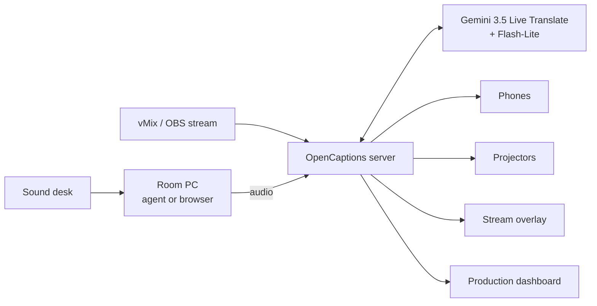

# Project overview

OpenCaptions is open-source software (MIT license) that captions and translates talks live, for conferences with many rooms at the same time. This page is the one-page summary for organizers, sponsors, judges and new contributors. For hands-on steps, start with [Getting started](getting-started.md).

## The problem

At a conference like Nerdearla, talks run in parallel across several rooms, in Spanish and English. People who don't speak the talk's language, who are deaf or hard of hearing, or who watch the stream remotely miss content.

Commercial captioning services are priced per room and per hour, and they are closed. They're also hard to connect to the setup venues already use: a sound desk, a mini PC per room, projectors, and vMix for the stream.

## The solution

| For | What they get |
|---|---|
| **Audience** | Scan a QR code, pick the room and language, and read live captions on the phone. Tap ✨ **What did I miss?** for a summary in your language, or 💬 **ask the talk** a question. Optionally listen to the translated voice. Afterwards, read, search and download every transcript. |
| **Room screens** | Large, high-contrast captions on the projector, in the translation and the original, with the QR code. |
| **Stream viewers** | Captions burned into the vMix or OBS stream through a transparent overlay. |
| **Production team** | One dashboard for every room: a getting-started checklist, status, audio level, latency, cost, alerts and transcripts. Rooms are added and edited live; paste the agenda once and talks name themselves. |
| **Organizers** | `npm run setup` in one minute, printable QR posters per room, and SRT, VTT and TXT transcripts per talk for YouTube uploads, the blog and accessibility archives. |

It runs unattended. Each room pauses itself when there's silence (nothing is billed then), resumes when someone speaks, splits transcripts per talk and reconnects by itself.

## How it works

1. Each room's audio reaches the server in one of three ways: the headless agent on the room PC, a browser page, or the stream vMix or OBS already produces.
2. **Gemini 3.5 Live Translate** transcribes the speech in real time and detects the language.
3. **Gemini Flash-Lite** translates each sentence, using the talk's context and a technical glossary. A provisional translation of the sentence in progress is shown while the speaker is still talking.
4. The server sends captions to every screen over WebSockets.
5. On request, the same text model reads the transcript to answer *What did I miss?* and questions from the audience — grounded only in what was said, cached and rate-limited.

The design details are in [Architecture](architecture.md), and the reasons behind each choice are in the [decision records](adr/README.md).

## Key numbers

| Metric | Value |
|---|---|
| Delay to original-language captions | about 3 s (measured) |
| Delay to translated captions | about 4.6–5.7 s (measured) |
| Rooms per server | Dozens. Tested with 10 simultaneous rooms at about 90 MB RAM. The limit is the Gemini quota. |
| Cost | about US$ 2.2 per room-hour of speech, plus US$ 0.4–0.6 per extra language. A 40-minute English → Spanish talk costs about US$ 1.8. |
| Languages | Any pair Gemini supports. Configured for Spanish, English and Portuguese. |
| Runtime dependencies | 5 npm packages, no build step, no database |

## What makes it different

- **It fits the existing venue setup.** The same cable from the sound desk and the same mini PC; vMix keeps working as it does.
- **One model session per room, whatever the number of languages.** Translation is a cheap text request per sentence, so cost and delay stay bounded.
- **Help for people, not just captions.** Latecomers catch up with a summary in their own language, anyone can ask what was said, and every talk leaves a searchable transcript.
- **Built for operations.** Silence gating, automatic reconnection with no lost audio, watchdogs, alerts, and a runbook for the crew.
- **Secure by default.** Tokens for everything except the public caption pages, hardened HTTP, SSRF-safe stream pulls, and no audio stored. An enterprise path runs through Google Cloud Vertex AI.
- **Open and forkable.** MIT license, plain JavaScript, documented APIs, and a pluggable engine interface.

## Status and maturity

| Area | Status |
|---|---|
| Captions and translation with real talks | Working and measured, with the real model and real conference videos |
| Multi-room operation | Tested with 10 simultaneous rooms (mock engine and real talks) |
| Security baseline | Implemented and covered by unit tests. See [known gaps](security-guide.md#known-gaps). |
| Audience assistant, transcript pages, agenda, QR kit | Implemented and tested with the mock engine and a fake model in unit tests; summaries/answers with the real model to be verified on event day |
| Platforms | macOS tested end to end; Linux tested in CI and mock mode; Windows expected ([Requirements](requirements.md#support-levels)) |
| Vertex AI backend | Implemented, not yet tested end to end |
| Automated tests | 24 unit and regression tests on Linux, macOS and Windows (captions, exports, security rules, reconnect/rollover edge cases, assistant, agenda). No automated end-to-end test with the real model yet. |
| Version | 0.x (pre-release). Breaking changes are listed in the [changelog](../CHANGELOG.md). |

## Roadmap

1. A local engine (Gemma) for events without internet.
2. Streaming translation to reduce delay by a further 0.2–0.5 s.
3. SSO login and per-person audit trail. Today an identity-aware proxy does this.
4. Speaker identification in captions.
5. An end-to-end test harness with recorded model responses.

## Origin and license

The first version was built for the [Nerdearla 2026 Vibeathon](https://nerdearla.devpost.com/) (September 24–25, 2026) to meet its challenge:

- live audio in;
- captions in the original language;
- English ↔ Spanish translation;
- at least two simultaneous rooms;
- an open-source license with a deployment guide;
- an audience view to pick room and language.

It's released under the [MIT license](../LICENSE). Contributions are welcome: see [CONTRIBUTING.md](../CONTRIBUTING.md).

## Glossary

| Term | Meaning |
|---|---|
| Room / stage | A physical room or track. `stage` is the identifier used in URLs and the API. |
| Talk | One continuous session in a room. Transcripts are stored per talk. Titles come from the agenda or the dashboard. |
| Assistant | The ✨ *What did I miss?* summary and 💬 *Ask the talk* feature |
| Ingest | Sending a room's audio to the server |
| Agent | The headless program on a room PC that captures the sound card and sends it |
| Pull | The server fetching a room's audio from a stream (SRT, RTMP, HLS) |
| Partial / final caption | Text still being refined / text that won't change |
| Silence gate | Pausing audio to the model during silence, to save cost |
