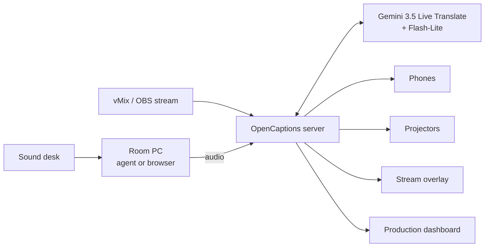

# Project overview

OpenCaptions is open-source software (MIT license) that captions and translates talks live, at any event: one room or many at the same time. This page is the one-page summary for organizers, sponsors, judges and new contributors. For hands-on steps, start with [Getting started](getting-started.md).

## The problem

At conferences, universities, public meetings and festivals, sessions often run in parallel across several rooms and in more than one language. People who don't speak the talk's language, who are deaf or hard of hearing, or who watch the stream remotely miss content.

Commercial captioning services are priced per room and per hour, and they are closed. They're also hard to connect to the setup venues already use: a sound desk, a mini PC per room, projectors, and vMix for the stream.

## The solution

| For | What they get |
|---|---|
| **Audience** | Scan a QR code, pick the room and language, and read live captions on the phone, with the speaker's name when the crew sets it. Tap **What did I miss?** for a summary in your language, or **ask the talk** a question. Listen to a translated voice when the organizer turns it on, or, with hearing aids or earbuds, to the room's own sound. Afterwards, read, search and download every transcript. |
| **Room screens** | Large, high-contrast captions on the projector, in the translation and the original, with the QR code. |
| **Stream viewers** | Captions burned into the vMix or OBS stream through a transparent overlay. |
| **Production team** | One dashboard for every room: a getting-started checklist, status, audio level, latency, cost, alerts and transcripts. Paste the agenda once and talks name themselves; a talk running over is flagged with a one-click start for the next. Volunteers get a crew sign-in with the live controls only, and alerts reach the organizers' phones. |
| **Organizers** | A Mac app, a Windows launcher or Docker, and a welcome wizard that connects the AI and creates a public address. Printable QR posters per room, Event mode with undo, SRT, VTT and TXT transcripts per talk (or all of them in one .zip), recordings captioned in minutes, and an event report with each talk's audience and cost. |

It runs unattended. Each room pauses itself when there's silence (nothing is billed then), resumes when someone speaks, splits transcripts per talk and reconnects by itself.

## How it works

<picture>
  <source media="(prefers-color-scheme: dark)" srcset="images/diagrams/how-it-works-dark.png" />
  
</picture>

Text version of this diagram

```mermaid
flowchart LR
  D[Sound desk] --> A[Room PC<br/>agent or browser]
  V[vMix / OBS stream] --> S
  A -- audio --> S[OpenCaptions server]
  S <--> G[Gemini 3.5 Live Translate<br/>+ Flash-Lite]
  S --> P[Phones]
  S --> R[Projectors]
  S --> O[Stream overlay]
  S --> M[Production dashboard]
```

1. Each room's audio reaches the server in one of three ways: the headless agent on the room PC, a browser page, or the stream vMix or OBS already produces.
2. **Gemini 3.5 Live Translate** transcribes the speech in real time and detects the language.
3. **Gemini Flash-Lite** translates each sentence, using the talk's context and a technical glossary. A provisional translation of the sentence in progress is shown while the speaker is still talking.
4. The server sends captions to every screen over WebSockets.
5. On request, the same text model reads the transcript to answer *What did I miss?* and questions from the audience — grounded only in what was said, cached and rate-limited.

The design details are in [Architecture](architecture.md), and the reasons behind each choice are in the [decision records](adr/README.md).

## Key numbers

| Metric | Value |
|---|---|
| Delay to original-language captions | about 3 s (measured) |
| Delay to translated captions | about 3–5 s (measured, with streaming translation) |
| Rooms per server | Dozens. Tested with 30 simultaneous rooms on one laptop; 3 rooms with 150 phones used 4 % CPU and 124 MB of memory. The limit is the Gemini quota. |
| Cost | about US$ 0.54 per room-hour of speech (US$ 2.2 with a translated voice in headphones), plus US$ 0.4–0.6 per extra language. A 40-minute English → Spanish talk costs about US$ 0.70. |
| Languages | 82 caption languages, in any pair Gemini supports; the setup wizard suggests Spanish, English and Portuguese. |
| Runtime dependencies | 5 npm packages, no build step, no database |

## What makes it different

- **It fits the existing venue setup.** The same cable from the sound desk and the same mini PC; vMix keeps working as it does.
- **One model session per room, whatever the number of languages.** Translation is a cheap text request per sentence, so cost and delay stay bounded.
- **Help for people, not just captions.** Latecomers catch up with a summary in their own language, anyone can ask what was said, and every talk leaves a searchable transcript.
- **Built for operations.** Silence gating, automatic reconnection with no lost audio, watchdogs, an offline backup, alerts on the organizers' phones, and a runbook for the crew.
- **Secure by default.** Sign-in for everything except the public caption pages (admin and crew roles, two-factor codes, company sign-in), a strict Content-Security-Policy, SSRF-safe stream pulls, and no audio stored. An enterprise path runs through Google Cloud Vertex AI.
- **Open and forkable.** MIT license, plain JavaScript, documented APIs, and a pluggable engine interface.
- **Cloud or local.** Gemini for the best quality at scale, or [local mode](local.md), where Whisper and an open model run on your own computer, with no account, no cost per hour and no audio leaving the building.

## Status and maturity

| Area | Status |
|---|---|
| Captions and translation with real talks | Working and measured, with the real model and real conference videos |
| Multi-room operation | Tested with 30 simultaneous rooms playing real talks through Gemini on one laptop (29 streamed; YouTube refused one video). See [Latency](latency.md#measured-numbers). |
| Security baseline | Implemented and covered by unit tests. See [known gaps](security-guide.md#known-gaps). |
| Audience assistant, transcript pages, agenda, QR kit | Implemented; summaries and answers tested end to end with a recorded real-model session |
| Event-day rehearsal | 8 minutes with the real model: 3 rooms, 150 phones (30 over the internet through Cloudflare), a talk running over, a room losing its audio, speaker changes. Every phone got captions, every alert arrived on time, no errors. |
| Platforms | macOS tested end to end, including the Mac app; Linux tested in CI and in Docker; Windows tested by hand and in CI ([Requirements](requirements.md#support-levels)) |
| Vertex AI backend | Implemented, not yet tested end to end |
| Caption a recording | Implemented; a 58-second talk takes about 20 seconds in local mode on a MacBook Pro (M3 Pro); not yet measured with Gemini ([Caption a recording](recording.md)) |
| Local mode (Whisper + Ollama) | Implemented; measured on CPUs with the bundled speech server (one room). GPU and Neural Engine backends, and several rooms per machine, not measured yet ([Local mode](local.md#measured-results)) |
| Automated tests | 219 tests on Linux, macOS and Windows: captions, exports, live corrections, breaks, recordings, restarts, sign-in and roles, security rules, alerts, reconnection edge cases, the assistant, the agenda, local mode, and an end-to-end test that replays a recorded Gemini session. Every page is checked against WCAG 2.2 AA (`npm run a11y`). `npm run local -- --check` tests local models end to end. |
| Version | 0.x (pre-release). Breaking changes are listed in the [changelog](../CHANGELOG.md). |

## Roadmap

1. **Nothing breaks quietly on event day** (next, 0.6.2): a damaged settings file stops the server with a clear message instead of starting over with simulated captions; the dashboard warns when transcripts can't be saved (a full disk); settings and transcripts survive a power cut mid-save; failed sign-ins from the venue's Wi-Fi are limited properly.
2. **Signed apps and more ways to install:** sign the Mac app and Windows launcher (no first-launch warning), `npx opencaptions`, a Homebrew tap and a winget entry.
3. **Closed captions inside the video stream** (CEA-608/708) for broadcasters and YouTube Live.
4. **Telling voices apart** automatically, so the crew doesn't have to label speakers.
5. **Local mode:** closer to the cloud's delay (today about 5–10 s behind it on a laptop's processor), measure GPU and Neural Engine backends and several rooms per machine, and a local translated voice.

Done recently (0.6): captions for about a quarter of the cost (Gemini's Transcribe Live by default, measured as accurate and as fast), and the speech model picked in Settings; in 0.6.1, captions from loud sound (a talk played from a browser tab) come every few seconds instead of every 15–30. Before that (0.5): recordings captioned in minutes, the room's own sound on phones for hearing aids, every transcript in one .zip, connecting the sound in plain words with a one-time link for the stage computer, rooms that reconnect by themselves after a restart. Before that (0.4): fixing captions live and transcripts afterwards, smooth TV-style captions, breaks from the agenda, local translations by whole sentence. Earlier (0.2.0): the Mac app and Windows launcher; the welcome wizard with the API key and a one-click public address; Event mode with undo; sign-in with admin and crew roles, two-factor and company sign-in; alerts on the organizers' phones; speaker labels; the event report; streaming translation; the offline backup; and an accessibility check of every page.

## License

OpenCaptions is released under the [MIT license](../LICENSE): free for any event, commercial or not. Contributions are welcome: see [CONTRIBUTING.md](../.github/CONTRIBUTING.md).

## Glossary

| Term | Meaning |
|---|---|
| Room / stage | A physical room or track. `stage` is the identifier used in URLs and the API. |
| Talk | One continuous session in a room. Transcripts are stored per talk. Titles come from the agenda or the dashboard. |
| Assistant | The *What did I miss?* summary and *Ask the talk* feature |
| Ingest | Sending a room's audio to the server |
| Agent | The headless program on a room PC that captures the sound card and sends it |
| Pull | The server fetching a room's audio from a stream (SRT, RTMP, HLS) |
| Partial / final caption | Text still being refined / text that won't change |
| Silence gate | Pausing audio to the model during silence, to save cost |
