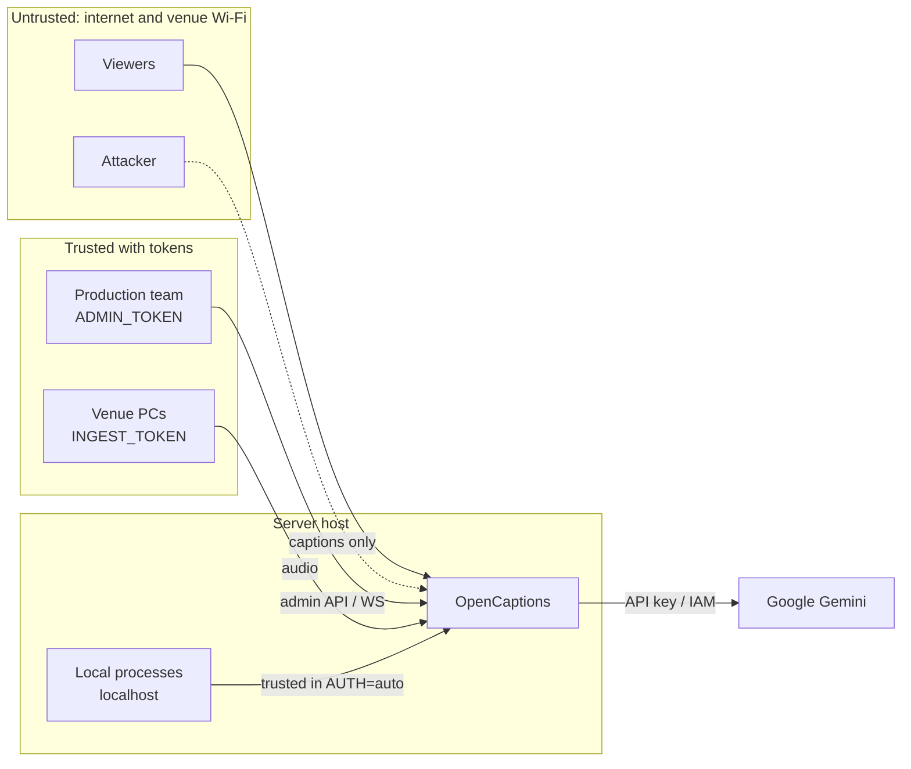

# Security

This page explains what OpenCaptions protects, which attacks it defends against and how. It ends with a hardening checklist for event day. To report a vulnerability, see the [security policy](../SECURITY.md).

**Summary:**

- The server is secure by default. Admin and audio ingest need a token from every device except the server machine itself.
- Caption pages are public on purpose.
- Audio is never stored.
- Transcripts can be switched off or deleted automatically.
- For organizations with compliance needs, run Gemini through Google Cloud Vertex AI inside your own project.

## What needs protecting

| Asset | Why it matters |
|---|---|
| Gemini credentials (API key or service account) | Direct financial exposure and quota abuse |
| Admin control (rooms, pulls, glossary) | An attacker could stop captions, burn budget by creating rooms, or change glossary replacements to put offensive text on stage screens |
| Audio ingest of a room | Injected audio becomes captions on a projector and in a live stream: a defacement risk with a big audience |
| Transcripts | Talks can be confidential in company settings |
| The server host and its network | Server-side pulls could be abused to reach internal services (SSRF) |
| Availability during the event | Captions are an accessibility service. Downtime excludes people. |

## Trust boundaries and actors



| Actor | Can do |
|---|---|
| Anyone | Read room names, captions, the glossary, the current talk's transcript (configurable), QR codes and `/healthz` |
| Holder of `INGEST_TOKEN` | Send audio to any room |
| Holder of `ADMIN_TOKEN` | Everything, including sending audio |
| A process on the server host (`AUTH=auto`) | Everything, without a token. Anyone who can run code on the host can already read `.env`. |

## Threats and controls (STRIDE)

| Threat | Example | Control |
|---|---|---|
| **Spoofing** an operator | Someone on venue Wi-Fi opens `/admin.html` | Tokens are required for admin and ingest from every non-local device. Tokens are compared in constant time. After 20 failures in 10 minutes, a client IP is locked out with HTTP 429. |
| Spoofing "localhost" | A request sent through a tunnel or proxy on the same machine, or DNS rebinding | Local trust requires a loopback socket, a `localhost`/`127.0.0.1` Host header **and** no proxy headers (`X-Forwarded-For`, `CF-Connecting-IP`, `Forwarded`…). Set `AUTH=token` to disable local trust. |
| **Tampering** with captions | Injecting audio into a room | Ingest needs `INGEST_TOKEN`. A new ingest replaces the previous one, which is visible on the dashboard. |
| Cross-site WebSocket hijacking | A malicious page drives the admin socket using a token stored in the operator's browser | Browser `Origin` must match the server's host, `PUBLIC_URL` or `ALLOWED_ORIGINS` for `/ws/admin` and `/ws/ingest` |
| Cross-site request forgery | A form on another site posts to the admin API | Admin HTTP calls need a header token (`Authorization` or `x-admin-token`). A token in the URL is only accepted on GET. No CORS is enabled. |
| Stored cross-site scripting | A room name or caption containing `<script>` | All dynamic text is HTML-escaped before rendering. Content-Security-Policy restricts script, frame and connection sources. Room fields are validated (id `[a-z0-9_-]{1,40}`, language codes, length limits). |
| Clickjacking | Embedding the dashboard in a hidden frame | `frame-ancestors 'self'` and `X-Frame-Options: SAMEORIGIN`. Overlays load as vMix/OBS browser inputs, not frames. |
| **Repudiation** | "Who changed the room?" | Admin actions are logged to the dashboard event log and stdout. There is no per-user identity (shared token). See [known gaps](#known-gaps). |
| **Information disclosure**: tokens | Tokens leaking through URLs, history or Referer | Pages move `?token=` into local storage and remove it from the address bar. `Referrer-Policy: no-referrer`. The agent and scripts send tokens in headers. |
| Information disclosure: transcripts | Downloading past talks | Only the talk in progress is public (`PUBLIC_TRANSCRIPTS=current`). Listing and past talks need admin. `none` makes everything private. |
| Information disclosure: internals | Stack traces, versions | Errors return `{ "error": "internal error" }`. `X-Powered-By` is disabled. `/metrics` and `/api/status` need admin. |
| Server-side request forgery | Admin pull of `http://169.254.169.254/…` or a LAN service | Pull URLs are validated: allowed schemes only; cloud metadata and link-local addresses always blocked; HTTP(S) to private or loopback addresses blocked unless `PULL_ALLOW_PRIVATE=1`; local files only from `samples/` or `MEDIA_DIR`. ffmpeg gets a network-only `-protocol_whitelist` for URLs. |
| **Denial of service** | Flooding APIs or sockets, huge messages | State-changing API calls are rate-limited per client IP. WebSocket upgrades are rate-limited. JSON bodies max 256 KB. WebSocket messages max 256 KB, and audio frames over 64 KB are dropped. `MAX_STAGES` and `MAX_VIEWERS` caps apply. |
| DoS on budget | Creating many rooms to burn Gemini credit | Admin only, plus the `MAX_STAGES` cap. Set a budget alert in Google Cloud or AI Studio. |
| DoS on budget via the audience assistant | Scripting thousands of summary/question requests | Summaries are cached and shared by every viewer of a room (45 s–2 min while live, 24 h after). Questions: 6/min per client and 30/min server-wide by default (`ASK_PER_CLIENT_PER_MIN`, `ASK_RPM`, `SUMMARY_RPM`). `AUDIENCE_AI=off` turns model calls off entirely. |
| Prompt injection | A question like "ignore your rules and…", or a speaker saying it on stage | The model only receives the transcript and the question, has no tools, and its output is shown as plain text (escaped). The system prompt tells it to treat the question as a question and to answer only from the transcript; the worst case is a wrong or silly answer, labeled as AI-generated. |
| **Elevation of privilege** | Escaping the process | The Docker image runs as a non-root user with a read-only root filesystem, `cap_drop: ALL` and `no-new-privileges`. The systemd unit is sandboxed (`ProtectSystem=strict` and more). |

## Audience AI

The ✨ *What did I miss?* summary and 💬 *Ask the talk* are public by design (they are for the audience), so they are built to be cheap and hard to abuse:

- **Grounded:** the model sees only the talk's transcript (at most the last ~60 000 characters) and must answer from it, with quotes and timestamps, or say it wasn't mentioned. No web access, no tools, no memory between requests.
- **Same access rules as transcripts:** a viewer can summarize or ask about exactly what `PUBLIC_TRANSCRIPTS` lets them read.
- **Bounded cost:** results are cached and shared; per-client and global rate limits; short outputs; the dashboard's cost estimate includes these calls.
- **Graceful without a model:** mock mode, `AUDIENCE_AI=off`, quota or network errors return transcript highlights and keyword quotes instead of failing.
- **Privacy:** questions are not stored or logged.

## Authentication modes

Set with `AUTH`:

| Mode | Behaviour | Use for |
|---|---|---|
| `auto` (default) | The server machine itself is trusted, so `npm start` then `http://localhost:8080/admin.html` just works. Every other device needs a token. | Laptops, venue PCs, VMs behind a proxy |
| `token` | A token is required everywhere, including localhost. | Shared hosts, multi-user machines, the strictest setups |
| `off` | No authentication. The server prints a warning. | Isolated lab networks only |

If `ADMIN_TOKEN` or `INGEST_TOKEN` isn't set, a random 24-character token is generated on first start, stored in `data/secrets.json` (file mode 600) and printed in the startup banner. An exposed server is never left open by accident. For events, set your own tokens (`openssl rand -base64 24`) so they survive a wiped `data/` folder.

**Presenting a token:**

- **Browsers:** open `…/admin.html?token=<ADMIN_TOKEN>` or `…/ingest.html?token=<INGEST_TOKEN>` once. The page stores it and cleans the URL.
- **Scripts, the agent and Prometheus:** send `Authorization: Bearer <token>`.

The admin token is also accepted wherever the ingest token is.

For single sign-on and per-person access, put an identity-aware proxy in front of `/admin.html`, `/api/*` (except the public endpoints) and `/ws/admin` and `/ws/ingest`. Google IAP, Cloudflare Access and oauth2-proxy all work. The public caption pages can stay open.

## Security headers

Every response includes:

```
Content-Security-Policy: default-src 'self'; script-src 'self' 'unsafe-inline' https://www.youtube.com https://s.ytimg.com; style-src 'self' 'unsafe-inline' https://fonts.googleapis.com; font-src 'self' https://fonts.gstatic.com data:; img-src 'self' data: https://i.ytimg.com; media-src 'self' blob:; worker-src 'self' blob:; connect-src 'self' ws: wss:; frame-src 'self' https://www.youtube.com https://www.youtube-nocookie.com; frame-ancestors 'self'; base-uri 'none'; form-action 'self'; object-src 'none'
X-Content-Type-Options: nosniff
Referrer-Policy: no-referrer
Permissions-Policy: microphone=(self), camera=(), geolocation=(), payment=(), usb=()
Cross-Origin-Opener-Policy: same-origin
Cross-Origin-Resource-Policy: same-origin
X-Frame-Options: SAMEORIGIN
Strict-Transport-Security: max-age=31536000   (only over HTTPS)
```

To embed pages in another site, set `FRAME_ANCESTORS`, for example `'self' https://www.example.com`.

## Data flow and privacy

```
Room audio ──(WSS/TLS)──► OpenCaptions server ──(TLS)──► Google Gemini (Live Translate + Flash-Lite)
                               │
                               ├──► viewers / screens / overlays (WSS/TLS): caption text (+ translated voice if enabled)
                               └──► disk: caption text per talk (JSONL), optional, with retention
```

| Data | Where it goes | Stored? |
|---|---|---|
| Raw audio | Server memory (a reconnect buffer of at most 12 s; the venue agent keeps about 15 s client-side), then Gemini | **Never written to disk** |
| Transcripts and translations | Viewers and `data/transcripts/` | Yes by default. `STORE_TRANSCRIPTS=false` disables storage. `RETENTION_DAYS=N` deletes old ones. |
| Translated voice | Relayed in memory to listeners | Never stored |
| Room config, glossary | `config/`, `data/stages.json` | Yes. No personal data. |
| Viewers | Nothing collected: no accounts, cookies, analytics or IP logs | Nothing |
| Tokens | `.env` or `data/secrets.json` | Keep both out of version control. `.gitignore` already covers them. |

## Choosing the AI backend

| | Gemini Developer API (API key, AI Studio) | Google Cloud Vertex AI (recommended for companies) |
|---|---|---|
| Setup | `GEMINI_API_KEY` | `GOOGLE_GENAI_USE_VERTEXAI=true`, `GOOGLE_CLOUD_PROJECT`, `GOOGLE_CLOUD_LOCATION` and a service account or ADC |
| Data used for training | Free tier: may be used to improve products. Paid tier: not used. | Not used without permission |
| Compliance coverage | Google's API terms | Google Cloud compliance program, including ISO 27001/27017/27018/27701, ISO 42001, SOC 2 Type II, HIPAA BAA and a GDPR DPA |
| Data residency | Global | Regional endpoints |
| Access control and audit | AI Studio | Your project's IAM, Cloud Audit Logs, VPC Service Controls |

The Vertex path uses the same SDK but has not yet been tested end to end, and model IDs may differ there (set `GEMINI_MODEL` and `TEXT_MODEL`). Always check current terms for your region.

### About ISO 27001 and SOC 2

Certifications apply to organizations and how they operate systems, not to software. An organization that holds them can run OpenCaptions inside its certified environment:

- Use Vertex AI.
- Put SSO in front of the admin surfaces.
- Keep transcripts per its records policy.
- Include the image in its vulnerability scanning.

The controls on this page are designed to make that straightforward.

## Hardening checklist

Before exposing a server for an event:

- [ ] HTTPS in front: a tunnel, Caddy or built-in TLS. `PUBLIC_URL` set to the HTTPS address.
- [ ] No router port forwarding to any venue PC. The app port (8080) is not reachable from the internet (`BIND_ADDR=127.0.0.1` or `HOST=127.0.0.1` behind a proxy).
- [ ] `ADMIN_TOKEN` and `INGEST_TOKEN` set to long random values, different from each other, and shared only with the people and PCs that need them.
- [ ] `AUTH` is `auto` or `token`, never `off`.
- [ ] `.env` has file mode 600 and isn't committed.
- [ ] A budget alert is configured in Google Cloud or AI Studio. A dedicated API key or project is used for the event.
- [ ] Transcript policy decided: `PUBLIC_TRANSCRIPTS`, `STORE_TRANSCRIPTS`, `RETENTION_DAYS`.
- [ ] `PULL_ALLOW_PRIVATE` stays off unless you pull HTTP streams from the LAN.
- [ ] Running in Docker or under the systemd unit, not as root.
- [ ] `npm audit --omit=dev` is clean, or its findings are reviewed.
- [ ] You know how to rotate tokens (below).

### Responding to a leaked token

1. Change `ADMIN_TOKEN` and/or `INGEST_TOKEN` in `.env`, or delete `data/secrets.json` if they were generated.
2. Restart the server. Existing sockets are dropped and must reconnect with the new token.
3. Update the agents' service configuration and re-open the dashboard with the new `?token=`.
4. Check the dashboard event log and the Gemini usage page for unexpected activity.

To rotate the Gemini API key, create a new key in AI Studio, update `.env`, restart the server, then delete the old key.

## Known gaps

These are accepted risks today, listed so you can decide whether they matter for your deployment:

| Gap | Impact | Mitigation now | Planned |
|---|---|---|---|
| Shared tokens, no user accounts or roles | No per-person audit trail. Revoking one person means rotating the token. | Identity-aware proxy (IAP, Cloudflare Access) | Optional OIDC login |
| Browsers send tokens as `?token=` on WebSocket URLs, because browsers can't set WebSocket headers | Tokens may appear in reverse-proxy access logs | Disable query logging in your proxy. TLS protects them in transit. | Short-lived session tickets |
| CSP allows `'unsafe-inline'` scripts | Weaker protection if an XSS bug is ever introduced | All dynamic text is escaped. No HTML rendering of user content. | Move inline scripts to files and use a strict CSP |
| Rate limits and lockouts are in memory, per process | They reset on restart and aren't shared across shards | Put a CDN or WAF in front for large public events | — |
| Audit log only on stdout and the dashboard | No tamper-evident history | Ship stdout to your log platform | Structured JSON logs |
| Stored transcripts aren't encrypted by the app | Anyone with disk access can read them | Encrypted volume or disk | — |
| DNS rebinding between pull validation and connection (time-of-check to time-of-use) | Narrow SSRF window for admins | Admin-only feature. Keep `PULL_ALLOW_PRIVATE` off. | Pin the resolved IP |
