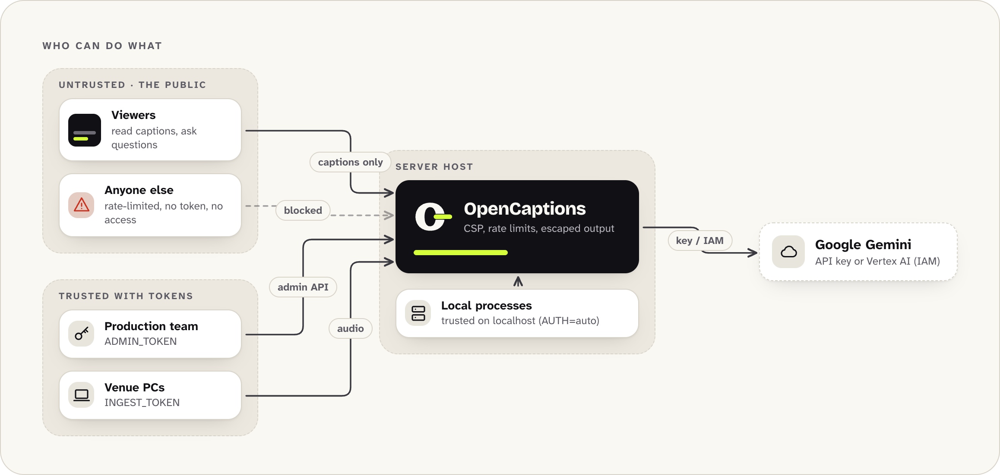
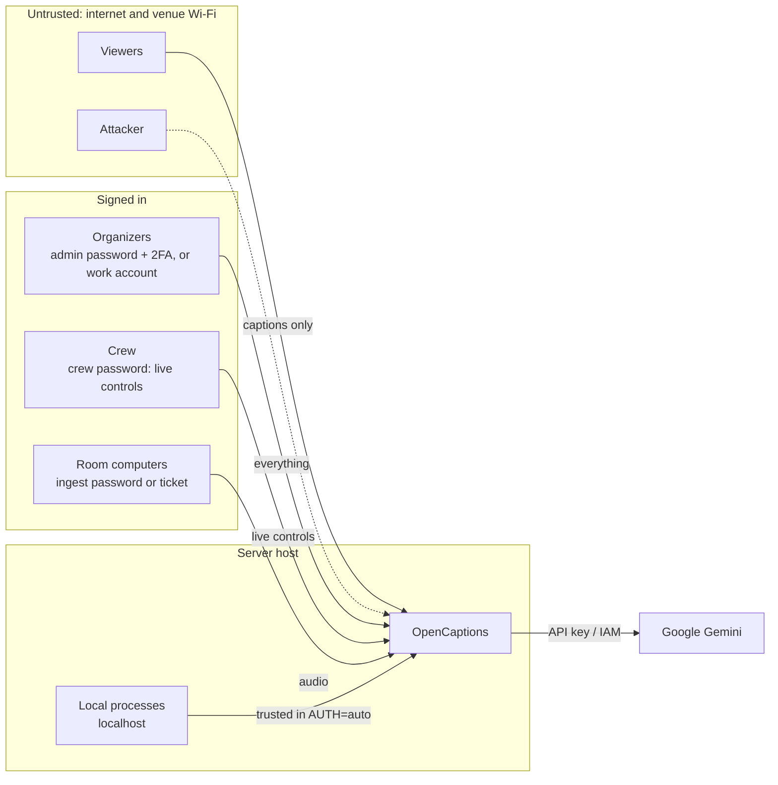

# Security

This page explains what OpenCaptions protects, which attacks it defends against and how. It ends with a hardening checklist for event day. To report a vulnerability, see the [security policy](../.github/SECURITY.md).

**Summary:**

- The server is secure by default. The dashboard needs sign-in, and sending audio a password, from every device except the server machine itself. The crew gets a password that only runs the live controls; two-factor codes and company sign-in are available.
- Caption pages are public on purpose.
- Audio is never stored. A room's sound reaches phones only in rooms where an admin turns it on (assistive listening, off by default).
- Transcripts can be switched off or deleted automatically.
- For organizations with compliance needs, run Gemini through Google Cloud Vertex AI inside your own project.

## What needs protecting

| Asset | Why it matters |
|---|---|
| Gemini credentials (API key or service account) | Direct financial exposure and quota abuse |
| Admin control (rooms, pulls, glossary, the API key, the public address, alerts) | An attacker could stop captions, burn budget by creating rooms, or change glossary replacements to put offensive text on stage screens |
| Audio ingest of a room | Injected audio becomes captions on a projector and in a live stream: a defacement risk with a big audience |
| Transcripts | Talks can be confidential in company settings |
| The server host and its network | Server-side pulls could be abused to reach internal services (SSRF) |
| Availability during the event | Captions are an accessibility service. Downtime excludes people. |

## Trust boundaries and actors

<picture>
  <source media="(prefers-color-scheme: dark)" srcset="images/diagrams/security-dark.png" />
  
</picture>

<details><summary>Text version of this diagram</summary>


```mermaid
flowchart LR
  subgraph Public["Untrusted: internet and venue Wi-Fi"]
    V[Viewers]
    X[Attacker]
  end
  subgraph Ops["Signed in"]
    A[Organizers<br/>admin password + 2FA, or work account]
    C[Crew<br/>crew password: live controls]
    I[Room computers<br/>ingest password or ticket]
  end
  subgraph Host["Server host"]
    S[OpenCaptions]
    L[Local processes<br/>localhost]
  end
  G[Google Gemini]
  V -- captions only --> S
  X -.-> S
  A -- everything --> S
  C -- live controls --> S
  I -- audio --> S
  L -- trusted in AUTH=auto --> S
  S -- API key / IAM --> G
```

</details>

| Actor | Can do |
|---|---|
| Anyone | Read room names, captions, the glossary, the current talk's transcript (configurable), QR codes and `/healthz` |
| Holder of `INGEST_TOKEN` | Send audio to any room |
| Whoever opens an unused room link first | The same as `INGEST_TOKEN`, in that one browser, until its session expires or is signed out |
| Holder of `CREW_TOKEN`, or a crew account (company sign-in) | The live controls and reading the dashboard; never the setup |
| Holder of `ADMIN_TOKEN` (plus a two-factor code, when on), or an admin account | Everything, including sending audio |
| A process on the server host (`AUTH=auto`) | Everything, without a token. Anyone who can run code on the host can already read `.env`. |

## Threats and controls (STRIDE)

| Threat | Example | Control |
|---|---|---|
| **Spoofing** an operator | Someone on venue Wi-Fi opens `/admin.html` | Sign-in is required from every non-local device; passwords are compared in constant time. After 20 failures in 10 minutes, a client IP is locked out with HTTP 429. Optional two-factor codes or company sign-in. |
| Spoofing "localhost" | A request sent through a tunnel or proxy on the same machine, or DNS rebinding | Local trust requires a loopback socket, a `localhost`/`127.0.0.1` Host header **and** no proxy headers (`X-Forwarded-For`, `CF-Connecting-IP`, `Forwarded`…). Set `AUTH=token` to disable local trust. |
| **Tampering** with captions | Injecting audio into a room | Ingest needs `INGEST_TOKEN`. A new ingest replaces the previous one, which is visible on the dashboard. |
| Cross-site WebSocket hijacking | A malicious page drives the admin socket with the operator's session | Browser `Origin` must match the server's host, `PUBLIC_URL` or `ALLOWED_ORIGINS` for `/ws/admin` and `/ws/ingest`; the session cookie is `SameSite=Strict` |
| Cross-site request forgery | A form on another site posts to the admin API | The session cookie is `SameSite=Strict`, and every change from a browser must carry this server's `Origin`, including on the server computer itself, where no password is asked (otherwise any website open there could post to `localhost`). Scripts send a header (`Authorization`); a password in the URL is only accepted on GET. No CORS is enabled. |
| Stored cross-site scripting | A room name or caption containing `<script>` | All dynamic text is HTML-escaped before rendering. Content-Security-Policy restricts script, frame and connection sources. Room fields are validated (id `[a-z0-9_-]{1,40}`, language codes, length limits). |
| Clickjacking | Embedding the dashboard in a hidden frame | `frame-ancestors 'self'` and `X-Frame-Options: SAMEORIGIN`. Overlays load as vMix/OBS browser inputs, not frames. |
| **Repudiation** | "Who changed the room?" | Every setup change in the History says who made it: the signed-in device's name or the work account. Company sign-in gives each person their own identity. See [known gaps](#known-gaps). |
| **Information disclosure**: passwords | Passwords leaking through URLs, browser storage, history or Referer | The dashboard swaps a password for an `HttpOnly` session cookie and keeps nothing in `localStorage`; a `?token=` link is exchanged and removed from the address bar. `Referrer-Policy: no-referrer`. The History never contains a password. The agent and scripts send passwords in headers. |
| Information disclosure: transcripts | Downloading past talks | Only the talk in progress is public (`PUBLIC_TRANSCRIPTS=current`). Listing and past talks need admin. `none` makes everything private. |
| Information disclosure: internals | Stack traces, versions | Errors return `{ "error": "internal error" }`. `X-Powered-By` is disabled. `/metrics` and `/api/status` need the crew or admin password. |
| Server-side request forgery | Admin pull of `http://169.254.169.254/…` or a LAN service | Pull URLs are validated: allowed schemes only; cloud metadata and link-local addresses always blocked; HTTP(S) to private or loopback addresses blocked unless `PULL_ALLOW_PRIVATE=1`; local files only from `samples/` or `MEDIA_DIR`. ffmpeg gets a network-only `-protocol_whitelist` for URLs. |
| Leaked connector links | Someone gets a Zoom, YouTube or Teams caption link, or a webhook secret, and posts into the meeting or fakes events | Links are stored only in `data/secrets.json` (`0600`), shown as host and path, and only the admin can add, test or remove them. Each type accepts only its platform's host. Webhooks are signed with HMAC-SHA256 and the secret is shown once. Meeting links expire with the meeting. |
| **Denial of service** | Flooding APIs or sockets, huge messages | State-changing API calls are rate-limited per client IP. WebSocket upgrades are rate-limited. JSON bodies max 256 KB. WebSocket messages max 256 KB, and audio frames over 64 KB are dropped. `MAX_STAGES` and `MAX_VIEWERS` caps apply. |
| DoS on budget | Creating many rooms to burn Gemini credit | Admin only, plus the `MAX_STAGES` cap. Set a budget alert in Google Cloud or AI Studio. |
| DoS on budget via the audience assistant | Scripting thousands of summary/question requests | Summaries are cached and shared by every viewer of a room (45 s–2 min while live, 24 h after). Questions: 6/min per browser, 60/min per IP and 30/min server-wide by default (`ASK_PER_CLIENT_PER_MIN`, `ASK_PER_IP_PER_MIN`, `ASK_RPM`, `SUMMARY_RPM`). `AUDIENCE_AI=off` turns model calls off entirely. |
| Prompt injection | A question like "ignore your rules and…", or a speaker saying it on stage | The model only receives the transcript and the question, has no tools, and its output is shown as plain text (escaped). The system prompt tells it to treat the question as a question and to answer only from the transcript; the worst case is a wrong or silly answer, labeled as AI-generated. |
| **Elevation of privilege** | Escaping the process | The Docker image runs as a non-root user with a read-only root filesystem, `cap_drop: ALL` and `no-new-privileges`. The systemd unit is sandboxed (`ProtectSystem=strict` and more). |

## Audience AI

The *What did I miss?* summary and *Ask the talk* are public by design (they are for the audience), so they are built to be cheap and hard to abuse:

- **Grounded:** the model sees only the talk's transcript (at most the last ~60 000 characters) and must answer from it, with quotes and timestamps, or say it wasn't mentioned. No web access, no tools, no memory between requests.
- **Same access rules as transcripts:** a viewer can summarize or ask about exactly what `PUBLIC_TRANSCRIPTS` lets them read.
- **Bounded cost:** results are cached and shared; per-client and global rate limits; short outputs; the dashboard's cost estimate includes these calls.
- **Graceful without a model:** mock mode, `AUDIENCE_AI=off`, quota or network errors return transcript highlights and keyword quotes instead of failing.
- **Privacy:** questions are not stored or logged.

## Protecting the setup from mistakes

Sign-in decides *who* can change the setup (admins only; the crew runs the live controls). Two more layers protect the event manager's work from accidents by people who are allowed in:

- **Event mode** locks the setup on the server while the event is live. Rooms, the agenda, the glossary and the event name can't be deleted or changed (the API answers `423 Locked`), whatever the dashboard sends. Live operations keep working. Turning it off takes an explicit confirmation and is recorded.
- **History and undo:** every setup change is stored in `data/history.jsonl` with what it replaced, and can be undone from the dashboard. Deleted rooms go to a trash and come back exactly as they were. Transcripts are never deleted by any dashboard action.

The setup wizard follows the same rules: it shows a review of every change before applying it, never removes a room that has transcripts unless you tick it, and can't apply anything in Event mode.

## Authentication modes

Set with `AUTH`:

| Mode | Behaviour | Use for |
|---|---|---|
| `auto` (default) | The server machine itself is trusted, so `http://localhost:8080/admin.html` just works there. Every other device signs in. | Laptops, venue PCs, VMs behind a proxy |
| `token` | Sign-in is required everywhere, including the server machine. | Shared hosts, multi-user machines, the strictest setups |
| `off` | No authentication. The server prints a warning. | Isolated lab networks only |

### Passwords and roles

Three passwords, each with its own job:

| Password | Opens | Give it to |
|---|---|---|
| **Admin** (`ADMIN_TOKEN`) | The whole dashboard, setup included | The organizers |
| **Crew** (`CREW_TOKEN`) | The dashboard's live controls only: start the next talk, rename the current one, reconnect a room, stop a pull, the offline-backup switch; reading the status, transcripts and history. Never the setup, Settings or Event mode. | Volunteers and technicians |
| **Ingest** (`INGEST_TOKEN`) | Sending a room's audio. It doesn't open the dashboard. | Room computers |

Any that isn't set is generated on first start (24 random characters), stored in `data/secrets.json` (file mode 600) and printed in the startup screen.

**Room links** spare room computers the ingest password. An admin makes one in **Screens and QR → Computer next to the stage** (or the wizard's step 7): `https://<server>/ingest.html?stage=<room>&link=<code>`, also as a QR code. Opening it signs that one browser in with a session that can send audio and nothing else (no dashboard, no status, no setup). The code is random (144 bits), works **once**, expires after **30 minutes**, is kept only as a hash in memory (a restart voids unused ones), and leaves the address bar as soon as the page reads it. A browser that can already send audio doesn't use it up. Each link made is recorded in the History, and the session it creates is listed in **Settings → Access → Signed-in devices** as "Room computer · <room>", where it can be signed out. Like the ingest password, it isn't tied to one room. Treat an unused link like the password: send it only to the person at that computer, and make a new one if it leaked. **Settings → Access → Passwords** changes a generated one: the new value is shown once, the old one stops working, and every device signed in with it is signed out. One set in `.env` is changed there, followed by a restart.

### Signing in

The dashboard and the welcome wizard show a sign-in screen on any device other than the server itself. The password is sent once; the server answers with a **session cookie** (`HttpOnly`, `SameSite=Strict`, `Secure` over HTTPS). The page never keeps the password: nothing goes into `localStorage`, and a `?token=` link (like the one Docker prints) is exchanged for a session and removed from the address bar. Scripts on the page can't read the cookie, so even an injected script couldn't steal the sign-in.

- **Sessions expire** after `SESSION_HOURS` (24 by default). The server stores only a hash of each session.
- **Each device has a name** ("Stage left tablet"), shown in **Settings → Access → Signed-in devices**, where any session can be signed out, or every other one at once. The History records who made each change.
- **Changes from other websites are refused:** a browser's requests must come from the dashboard itself (the cookie is `SameSite=Strict`, and the server checks the `Origin`), on the server computer too.
- **Wrong passwords** count towards the lockout: 20 per 10 minutes per address and browser, 100 per address. Someone guessing on the venue Wi-Fi locks out only their own browser, not the crew sharing the same public address.

Scripts, the room agent and Prometheus send a password as `Authorization: Bearer <password>`. The crew password is enough for `/metrics`.

### Two-factor sign-in

**Settings → Access → Two-factor sign-in** adds a 6-digit code from an authenticator app (Google Authenticator, 1Password, Authy… standard TOTP) to the admin password. Each code works once. While it's on, the admin password alone opens nothing: not the sign-in screen, and not a script's `Authorization` header either. Scripts that need the admin password (`npm run loadtest`, `subtitle`, `multi`) then run on the server computer, which needs no password. The crew password is unaffected. Lost the phone? On the server computer, open the dashboard (no sign-in there) and turn it off, or delete `totpSecret` from `data/secrets.json` and restart.

### Company sign-in

Each person signs in with their own work account (Google Workspace, Microsoft Entra ID, Okta, Auth0, Keycloak or any OpenID Connect provider), with your provider's own two-factor rules. OpenCaptions uses the authorization code flow with PKCE and checks the ID token's signature, issuer, audience, expiry and nonce.

1. **Register an app** with your provider, type "Web application", with this redirect address: `https://<your public address>/auth/oidc/callback`. Use a fixed address: a quick `trycloudflare.com` address changes on every restart.
   - **Google:** Google Cloud console → APIs & Services → Credentials → Create credentials → OAuth client ID. Issuer: `https://accounts.google.com`.
   - **Microsoft:** Entra admin center → App registrations → New registration, then Certificates & secrets → New client secret. Issuer: `https://login.microsoftonline.com/<tenant id>/v2.0`.
2. **Set it in `.env`** and restart:

   ```bash
   OIDC_ISSUER=https://accounts.google.com
   OIDC_CLIENT_ID=<client id>
   OIDC_CLIENT_SECRET=<client secret>
   OIDC_ADMINS=ana@example.org,ben@example.org   # or a whole domain: @example.org
   OIDC_CREW=@volunteers.example.org            # optional: these get the crew role
   ```

   `OIDC_REDIRECT_URI` sets the redirect address when it can't be worked out (a proxy that hides the public address). `OIDC_LABEL` changes the button's name. `OIDC_ONLY=1` turns off password sign-in in the browser, so only work accounts get in (scripts with a password in a header still work).
3. The sign-in screen shows **Sign in with Google** (or your provider). Accounts not listed in `OIDC_ADMINS` or `OIDC_CREW` are turned away.

Keep password sign-in on at events unless you're sure of the venue's internet: if the provider can't be reached, nobody can sign in with it.

## Security headers

Every response includes:

```
Content-Security-Policy: default-src 'self'; script-src 'self' https://www.youtube.com https://s.ytimg.com; script-src-attr 'none'; style-src 'self' 'sha256-…'; style-src-attr 'none'; font-src 'self' data:; img-src 'self' data: https://i.ytimg.com; media-src 'self' blob:; worker-src 'self' blob:; connect-src 'self' ws: wss:; frame-src 'self' https://www.youtube.com https://www.youtube-nocookie.com; frame-ancestors 'self'; base-uri 'none'; form-action 'self'; object-src 'none'
X-Content-Type-Options: nosniff
Referrer-Policy: no-referrer
Permissions-Policy: microphone=(self), camera=(), geolocation=(), payment=(), usb=()
Cross-Origin-Opener-Policy: same-origin
Cross-Origin-Resource-Policy: same-origin
X-Frame-Options: SAMEORIGIN
Strict-Transport-Security: max-age=31536000   (only over HTTPS)
```

Both scripts and styles are strict: only files from this server run or apply, plus each page's own `<style>` block, allowed by its hash (`'sha256-…'`, computed when the server starts). There are no inline scripts, event handlers or `style=""` attributes; `npm test` fails if one is added. So injected markup can neither run code nor restyle a page, for example to hide a warning or draw a fake button over a real one.

To embed pages in another site, set `FRAME_ANCESTORS`, for example `'self' https://www.example.com`.

## Data flow and privacy

```
Room audio ──(WSS/TLS)──► OpenCaptions server ──(TLS)──► Google Gemini (Live Translate + Flash-Lite)
                               │
                               ├──► viewers / screens / overlays (WSS/TLS): caption text (+ translated voice if enabled)
                               ├──► phones listening (WSS/TLS): the room's own sound, only in rooms that have it on
                               └──► disk: caption text per talk (JSONL), optional, with retention
```

| Data | Where it goes | Stored? |
|---|---|---|
| Raw audio | Server memory (a reconnect buffer of at most 12 s; the venue agent keeps about 15 s client-side), then Gemini, or the local speech server in local mode | **Never written to disk** |
| Transcripts and translations | Viewers and `data/transcripts/` | Yes by default. `STORE_TRANSCRIPTS=false` disables storage. `RETENTION_DAYS=N` deletes old ones. |
| Translated voice | Relayed in memory to listeners | Never stored |
| The room's sound (assistive listening) | Relayed in memory, as it arrives, to phones listening on rooms where an admin turned it on (off by default) | Never stored |
| Room config, glossary, agenda | `config/`, `data/stages.json` | Yes. Speaker names from the agenda. |
| Signed-in devices and the History | `data/sessions.json` (a hash of each session, the device's name, its address), `data/history.jsonl` (who changed what) | Yes. Sessions expire after `SESSION_HOURS`. |
| Alerts | Sent to the services you choose (ntfy, Telegram, Slack, Discord, a webhook): room names and what went wrong, never captions | Not stored by OpenCaptions |
| Viewers | Nothing collected: no accounts, cookies, analytics or IP logs | Nothing |
| Passwords, the Gemini API key, the Cloudflare tunnel token, the two-factor secret and alert destinations | `.env` or `data/secrets.json` (file mode 600) | Keep both out of version control. `.gitignore` already covers them. A key or tunnel token pasted in the dashboard goes to `data/secrets.json` and is never sent back to any browser: the dashboard sees only the key's last 4 characters, and the history records that the key changed, not the key. Google checks a new key before it's saved. |

### Who can see what

Viewers need no account, so access is per kind of data and per role. *This computer* is the server itself, which needs no password unless `AUTH=token`.

| Data | Audience (no sign-in) | Crew password | Admin password | Just for me |
|---|---|---|---|---|
| Live captions and translations of a room, the translated voice | Anyone with the room's address (the QR code) | ✓ | ✓ | Only this computer and devices signed in with the admin password |
| The room's sound, live (assistive listening for hearing aids and earbuds) | Only in rooms where an admin turned on **The room's sound on phones** (off by default). Then anyone with the room's address can listen, from anywhere, up to the room's listener limit. | Listens like the audience; can't turn it on | Turns it on or off per room | Never, not even for its own room |
| Transcripts of talks, *What did I miss?* and *Ask the talk* | As set in **Settings → Transcripts for the audience**: the talk in progress (default), every talk, or none | Read | Read, correct, delete | Only this computer and signed-in devices |
| Room names, talk titles, speakers, the agenda | Shown on the audience pages | ✓ | ✓, and change them | Not used |
| Room status, the glossary, the History | No | Read (stream addresses left out: they can carry keys) | Read and change | Not used |
| Integrations, vision mixers, alerts, signed-in devices | No | No | ✓ | Not used |
| Passwords, the Gemini API key, the tunnel token, the two-factor secret | No | No | Never shown again after saving (the key's last 4 characters) | Same |
| Room audio | Only live, in rooms that play their sound (the row above). Never recorded. | A level meter | A level meter | Never leaves the computer except to the AI |

Nobody sees viewers: there are no viewer accounts, cookies, analytics or logs of who read what. A browser remembers its own choices (language, text size, theme) in its local storage, which is never sent.

## Choosing the AI backend

| | Gemini Developer API (API key, AI Studio) | Google Cloud Vertex AI (recommended for companies) | [Local mode](local.md) (`ENGINE=local`) |
|---|---|---|---|
| Setup | `GEMINI_API_KEY` | `GOOGLE_GENAI_USE_VERTEXAI=true`, `GOOGLE_CLOUD_PROJECT`, `GOOGLE_CLOUD_LOCATION` and a service account or ADC | `npm run local`: a Whisper speech server and Ollama on the same machine or your LAN |
| Data used for training | Free tier: may be used to improve products. Paid tier: not used. | Not used without permission | Nothing leaves your machines |
| Compliance coverage | Google's API terms | Google Cloud compliance program, including ISO 27001/27017/27018/27701, ISO 42001, SOC 2 Type II, HIPAA BAA and a GDPR DPA | Your own environment and controls |
| Data residency | Global | Regional endpoints | The machine running the models |
| Access control and audit | AI Studio | Your project's IAM, Cloud Audit Logs, VPC Service Controls | Your network. The speech server and Ollama have no authentication: `npm run local` binds them to `127.0.0.1`. If you run them on another machine, keep them on a trusted network. |

The Vertex path uses the same SDK but has not yet been tested end to end, and model IDs may differ there (set `GEMINI_MODEL` and `TEXT_MODEL`). Always check current terms for your region.

### About ISO 27001 and SOC 2

Certifications apply to organizations and how they operate systems, not to software. An organization that holds them can run OpenCaptions inside its certified environment:

- Use Vertex AI.
- Turn on company sign-in (`OIDC_*`) with its own two-factor rules, and `OIDC_ONLY=1`.
- Keep transcripts per its records policy.
- Include the image in its vulnerability scanning.

The controls on this page are designed to make that straightforward.

## Hardening checklist

Before exposing a server for an event:

- [ ] HTTPS in front: **Settings → Public address** (Cloudflare Tunnel), Caddy or built-in TLS. With your own proxy, `PUBLIC_URL` set to the HTTPS address. A quick `trycloudflare.com` address is public to anyone who has the link, like any other public address: the dashboard still needs sign-in through it, and room computers their password. Turning it off and on is locked in Event mode.
- [ ] No router port forwarding to any venue PC. The app port (8080) is not reachable from the internet (`BIND_ADDR=127.0.0.1` or `HOST=127.0.0.1` behind a proxy).
- [ ] The admin password only for organizers, the **crew password** for volunteers, the ingest password only on room computers. Set your own (`openssl rand -base64 24`) if `data/` may be wiped.
- [ ] **Two-factor sign-in** on (Settings → Access), or company sign-in with your provider's two-factor.
- [ ] After the event, sign out every other device and change the crew password (Settings → Access).
- [ ] `AUTH` is `auto` or `token`, never `off`.
- [ ] `.env` has file mode 600 and isn't committed.
- [ ] A budget alert is configured in Google Cloud or AI Studio. A dedicated API key or project is used for the event.
- [ ] Transcript policy decided: `PUBLIC_TRANSCRIPTS`, `STORE_TRANSCRIPTS`, `RETENTION_DAYS`.
- [ ] `PULL_ALLOW_PRIVATE` stays off unless you pull HTTP streams from the LAN.
- [ ] Running in Docker or under the systemd unit, not as root.
- [ ] `npm audit --omit=dev` is clean, or its findings are reviewed.
- [ ] You know how to change a password and sign out a device (below).

### Responding to a leaked password or a lost device

1. **Settings → Access → Signed-in devices:** sign out the lost device, or every other device.
2. **Settings → Access → Passwords → Change** the leaked one. Devices signed in with it are signed out at once; the new value is shown once. (Set in `.env`? Change it there and restart.)
3. If it was the ingest password, update the agents' service configuration and each room's audio page.
4. Check the History (who changed what), the event log and the Gemini usage page for unexpected activity.

To rotate the Gemini API key, create a new key in AI Studio, paste it in **Settings → Gemini** (or update `.env` and restart), then delete the old key.

## Known gaps

These are accepted risks today, listed so you can decide whether they matter for your deployment:

| Gap | Impact | Mitigation now | Planned |
|---|---|---|---|
| Password sign-in shares one password per role | The History knows the device's name, not a verified person | Company sign-in gives each person their own account; name devices clearly | — |
| Rate limits and lockouts are in memory, per process | They reset on restart and aren't shared across shards | Put a CDN or WAF in front for large public events | — |
| The History (`data/history.jsonl`) records who changed the setup, but it isn't tamper-evident | Someone with disk access could edit it | Ship stdout to your log platform | Structured JSON logs |
| Stored transcripts aren't encrypted by the app | Anyone with disk access can read them | Encrypted volume or disk | — |
| DNS rebinding between pull validation and connection (time-of-check to time-of-use) | Narrow SSRF window for admins | Admin-only feature. Keep `PULL_ALLOW_PRIVATE` off. | Pin the resolved IP |
| HLS playlists (`.m3u8`) on a public host can list segments on private addresses, which ffmpeg fetches: only the playlist's own address is checked | SSRF for admins through a crafted playlist | Admin-only feature. Pull HLS only from sources you trust. | Fetch playlists through a checking proxy |
